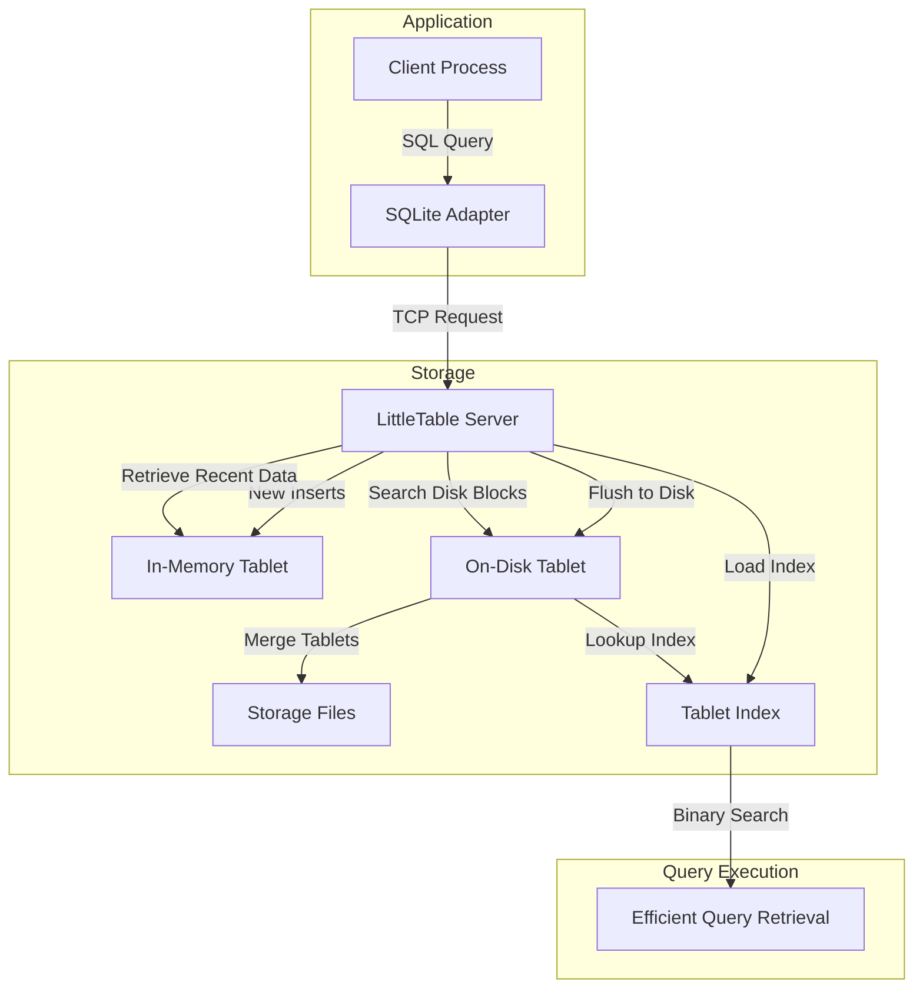

Time-series data is everywhere in modern systems—from network monitoring and IoT sensors to application metrics and financial data. But storing and querying massive amounts of time-series data efficiently presents unique challenges. How do you handle hundreds of thousands of writes per second while maintaining fast query performance? How do you store terabytes of historical data without breaking the bank?

Enter [LittleTable](https://dl.acm.org/doi/abs/10.1145/3035918.3056102), a relational database purpose-built for storing, querying, and aggregating high-resolution time-series data. Since 2008, Cisco Meraki has leveraged LittleTable to handle network timeseries such as usage statistics, event logs, and various device metrics, proving its mettle in demanding production systems.

## A Deep Dive into the Architecture

Clients interact with LittleTable through a custom [SQLite](https://www.sqlite.org/) adaptor, which acts as a bridge between applications and the database. This adaptor allows clients to perform inserts, queries, and aggregations using SQL commands, making integration seamless for developers familiar with relational databases.

This section deep dive into the different components making the architecture of LittleTable, which can be summarized with the following diagram:



### Log-Structured Storage Model

LittleTable's architectural design centers around a **log-structured merge tree (LSM-tree)**. Data is first written into memory within balanced tree "*tablets*" that get periodically flushed to disk as immutable files. Older tablet files are merged progressively, reducing fragmentation and improving long-term query efficiency. When a query is issued, the system scans these tablet files and merges pre-sorted streams to assemble the final results. This method of operation empowers LittleTable to ramp up its query performance while simultaneously controlling the number of on-disk files.

This design leans into the nature of single-writer, append-only data. By forgoing the need for a dedicated write-ahead log and by relying on infrequent flushes and background table merges, LittleTable achieves high throughput—even on spinning disks. In practice, with the right key choices, it can handle over 500,000 rows per second for queries while supporting inserts at 42% of the peak disk write throughput. Today, this system supports the storage of over 320TB of time-series data at Cisco Meraki.

```

      ,---------------- LittleTable Server --------------.
      |                                                  |
      |         ,------------------,          ,------------------,
Table |------>  | In-Memory Tablet |  ......> | In-Memory Tablet |
insert|         '------------------'          '------------------'   
      |                                                  ^
      |     ,---------------------,                      | flush when 
      |---- | On-Disk Tablet      | <--------------------'  full  
      |     | ts: 1/1 - 1/15      |
      |     | key: sort order     |
      |     '---------------------'
      |
      |     ,---------------------,
      |---- | On-Disk Tablet      |  
      |     | ts: 1/16 - 1/31     |   
      |     | key: sort order     |
      |     '---------------------'
      |
      |           (more tablets)
      |                                                  |
      '--------------------------------------------------'
                                       |
                                  query ---> row
                                       |
                                       V
```
_LittleTable Log-Structured Storage_

### Two-Dimensional Clustering for Efficient Queries

LittleTable optimizes time-series data storage by clustering tables in two dimensions:

1. **Time Clustering**  
   By partitioning rows based on timestamp, recent data naturally clusters together. This design choice allows the system to quickly locate and access current information while still efficiently retaining vast volumes of historical data.

2. **Key Sorting**  
   Within each timestamp partition, rows are further sorted by a hierarchically defined key. This extra level of organization enables developers to align the physical storage layout with expected query patterns. For example, usage data can be clustered simultaneously by network, device, and time period, thus optimizing both read and write paths.

### Weak Durability for High Throughput
Instead of enforcing strict durability constraints, LittleTable makes an interesting trade-off:

- **Single-writer model:** Data from a single source type is written by a single process, avoiding complex concurrency management.
- **Append-only design:** Rows are never updated; only new rows are inserted.
- **Recoverability considerations:** Since Meraki devices retain local copies of recent data, LittleTable can afford to lose some writes in the event of a crash.

This relaxed durability allows LittleTable to achieve high insert throughput, especially when compared to traditional ACID-compliant databases.

### Flexible Schema Evolution

Although LittleTable's schema modification capabilities are intentionally limited, they provide enough flexibility to adapt over time:

- **Appending Columns:** Users can extend the schema simply by adding new columns at the end of the table.
- **Increasing Column Precision:** For instance, 32-bit integer columns can be upgraded to 64-bit, providing a straightforward tool for working with evolving data needs.
- **TTL Adjustments and Schema Re-creations:** The system permits changes to the table's time-to-live (TTL) as well as the full recreation of a table with a new schema—an approach often employed during new feature developments.

Notably, while new data can be seamlessly added and the properties of existing columns can be adjust, the direct removal of columns is not supported. Moreover, when reading from tablets that were created under an older schema, LittleTable transparently maps the data to the current table schema, ensuring a smooth evolution without breaking older records.


## Management Operations

LittleTable employs a series of intelligent background operations that manage data efficiently without interrupting user reads or writes:


### Tablet Management

- **In-Memory to Disk:** As in-memory tablets fill, LittleTable closes them off for further writes, places them into a flush queue, and opens a new tablet for incoming data.
- **Background Merges:** A dedicated process later merges these flushed tablets, ensuring that the total count of on-disk files remains manageable and that expired data is removed promptly.

### Administration Operations

The system divides its operations into non-blocking and potentially blocking actions:

- **Non-Blocking (Background) Operations:**
  - **Tablet Merging:** Adjacent on-disk tablets are merged periodically to keep their number logarithmic with respect to the total rows.
  - **Expired Data Deletion:** A background process continuously removes data that has exceeded its TTL.

- **Potentially Blocking Operations:**
  - Operations such as table creation/deletion and some schema changes might temporarily block writes. For example, flushing in-memory tablets or enforcing primary key uniqueness can briefly pause data input. However, these operations are minimized and designed to have a limited impact overall.

- **Continuous Archival:** In tandem with PostgreSQL's continuous archiving, asynchronous replication ensures that a warm spare is always available for disaster recovery.

## Tablet Merging: The Key to Efficient Storage

Tablet merging in LittleTable serves two main purposes:

1. **Performance Improvement:** By limiting the number of tablets that a query must scan, the system avoids excessive random I/O, improving read performance.
2. **Space Reclamation:** As data ages past its TTL, merging tablets discards the expired rows and rebuilds tablets with only current, valid data.

Two distinct merging policies come into play:

- **Adjacent Tablet Merging:** The oldest tablet is merged with any adjacent ones that are less than half its size. This process repeats until no eligible tablets remain, keeping the total tablet count in check.
- **Time Period Merging:** Tablets are grouped into well-defined time periods (such as 4-hour intervals for the past day, daily intervals for the past week, and weekly intervals further back) to ensure that merges occur only with tablets covering the same clock period. This strategy prevents queries from having to parse through extraneous data outside their time range.

## Conclusion

LittleTable's innovative blend of a log-structured merge tree, time-based clustering, and efficient schema evolution highlights its capacity as a cost-effective, high-performance solution for managing time-series data. Whether it's powering real-time network analytics or storing massive historical datasets, LittleTable's design choices—like smart tablet merging and flexible, albeit limited, schema modifications—ensure that it continues to meet the rigorous demands of a production environment.

As systems grow ever more data-intensive, the architectural insights from LittleTable may offer valuable guidance—not only for time-series databases but for other applications that require efficiency and scalability in data management. How might these principles apply to the systems you're building? The conversation is just beginning.

---

*I hope you enjoyed this article, feel free to leave a comment or reach out on twitter [@bachiirc](https://twitter.com/bachiirc).*
