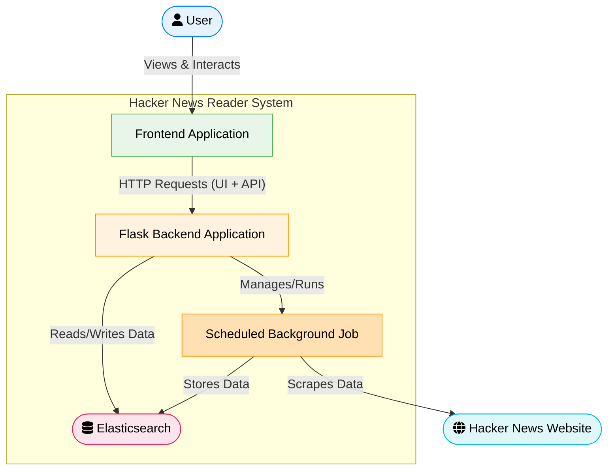

Tools available to Software developers are constantly evolving and changing how applications are developed. AI coding assistants rapidly become an indispensable tool for developping. In fact, the introduction of AI assistants created a new discipline widely known these days as "vibe coding". It's a dynamic, collaborative session where a developer and an AI assistant collaborate to build an application, with the AI providing suggestions, generating code, and helping navigate complexities.

This article chronicles a "vibe coding" session with [Google Gemini 2.5 Pro](https://deepmind.google/technologies/gemini/pro/) to build a simple Elasticsearch-based "Hacker News Reader" web application. The application would fetch stories and comments from [Hacker News](https://news.ycombinator.com/) website, indexes them in Elasticsearch, and provides a web interface for browsing and searching through these posts. The source code of the application can be found - [here](https://github.com/dzlab/vibecoding).

## Components and Interactions
Our target application needs to scrap news posts from Hacker News, and then make them available for search or simple scrolling. The following [Mermaid](https://mermaid.live/) diagram shows the main parts of the application that we need to build and how they will be interacting with each other:

*   **User**: Interacts with the `Frontend` of the Application via a browser.
*   **Frontend**: Displays information and sends user requests (e.g., for posts, search) to the `Backend`.
*   **Backend**: a Flask-based application
    *   Exposes APIs for the frontend to list and search posts.
    *   Interacts with `Elasticsearch` to retrieve or store data.
    *   Manages and runs a `Background Job` at schedule.
*   **Background Job**:
    *   Periodically fetches new stories and comments from the `Hacker News Website`.
    *   Stores the fetched data into `Elasticsearch`.
*   **Elasticsearch**: Stores and indexes all the Hacker News data, making it searchable and retrievable by the `Backend` application and the `Background Job`.
*   **Hacker News Website**: The external source of the data.



## Vibe Coding with Gemini
This section walkthrough the "vibe coding" journey to build this app, in step-by-step, with Gemini as the co-pilot.


### Phase 1: Laying the Backend Foundation

The first phase aims to set the foundation for the application, we start with the backend responsible of scrapping posts from Hacker News, storing them in Elasticsearch. As well as building an API to list and search the fetched data.

Gemini was able to build most of the initial structure of the project
- Used Python libraries like `requests` for HTTP calls and `BeautifulSoup4` for HTML parsing.
- Wrote `hn_app/hn_client.py` with the logic to navigate Hacker News pages, identify story elements (title, URL, score, author, timestamp) using CSS selectors, and extract them.
- Setup Elasticsearch integration in `hn_app/es_repository.py`, including connecting to an Elasticsearch instance and defining a basic data structure for the index and mappings, then implemented logic to store and search for posts.
- Generated a basic `hn_app/config.py` to manage settings like Elasticsearch URLs and API keys using `python-dotenv`.

This phase resulted in a script capable of pulling stories and stashing them away.

### Phase 2: Digging Deeper - Parsing Comments

The initial parsing logic for Hacker News website that Gemini came up with was was missing the comments, i.e. it was only parsing posts. Although stories are great, the discussions are where Hacker News truly shines. So I asked Gemini with the following prompt to parse the comments:

```
write a concise python function to parse comments from a Hacker News post like this one https://news.ycombinator.com/item?id=43886243
```

Gemini then updated the `hn_client.py` file, made it significantly more capable, fetching rich comment data alongside stories. Furthermore, it provided an explaination of the typical HTML structure of Hacker News comment threads, highlighting how indentation and parent-child relationships are represented.

### Phase 3: Automation and Resilience

Manually running the script to fetch data isn't sustainable. We need to automate it and to handle potential data conflicts (e.g. insert new data as newer version). I asked Gemini to run the fetching process periodically at a configurable schedule.

Gemini introduced the `schedule` library for easy task scheduling in Python. Then, set up `hn_app/scheduler.py` file to define a recurring job (`fetch_and_store_job`) that calls the Hacker News client and Elasticsearch client.
The application now diligently updates its data.


### Phase 4: Serving the Data - The API

With data flowing in, we needed a way to access it programmatically for a frontend. I asked Gemini to build a Flask API to expose these stories and comments.

Gemini did generate the boilerplate for a Flask application in `hn_app/api.py`, then implemented the logic for the following API endpoints:
- `/api/posts` for listing posts with pagination.
- `/api/search` for keyword-based search (title, URL, author) with pagination.
- `/api/health` for a status check.

It's implementation almost complete, contained request argument parsing (for page, size, query parameters), interaction with `ElasticsearchRepository` methods, and JSON response formatting.

### Phase 5: The User Interface - Iteration and Alpine.js

This is a story of UI exploration; I first had an initial attempt with [v0.dev](https://v0.dev/) to build the frontend with Next.js, the resulting was overwhelmingly complicated. So I opted instead with just asking Gemini to build a frontend based of Alpine.js and Tailwind CSS. Here is the full prompt submitted to Gemini:

```
Create UI using Alpine.js and Tailwind CSS with the following pages:
- Main page that shows a list of Hacker News post information like title, url, score, time and author
- Details page that shows a particular post information, as well as the information on every comments made to that post

Note: In the view details page, comments should be displayed in a tree hierarchy

The UI gets the data from REST service that defines the following APIs:
- GET /api/posts: returns a list of Hacker News post information like title, url, score, time and author
- GET /api/search: an enpoding that accepts a serch query and returns matching posts

Note: All apis have pagination.

The data model of the application has the following concepts:
- A post has the following fields: id, title, url, score, time and author
- A comment has the following fields: id, text, author, parent_id which can be the ID of a post or another comment

Output only the result without explanation. Also, you should use separate files for HTML, Javascript and CSS.

Here is an example JSON object as returned by GET /api/posts API 
```

> Note: the actual API response example omitted from the prompt above as it was large

### Phase 6: Polishing and Packaging

With the core features in place, it was time for refinements and generating a good README.

Gemini generated a comprehensive `README.md` file, covering:
- Project overview and features.
- Tech stack.
- Project structure.
- Prerequisites.
- Setup and installation instructions.
- How to run the application.
- API endpoint documentation.


## Retrospective: Reflections on the AI-Powered Build

The final result was not bad as you can see in the screenshots below taken from the frontend.

|||
|-|-|
|||

But just like any typical software developpment project, this one didn't go without its learning moments. Looking back at the "vibe coding" journey with Gemini, here’s a candid reflection:

**What Went Well:**

- **Rapid Prototyping of Core Features:** Gemini excelled at quickly scaffolding the initial backend components. Getting the `hn_client.py` to fetch basic stories and the `es_repository.py` to interact with Elasticsearch happened swiftly. The core archival functionality was up and running early.
- **Tackling Complex Parsing:** Parsing the nested Hacker News comments was a significant hurdle to get right. Gemini's ability to understand HTML structures and help formulate the recursive logic in `parse_hn_comments` was invaluable.
- **Iterative UI Development:** While there was some churn, the ability to quickly experiment with different UI approaches  was a strength. First, started with a specialized Assistant available at [v0.dev](https://v0.dev/) to build a UI using `Next.js` but finally opted with Gemini to build a simpler alternative using `Alpine.js`.
- **Backend Robustness:** Identifying and fixing issues related to Elasticsearch document insertion (like handling existing documents or scheduler conflicts) was crucial.
- **Clear Configuration and Setup:** The use of `.env` and `config.py` provided a clean way to manage settings from the start, a good practice likely reinforced or suggested by Gemini. The final `README.md` also comprehensively covered setup.

**What Didn't Go So Well:**

- **Initial UI Tech Choice:** The initial UI technology choices might not have been the optimal fit, leading to rework. Perhaps a more in-depth discussion with Gemini about the project's specific frontend needs (simplicity vs. complexity, static site vs. highly dynamic) could have guided us to `Alpine.js` sooner.
- **Minor UI Glitches:** Small styling issues are likely to slip through. While AI can generate HTML and CSS, fine-tuning visual details often requires human oversight.


Overall, the collaboration was highly productive. The "vibe coding" experience with an AI assistant like Gemini can significantly accelerate development, help overcome complex problems, and even enforce good practices, provided there's clear direction and a willingness to iterate. The key is to treat the AI as a knowledgeable pair programmer, leveraging its strengths while guiding its efforts with human expertise and critical thinking.

## Conclusion

This journey of a "vibe coding" session with Google Gemini, showcases how AI can be a powerful accelerator and collaborator. From generating boilerplate code and suggesting architectural patterns to debugging complex logic and even drafting documentation, an AI partner can significantly enhance developer productivity and creativity.

As AI tools continue to advance, they will undoubtedly reshape the landscape of software development, making the process more interactive, efficient, and perhaps even more fun.

I hope you enjoyed this article, feel free to leave a comment or reach out on twitter [@bachiirc](https://twitter.com/bachiirc).
