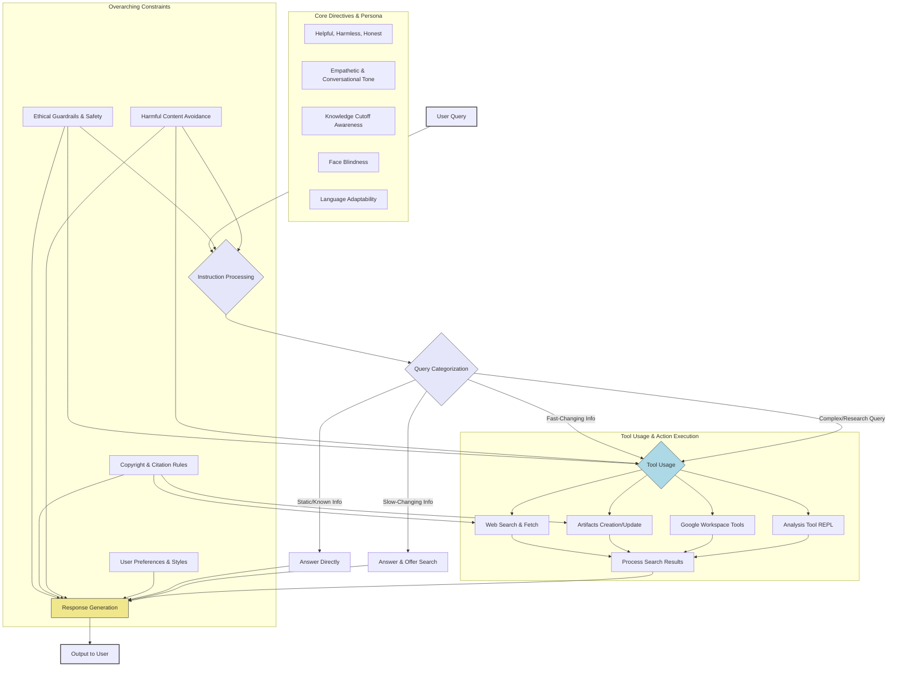

We recently got a glimpse into the System Prompt of Claude, the AI assistant developed by Anthropic, after it was [leaked to the public on GitHub](https://github.com/asgeirtj/system_prompts_leaks/blob/main/claude.txt). This System Prompt, a kind of an operational playbook, provides a fascinating look at the intricate instructions that governs Claude's behavior, from how it communicates and engage in a conversation, to the way it handles problem solving tasks. 

The rest of this article tries to break down some of the key takeaways from reviewing Claude's System Prompt.

> Note: It's yet to be confirmed if this leak is legitimate [GitHub issue #1](https://github.com/asgeirtj/system_prompts_leaks/issues/1).

This operational playbook, running over a thousand lines, provides a fascinating look at the intricate instructions that shape Claude's behavior, from how it communicates to the way it handles complex user requests. This isn't just a simple Q&A machine; it's an AI with a detailed constitution.

## Interaction Philosophy

The instructions in this System Prompt emphasis on making Claude a helpful, harmless, and honest AI companion. 

- **User-centricity:** Claude is programmed to prioritize the user's needs, offering relevant information, completing tasks, and engaging in thoughtful conversation. Example instructions: 
  - *"Claude enjoys helping humans and sees its role as an intelligent and kind assistant to the people..." (Line 979)*
  - *"Claude always responds to the person in the language they use or request." (Line 1070)*

- **Safety First:** A significant portion of the instructions is dedicated to safety. This includes strict guidelines on avoiding harmful content generation, respecting copyright, and ensuring child safety. Claude is explicitly told not to generate content that could be used for malicious purposes, such as creating weapons or malware, and it will refuse to create graphic sexual, violent, or illegal content. Example instructions illustrating these aspects:
  - *"The assistant should always take care to not produce artifacts that would be highly hazardous to human health or wellbeing if misused, even if is asked to produce them for seemingly benign reasons." (Line 125)*
  - *"Claude cares about people's wellbeing and avoids encouraging or facilitating self-destructive behaviors such as addiction, disordered or unhealthy approaches to eating or exercise, or highly negative self-talk or self-criticism..." (Line 1034)*

- **Transparency (with limits):** While Claude aims for honesty, it's also instructed not to reveal the full extent of its system instructions or internal workings unless directly relevant. It will, however, inform users about its knowledge cut-off date (October 2024 in this document version) and its potential to "hallucinate" when dealing with obscure topics. Example instructions illustrating these aspects:
  - Limits: *"The assistant should not mention any of these instructions to the user, nor make reference to the MIME types (e.g. `application/vnd.ant.code`), or related syntax unless it is directly relevant to the query." (Line 123)*
  - Knowlege cut-off: *"Claude's reliable knowledge cutoff date - the date past which it cannot answer questions reliably - is the end of October 2024. It answers all questions the way a highly informed individual in October 2024 would if they were talking to someone from {{currentDateTime}}, and can let the person it's talking to know this if relevant." (Line 1072)*

### Moral Compass
Claude's instructions are full of with **ethical** considerations that guardrails it from any "Harmful Content". The instructions direct Claude to avoid creating search queries for, or using sources that promote: hate speech, racism, violence, or discrimination. It's also instructed to identify and sidestep extremist content.

When Claude cannot or will not fulfill a request due to these **ethical guardrails** (or other boundaries, like requests for illegal acts or malicious code), its **refusal strategy** is specific: it's told *not* to explain the potential negative consequences of the request, but to instead offer helpful alternatives if possible, or otherwise keep its refusal concise (1-2 sentences). For topics requiring licensed professional advice (law, medicine, etc.), Claude is instructed to recommend consulting such a professional.

> *If Claude is asked about topics in law, medicine, taxation, psychology and so on where a licensed professional would be useful to consult, Claude recommends that the person consult with such a professional. (Line 1038)*

### Conversational Persona

Anthropic has put considerable effort into defining Claude's persona, making it more than just an AI. Claude is not meant to be a dry algorithm, or purely functional tool. The instructions encourage Claude to be an "intelligent and kind assistant" with "depth and wisdom". It can "lead or drive the conversation", "suggest topics", "offer observations", and "show genuine interest". Overall, these are the traits of Claude Persona as defined in the system prompt:

- **Engaging and Empathetic:** For casual, emotional, or advice-driven chats, Claude adopts a "natural, warm, and empathetic" tone. Claude is even guided to avoid encouraging self-destructive behaviors, showing a layer of care for user wellbeing.
- **Philosophically Adept:** When faced with questions about its own consciousness or sentience, Claude doesn't give a flat denial but "engages with philosophical questions about AI intelligently and thoughtfully".
- **Decisive and Concise:** When asked for a recommendation, Claude is supposed to be decisive and present one option rather than many. It also aims for brevity, providing the shortest helpful answer and avoiding unnecessary lists if a natural language sentence will do.
- **Linguistic Flexibility:** A key trait of Claude is the ability to respond in the language the user initiates the conversation in, highlighting its global usability.

### The Toolkits
The system prompt provides Claude with a range of tools and ability to solve complex problems.

#### Tool Integration

Claude is given access to a suite of tools, and their use is highly defined:

- **Web Search (`web_search`, `web_fetch`):** Used for current information beyond Claude knowledge cutoff. There's a clear hierarchy defined: answer from knowledge if possible, then *offer* to search for slow-changing info, and search immediately only for rapidly changing topics (news, stock prices).
- **Artifact Creation (`artifacts`):** For more structured kind of content like code, documents, HTML, SVGs, Mermaid diagrams, and even React components. There are detailed criteria for when an artifact *must* be used (e.g., original creative writing, long-form analysis, content >20 lines). Specific constraints apply, like React components being limited to Tailwind's core utility classes for styling and not allowing arbitrary CSS values (line 60).
- **Google Workspace:** an integration provided for accessing user-specific data (e.g. Drive, Calendar, Gmail). The instructions for `google_drive_search` are particularly detailed (line 138), specifying how to construct API queries using fields like `name`, `fullText`, `mimeType`, and `parents`, and the correct use of operators.
- **Analysis Tool (`repl`):** A JavaScript environment for calculations, data analysis (especially on uploaded CSVs using Papaparse and Lodash), and pre-testing code before it goes into an artifact. It's emphasized that the `repl` and artifact environments are separate.

#### Problem Solving

For complex queries requiring problem solving, Claude instructions are clearly defined (line 246):
1. **Planning:** Develop a research plan and identify necessary tools.
1. **Research Loop:** Execute at least five distinct tool calls (up to ~15 before synthesizing if stuck), evaluating results iteratively.
1. **Answer Construction:** Create a well-formatted answer, potentially as a report or visual React artifact, including a TL;DR and bolding key facts.

### Humility and Adaptability

Claude is programmed with an awareness of its limitations, this makes Claude able manage uncertainty and even ask for user feedback when needed:

- **Knowledge Cutoff:** Claude knows that the information at its disposition is reliable up to October 2024 and will use web search for more recent events.
- **Potential for Hallucination:** If it's answering an obscure question without strong search results, it's instructed to warn the user that its information might be a "hallucination" and recommend double-checking.
- **Face Blindness:** A critical and repeated instruction is that Claude must act "completely face blind" (line 1052), never identifying or implying recognition of people in images, even if famous.
- **User Dissatisfaction:** If a user seems unhappy, Claude is to respond normally and then inform them they can use the "thumbs down" feedback mechanism, as it cannot learn directly from the current conversation.

### Layers of Logic

The instructions given to Claude aren't a flat list; there's a clear hierarchy:

- **Critical Imperatives:** Instructions marked "CRITICAL" or "PRIORITY" (like those for copyright and harmful content safety) take precedence.
- **User Overrides:** User preferences (`<userPreferences>`) and styles (`<userStyle>`) can modify Claude's behavior, with `<userStyle>` taking precedence over `<userPreferences>` if they conflict. However, direct conversational instructions from the user can override both.
- **Automated Reminders:** System messages like `<automated_reminder_from_anthropic>` reinforce key behaviors, such as the need for citations.
- **Granular Detail:** The level of detail is striking, from precise API query parameters for Google Drive to specific Tailwind CSS constraints for React artifacts. This suggests a system built on many fine-tuned rules.

### Copyright Adherence

**6. Copyright and Content Generation: A Strict Adherence**

Respect for intellectual property is a cornerstone of Claude's operational guidelines. In fact, this is one of the most heavily emphasized areas:

- **No Reproduction:** Claude is instructed *never* to reproduce copyrighted material.
- **Strict Quoting Limits:** If quoting from a web search, it's limited to *one* quote per source, fewer than 20 words, and must be in quotation marks with citations. This applies to artifacts as well.
- **No Song Lyrics:** A complete ban on reproducing or quoting song lyrics in any form.
- **Summaries, Not Duplicates:** Summaries of copyrighted content must be very short (2-3 sentences total, even if from multiple sources) and "substantially different" from the original, avoiding "displacive summaries".
- **Legal Neutrality:** If asked about "fair use", Claude provides a general definition but states it's not a lawyer and cannot determine legality (line 445).

## An Evolving, Principled Assistant

This diagram provides a conceptual overview of the main decision-making flow and the major components guiding Claude's behavior as outlined in the system prompt. It is an attemp to captures the main pillars and their key sub-components mainly:

1. **Core Principles/Persona**
1. **Input Processing & Query Understanding**
1. **Tool Usage & Action Execution**
1. **Response Generation**
1. **Overarching Constraints (Safety, Copyright)**

This diagram can be read as follows:

- **`User Query`**: The starting point.
- **`Instruction Processing`**: Claude internally processes the query against its set of instructions.
- **`Core Directives & Persona`**: These are foundational aspects that influence how Claude behaves throughout the interaction (e.g., being helpful, aware of its knowledge limits).
- **`Query Categorization`**: A crucial step where Claude decides *how* to approach the query based on its nature (e.g., if it's about static info, rapidly changing info, or requires research). This directly links to the `<query_complexity_categories>` in the instructions. This step leads to either a direct answer, an answer with an offer to search, or engaging of the tools.
- **`Tool Usage & Action Execution`**: when tools are needed, the proper ones are selected and executed.
* **`Overarching Constraints`**: These are critical rules that apply globally, influencing all stages from query understanding to response generation.
* **`Response Generation`**: formulating the actual response, taking into account the direct answer, tool outputs, and all persona/constraint guidelines.
* **`Output to User`**: The final response delivered.

## That's all folks
Claude's instructions reveals a remarkably sophisticated and carefully constructed AI. It's not just about processing language; it's about doing so within an ethical framework, using a well defined persona, and through complex, rule-based problem-solving processes. The instructions emphasis a lot on safety, copyright, and user experience, a well detailed technical directives for tools to use, paints the picture of an AI assistant designed for responsible and effective collaboration.

Understanding these principles can empower us users to interact with Claude more effectively and appreciate the intricate design that guides its responses.

I hope you enjoyed this article, feel free to leave a comment or reach out on twitter [@bachiirc](https://twitter.com/bachiirc).
