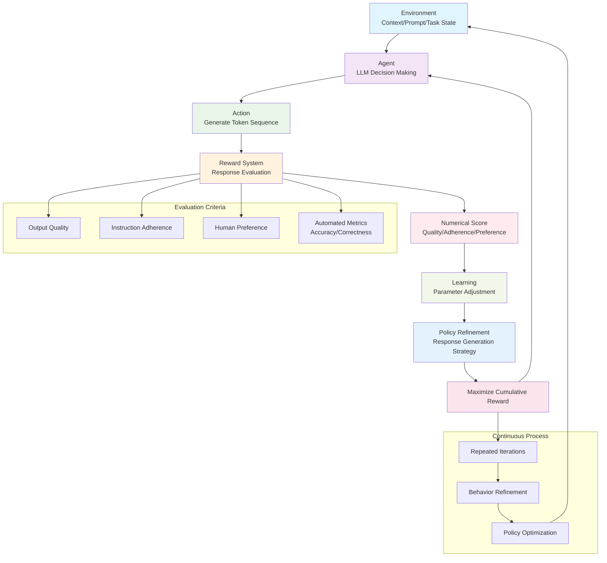

Reinforcement Fine-Tuning (RFT) has been used successfully for fine-tuning large language models (LLMs) to tackle complex, multi-step reasoning tasks.
In this article, we will delve into the fundamentals of RFT, the critical role and design of *reward functions* (including LLM-as-a-judge methodologies and the challenge of reward hacking), GRPO and how it compares to other RL algorithms like RLHF and DPO, a detailed breakdown of its core components (policy, rewards, advantage, loss function), and practical steps for implementing GRPO-based fine-tuning.

## Reinforcement Fine-Tuning (RFT)

Reinforcement Fine-Tuning (RFT) is an fine-tuning technique that uses reinforcement learning (RL) to improve the performance of LLMs, particularly on tasks that necessitate sequential decision-making and elaborate reasoning, e.g. as mathematical problem-solving or code generation. Unlike traditional supervised fine-tuning (SFT), which heavily relies on datasets with thousands of *labeled examples* and *teaching the model by demonstration*, RFT empowers the LLM to autonomously discover optimal solutions. It achieves this by enabling the model to "think step by step," iteratively refining its strategies based on feedback from its actions.

This approach allows for the adaptation of models to highly complex tasks using significantly less training data—sometimes as few as a couple of dozen examples. This makes this approach well suited when high-quality labels are scarce, expensive, or when the task requires intricate reasoning.

Example of such tasks include:

* **Mathematical Problem Solving**: RFT allows the model to generate, verify, and refine detailed solution steps.
* **Code Generation and Debugging**: The model learns by receiving scores based on test case execution, linting rule adherence, or code functionality, enabling it to produce correct, idiomatic code and iteratively fix errors.
* **Logical and Multi-Step Reasoning (Agentic Workflows)**: For tasks requiring a sequence of decisions, RFT encourages the model to self-critique and improve each step based on the final outcome or intermediate rewards.

### Key RFT Algorithms

Some of the key RL-based fine-tuning methods for LLM alignment are:

- **RLHF (Reinforcement Learning from Human Feedback):** the LLM sample multiple responses, then human annotators rank these candidate responses, then a separate *reward model* is trained to learn these human preferences, and finally the original LLM using an RL algorithm (like PPO) is fine-tuned with the trained reward model providing the reward signals.
- **DPO (Direct Preference Optimization):** Sample two responses (A and B) for a prompt, then human preferences over response pairs are collected to create a dataset of `(prompt, chosen_response, rejected_response)`, then the LLM is directly fine-tuned to increase the likelihood of preferred responses, and decrease that of rejected ones, without an explicit reward model.
- **GRPO (Group Relative Policy Optimization):** Unlike RLHF and DPO, GRPO eliminates the need for human feedback by using *programmable reward functions* or LLM as a judge. For each prompt, the LLM generates multiple responses, scores them automatically, and updates its policy to favor above-average responses.

The following table summaries the comparison between these different algorithms:

||RLHF|DPO|GRPO|
|-|-|-|-|
|**Feedback Source**|relies on human preference rankings and a learned reward model|uses pairwise human preferences|uses directly programmed reward functions based on verifiable metrics|
|**Reward System**|involves training an additional model (the reward model) and can have high computational overhead|requires substantial human preference data but does not use a reward model|directly uses the output of code-based reward functions|
|**Data Requirement**|requires significant human annotation effort|requires human annotation effort|no requirements as it uses automated scoring|
|**Learning Signal**|learns a preferences|learns a preference relationship|learns to maximize absolute scores from reward functions (relative to a group average)|

While RLHF and DPO are effective for aligning models with human preferences, GRPO is particularly suited for tasks where objective, verifiable metrics of success can be defined and programmed, allowing the model to learn complex, reasoning-intensive tasks often without human labels.

### How RFT Works
The process of fine-tuning with RFT works similarly to what RL works. Conceptually, it can be simplified to the following components:

1. **Agent:** The LLM acts as the agent, making decisions (i.e., generating text or image).
2. **Environment:** The environment provides the context, typically in the form of a prompt or a current task state.
3. **Action:** The LLM takes an action by generating a sequence of tokens as its response to the prompt.
4. **Reward:** The generated response is evaluated, and a numerical score, or reward, is assigned. This reward can be based on various criteria such as output quality, adherence to instructions, human preference, or automated metrics like accuracy or correctness against verifiable standards.
5. **Learning:** The LLM uses this reward as feedback to adjust its internal parameters (weights). The objective is to learn a policy (a strategy for generating responses) that maximizes the cumulative reward over time for a variety of input prompts. This process is repeated, allowing the model to continuously refine its behavior.

The followind diagram further exaplin visually this process:

## GRPO

**Group Relative Policy Optimization (GRPO)** is a RFT algorithm developed by DeepSeek AI, notably used in their DeepSeek Coder models. GRPO is specifically designed for the reinforcement fine-tuning of LLMs on reasoning tasks. A key characteristic of GRPO is its reliance on **programmable reward functions** that score model outputs based on verifiable metrics (e.g., correct code formatting, successful execution of generated code, adherence to game rules). This contrasts with methods like RLHF or DPO that primarily depend on human preference data.

The process of fine-tuning an LLM with GRPO begins with an input prompt, for which, LLM generates several candidate responses. Then, each response is evaluated by reward function(s) that assign numerical scores based on criteria (correctness, format, etc.). Advantages are then computed to measure how much better or worse each response is compared to others.
Then, the model’s loss is calculated using the GRPO method, which balances learning from rewards and staying close to the base model. Then, the weights are updated, and the process repeats for more training steps.
When finally the training is complete, you have a reinforcement fine-tuned model.

## Practical Example: Training an LLM to Play Wordle

The course uses Wordle—a simple yet strategic word puzzle—as a sandbox to demonstrate RFT with GRPO. The process involves:

1. **Prompting the Model:** The LLM is prompted to play Wordle, receiving structured feedback after each guess.
2. **Defining Reward Functions:** Several reward functions are crafted, such as:
   - **Binary Rewards:** 1 for the correct word, 0 otherwise.
   - **Partial Credit:** Rewards based on correct letters and positions.
   - **Format and Strategy:** Rewards for following output format and logical use of feedback.
3. **Simulating Gameplay:** The base and fine-tuned models are compared, showing how reinforcement fine-tuning yields much more strategic, step-by-step reasoning in gameplay.
4. **Advantage Calculation:** Rewards are normalized (centered around zero) to compute “advantages,” which guide policy updates.
5. **Diversity and Exploration:** Temperature-based sampling is used to encourage diverse outputs, ensuring the model learns from a variety of strategies.

## Beyond Wordle: Subjective Rewards and Reward Hacking

RFT isn’t limited to objectively verifiable tasks. For instance, to train models to summarize earnings call transcripts, the course demonstrates:

- **LLM-as-a-Judge:** Using another LLM to rate outputs when human evaluation is subjective or costly.
- **Structured Evaluation:** Creating quizzes from reference text and scoring summaries based on quiz performance.
- **Reward Hacking:** Addressing cases where the model “games” the reward by, for example, regurgitating the transcript instead of summarizing. This is mitigated by adding penalties (e.g., for excessive length) to the reward function.

## Technical Details: The GRPO Loss Function

The GRPO loss function is central to training. Its key components are:

- **Policy Loss:** Measures the difference between the current policy and a reference (pre-trained) model.
- **Advantages:** Higher for better-than-average responses.
- **Clipping:** Prevents large, destabilizing updates.
- **KL Divergence Penalty:** Keeps the fine-tuned model close to the reference, preventing catastrophic forgetting or overfitting to the reward.

The loss function is implemented using token probabilities from both the policy and reference model, scaling updates by computed advantages, and incorporating clipping and KL divergence as safety checks.

## Putting It All Together

The final training pipeline involves:

1. **Data Preparation:** Collecting Wordle games or other task data.
2. **Prompt Engineering:** Crafting prompts that elicit desired behaviors.
3. **Reward Function Design:** Combining objective checks, strategic incentives, and penalties.
4. **Model Training:** Using a platform like Predabase to orchestrate data, training runs, and repository management.
5. **Evaluation:** Benchmarking the fine-tuned model against baselines and analyzing improvements.

The results are promising: with RFT and GRPO, a relatively small LLM can outperform much larger models on specialized tasks, especially when combining supervised and reinforcement fine-tuning.

## Conclusion

Reinforcement fine-tuning with programmable rewards (GRPO) is a flexible, powerful approach for customizing LLMs to solve complex, reasoning-intensive tasks. By thoughtfully designing reward functions and leveraging open-source tools, practitioners can push the boundaries of what LLMs can achieve—often with minimal labeled data.

Whether you’re building agentic workflows, automated code generators, or domain-specific summarizers, RFT with GRPO provides a robust framework to guide your models toward the behaviors you care about most.

---

**Further Reading:**  
Check out Predabase and DeepSeek’s resources for more details on GRPO, and explore the full course for code examples and hands-on notebooks.