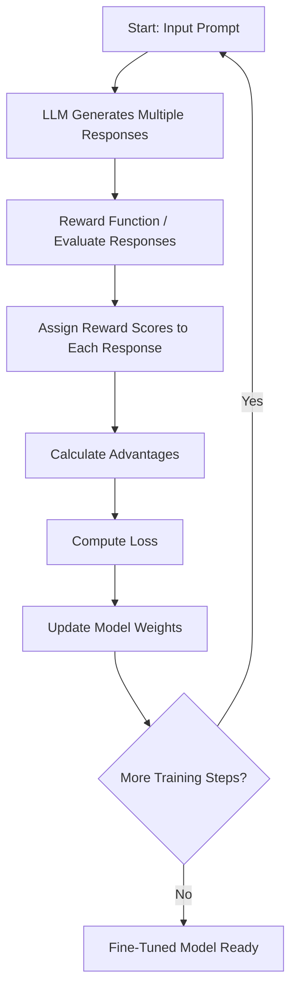

Reinforcement learning (RL) is emerging as a powerful paradigm for fine-tuning large language models (LLMs) to tackle complex, multi-step reasoning tasks. This post summarizes a comprehensive course on reinforcement fine-tuning (RFT) with Group Relative Policy Optimization (GRPO), developed in partnership with Predabase and DeepSeek, and provides practical insights into how programmable reward functions can unlock new model capabilities.

## Introduction: Why Reinforcement Fine-Tuning?

Traditional fine-tuning of LLMs relies on supervised learning: providing thousands of labeled examples and teaching the model by demonstration. This approach works well for many tasks but struggles when high-quality labels are scarce, expensive, or when the task requires intricate reasoning.

Reinforcement fine-tuning (RFT) offers an alternative. Instead of mimicking demonstrations, the model learns by exploring, receiving feedback, and optimizing for a reward signal. This enables adaptation to new tasks with far fewer labeled examples—sometimes just a couple dozen—by harnessing the model’s reasoning abilities and guiding it toward solutions.

## Key Algorithms: RLHF, DPO, and GRPO

Several RL-based methods for LLM alignment are covered:

- **RLHF (Reinforcement Learning from Human Feedback):** Candidate responses are ranked by human annotators, a reward model is trained on these preferences, and the LLM is fine-tuned to optimize for high reward.
- **DPO (Direct Preference Optimization):** Human preferences over response pairs are collected, and the LLM is tuned to increase the likelihood of preferred responses.
- **GRPO (Group Relative Policy Optimization):** Unlike RLHF and DPO, GRPO eliminates the need for human feedback by using programmable reward functions. For each prompt, the LLM generates multiple responses, scores them automatically, and updates its policy to favor above-average responses.

Explanation:

The process begins with an input prompt.
The LLM generates several candidate responses.
Each response is evaluated by reward function(s) that assign numerical scores based on criteria (correctness, format, etc.).
Advantages are computed to measure how much better or worse each response is compared to others.
The model’s loss is calculated using the GRPO method, which balances learning from rewards and staying close to the base model.
Weights are updated, and the process repeats for more training steps.
When training is complete, you have a reinforcement fine-tuned model.

## Practical Example: Training an LLM to Play Wordle

The course uses Wordle—a simple yet strategic word puzzle—as a sandbox to demonstrate RFT with GRPO. The process involves:

1. **Prompting the Model:** The LLM is prompted to play Wordle, receiving structured feedback after each guess.
2. **Defining Reward Functions:** Several reward functions are crafted, such as:
   - **Binary Rewards:** 1 for the correct word, 0 otherwise.
   - **Partial Credit:** Rewards based on correct letters and positions.
   - **Format and Strategy:** Rewards for following output format and logical use of feedback.
3. **Simulating Gameplay:** The base and fine-tuned models are compared, showing how reinforcement fine-tuning yields much more strategic, step-by-step reasoning in gameplay.
4. **Advantage Calculation:** Rewards are normalized (centered around zero) to compute “advantages,” which guide policy updates.
5. **Diversity and Exploration:** Temperature-based sampling is used to encourage diverse outputs, ensuring the model learns from a variety of strategies.

## Beyond Wordle: Subjective Rewards and Reward Hacking

RFT isn’t limited to objectively verifiable tasks. For instance, to train models to summarize earnings call transcripts, the course demonstrates:

- **LLM-as-a-Judge:** Using another LLM to rate outputs when human evaluation is subjective or costly.
- **Structured Evaluation:** Creating quizzes from reference text and scoring summaries based on quiz performance.
- **Reward Hacking:** Addressing cases where the model “games” the reward by, for example, regurgitating the transcript instead of summarizing. This is mitigated by adding penalties (e.g., for excessive length) to the reward function.

## Technical Details: The GRPO Loss Function

The GRPO loss function is central to training. Its key components are:

- **Policy Loss:** Measures the difference between the current policy and a reference (pre-trained) model.
- **Advantages:** Higher for better-than-average responses.
- **Clipping:** Prevents large, destabilizing updates.
- **KL Divergence Penalty:** Keeps the fine-tuned model close to the reference, preventing catastrophic forgetting or overfitting to the reward.

The loss function is implemented using token probabilities from both the policy and reference model, scaling updates by computed advantages, and incorporating clipping and KL divergence as safety checks.

## Putting It All Together

The final training pipeline involves:

1. **Data Preparation:** Collecting Wordle games or other task data.
2. **Prompt Engineering:** Crafting prompts that elicit desired behaviors.
3. **Reward Function Design:** Combining objective checks, strategic incentives, and penalties.
4. **Model Training:** Using a platform like Predabase to orchestrate data, training runs, and repository management.
5. **Evaluation:** Benchmarking the fine-tuned model against baselines and analyzing improvements.

The results are promising: with RFT and GRPO, a relatively small LLM can outperform much larger models on specialized tasks, especially when combining supervised and reinforcement fine-tuning.

## Conclusion

Reinforcement fine-tuning with programmable rewards (GRPO) is a flexible, powerful approach for customizing LLMs to solve complex, reasoning-intensive tasks. By thoughtfully designing reward functions and leveraging open-source tools, practitioners can push the boundaries of what LLMs can achieve—often with minimal labeled data.

Whether you’re building agentic workflows, automated code generators, or domain-specific summarizers, RFT with GRPO provides a robust framework to guide your models toward the behaviors you care about most.

---

**Further Reading:**  
Check out Predabase and DeepSeek’s resources for more details on GRPO, and explore the full course for code examples and hands-on notebooks.