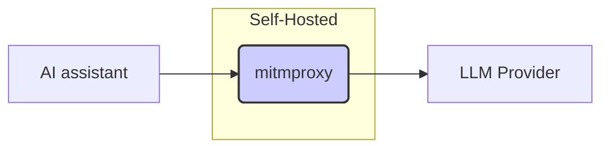

The allure of AI coding assistants like [Zed](https://zed.dev/) is undeniable. They promise streamlined workflows and enhanced productivity, but their inner workings often remain shrouded in mystery. 
This article details how to reverse engineer Zed using `mitmproxy`, providing insights into its System prompt, prompting strategies and API interactions with Large Language Model (LLM) providers.


### Motivation

Before integrating any AI tool deeply into our workflow, understanding its underlying mechanisms is crucial. All existent AI assistants abstract away the complexities of prompt engineering, which simplifies our lifes as end user as we won't need to craft sophisticated prompts to get the outcome we wants.
But not understanding the inner working of these assitants, we end up relying on a complex system without fully grasping its process and logic, hindering our ability to optimize or troubleshoot effectively. 

Enter the realm of HTTP(s) proxies, just like any networked-program, in fact by simply intercepting and observing the API calls made by the assistant, we can demystify its functionality, assess its efficiency, and potentially identify areas for improvement. Furthermore, this allows us to:

* **Necessity of the framework:** Assess if the framework truly essential, or could a simpler approach achieve similar results?
* **Prompt optimization:** Analyzing the prompts sent to the LLMs to Identify patterns, structure, and any special formatting or instructions. Are they efficient? Can we craft more efficient or effective prompts than those used by the assitant?
* **API call efficiency:** Examine the parameters included in the API requests.  This might include model names, temperature settings, maximum token limits, and other factors affecting the LLM's behavior. Also, is the number of API calls made optimal, or are there redundancies?
* **Response Handling:** Observe how the assitant processes the LLM's responses.  Is there any post-processing, error handling, or validation?

### Setting Up mitmproxy

`mitmproxy` is a powerful tool for intercepting and inspecting network traffic, including HTTP and HTTPs requests. By setting up `mitmproxy` as a proxy, as depicted in the following diagram, we can capture all of Zed's communication with the LLM provider.



Let's setup `mitmproxy`

1. **Installation:** Follow the installation instructions on the `mitmproxy` website. On MACOS, simply do:

```bash
➜  ~ brew install mitmproxy
```

2. **Interactive UI:** Start the interactive UI by running `mitmweb` in your terminal. Note the URL of the interactive UI (e.g., `http://127.0.0.1:8081/`).

```bash
➜  ~ mitmweb
[10:08:00.911] HTTP(S) proxy listening at *:8080.
[10:08:00.912] Web server listening at http://127.0.0.1:8081/?token=5e67ee3cce6e2a0b49b835323ba71dd6
```

3. **Proxy Configuration:** Configure your system to route traffic through `mitmproxy`, listening on `http://localhost:8080`.

For instance on MACOS, open _System Settings_, in the sidebar click on _Network_, then choose the network you're connectred to on the right panel, and click _Details_, then click _Proxies_.

In the HTTP(s) proxy configuration, set the host to `localhost` and the port to `8080` as depicted below:

{: .center-image }

4. **CA Certificate:** To be able to intercept HTTPS requests, we need to install the `mitmproxy` Certificate Authority (CA) certificate. This certificate is generated as part of the installation of `mitmproxy`, on MACOS it's available under the `~/.mitmproxy` folder. To install it, simply run:

```bash
➜  ~ sudo security add-trusted-cert -d -p ssl -p basic -k /Library/Keychains/System.keychain ~/.mitmproxy/mitmproxy-ca-cert.pem
```

Then you can confirm the certificate was added successfully by checking Keychain Access

{: .center-image }

If you need to setup mitmproxy to intercept HTTP(s) traffic from python programs (e.g. to use with `requests`), you can simply setup the following Environment Variables:

```bash
export REQUESTS_CA_BUNDLE=~/.mitmproxy/mitmproxy-ca-cert.pem
export SSL_CERT_FILE=~/.mitmproxy/mitmproxy-ca-cert.pem
export HTTPS_PROXY="http://127.0.0.1:8080"
```

### Intercepting Zed's API Calls


Once `mitmproxy` is configured, we can launch Zed and perform typical coding tasks.


#### Analyzing the traffic

`mitmproxy`'s interactive UI will display Zed's API calls, including the requests and responses. The intercepted API calls should reveal how Zed constructs its prompt by concatenating the current code context, the user's partial input, and specific instructions for code completion. Further details on Zed's logic that we should expect learn more about from the traffic includes:

* **Contextual Awareness:** how Zed incorporates surrounding code to provide relevant completions.
* **Instruction Specificity:**  how Zed uses clear instructions to guide the LLM's response towards valid and helpful code.

The following GIF illustrates the traffic generate by Zed in one session:

{: .center-image }

Some interesting observations:
- Zed sending too many [`countTokens` API](https://cloud.google.com/vertex-ai/generative-ai/docs/model-reference/count-tokens) calls to the LLM provider (in this case Gemini). Almost, an API call is sent every time the user types a character.
- When the user click the submit button on Zed's UI, an API call is sent to [`streamGenerateContent` API](https://cloud.google.com/vertex-ai/generative-ai/docs/model-reference/inference) containing the user prompt as well as Zed's System Prompt.
- A final following API call is made to `streamGenerateContent` to generate a title for the user thread.

#### Analyzing Zed's System Prompt
As we saw in the previous section, when Zed's sends a request for the LLM to answer the user prompt, it also includes a System Prompt, which you can find the full content below.

This system prompt is designed to guide the LLM, in how to interact with a user and utilize specific tools. It can be breaking down into the following key aspects:

**I. Role and Responsibilities:**

The prompt establishes the assistant role as a highly skilled software engineer, emphasizing expertise in various programming aspects. It dictates a professional yet conversational communication style and strict adherence to truthfulness. The prompt strongly discourages apologies for unexpected outcomes, focusing instead on problem-solving and explanation.

**II. Tool Usage:**

This section provides rigorous guidelines for using provided tools. It mandates:

* **Adherence to schemas:** must correctly use the APIs provided, including supplying all necessary parameters.
* **Contextual awareness:** shouldn't use tools to access information readily available in the context.
* **Availability checks:** Only available tools should be utilized. This implies dynamic tool availability; the prompt suggests tools can be enabled or disabled.
* **Process management:** is explicitly forbidden from running long-running background processes like servers or file watchers.

**III. Searching and Reading:**

This section details the assistant's approach to file system navigation and code searching.  It emphasizes:

* **Proactive information gathering:** When unsure, it should use tools to acquire information.
* **Project structure awareness:** understands the project's root directories (`kvwc` in this case).
* **Path specificity:** Paths provided to tools must originate from one of the root directories. No guessing of paths is allowed.
* **Tool preference:** The `grep` tool is preferred for code symbol searches, while `find_path` is used for path-based searches.

**IV. Code Block Formatting:**

This section enforces a *very* specific format for code blocks: ` ```path/to/Something.blah#L123-456 (code goes here) ```.  The path is mandatory, even for example code not directly related to the project. This rigid format is likely necessary due to limitations in the Markdown parser being used, implying the system has specific constraints not directly defined in the system prompt itself.

**V. Diagnostics Handling:**

This section outlines the assistant's approach to fixing software diagnostics (errors, warnings):

* **Limited attempts:** should attempt to fix diagnostics only a couple of times before seeking user input.
* **Code preservation:** should not unnecessarily simplify or modify generated code to resolve diagnostics.

**VI. Debugging:**

The prompt encourages best practices for debugging: addressing root causes, adding logging, and employing test functions.

**VII. External API Usage:**

This section directs the assistant on how to use external APIs. It includes:

* **Proactive usage:** should use suitable external APIs without explicit user permission.
* **Version selection:** must choose API versions compatible with the project's dependency management; otherwise, it must choose the latest version available.
* **API key handling:** is cautioned about secure API key management.

**VIII. System Information:**

This provides basic system information like operating system and shell, which might be relevant for certain tool invocations.

<details>

<summary>Full Zed System Prompt</summary>

~~~markdown
You are a highly skilled software engineer with extensive knowledge in many programming languages, frameworks, design patterns, and best practices.

## Communication

1. Be conversational but professional.
2. Refer to the user in the second person and yourself in the first person.
3. Format your responses in markdown. Use backticks to format file, directory, function, and class names.
4. NEVER lie or make things up.
5. Refrain from apologizing all the time when results are unexpected. Instead, just try your best to proceed or explain the circumstances to the user without apologizing.

## Tool Use

1. Make sure to adhere to the tools schema.
2. Provide every required argument.
3. DO NOT use tools to access items that are already available in the context section.
4. Use only the tools that are currently available.
5. DO NOT use a tool that is not available just because it appears in the conversation. This means the user turned it off.
6. NEVER run commands that don't terminate on their own such as web servers (like `npm run start`, `npm run dev`, `python -m http.server`, etc) or file watchers.

## Searching and Reading

If you are unsure how to fulfill the user's request, gather more information with tool calls and/or clarifying questions.

If appropriate, use tool calls to explore the current project, which contains the following root directories:

- `kvwc`

- Bias towards not asking the user for help if you can find the answer yourself.
- When providing paths to tools, the path should always begin with a path that starts with a project root directory listed above.
- Before you read or edit a file, you must first find the full path. DO NOT ever guess a file path!
- When looking for symbols in the project, prefer the `grep` tool.
- As you learn about the structure of the project, use that information to scope `grep` searches to targeted subtrees of the project.
- The user might specify a partial file path. If you don't know the full path, use `find_path` (not `grep`) before you read the file.

## Code Block Formatting

Whenever you mention a code block, you MUST use ONLY use the following format:
```path/to/Something.blah#L123-456
(code goes here)
```
The `#L123-456` means the line number range 123 through 456, and the path/to/Something.blah
is a path in the project. (If there is no valid path in the project, then you can use
/dev/null/path.extension for its path.) This is the ONLY valid way to format code blocks, because the Markdown parser
does not understand the more common ```language syntax, or bare ``` blocks. It only
understands this path-based syntax, and if the path is missing, then it will error and you will have to do it over again.
Just to be really clear about this, if you ever find yourself writing three backticks followed by a language name, STOP!
You have made a mistake. You can only ever put paths after triple backticks!
<example>
Based on all the information I've gathered, here's a summary of how this system works:
1. The README file is loaded into the system.
2. The system finds the first two headers, including everything in between. In this case, that would be:
```path/to/README.md#L8-12
# First Header
This is the info under the first header.
## Sub-header
```
3. Then the system finds the last header in the README:
```path/to/README.md#L27-29
## Last Header
This is the last header in the README.
```
4. Finally, it passes this information on to the next process.
</example>
<example>
In Markdown, hash marks signify headings. For example:
```/dev/null/example.md#L1-3
# Level 1 heading
## Level 2 heading
### Level 3 heading
```
</example>
Here are examples of ways you must never render code blocks:
<bad_example_do_not_do_this>
In Markdown, hash marks signify headings. For example:
```
# Level 1 heading
## Level 2 heading
### Level 3 heading
```
</bad_example_do_not_do_this>
This example is unacceptable because it does not include the path.
<bad_example_do_not_do_this>
In Markdown, hash marks signify headings. For example:
```markdown
# Level 1 heading
## Level 2 heading
### Level 3 heading
```
</bad_example_do_not_do_this>
This example is unacceptable because it has the language instead of the path.
<bad_example_do_not_do_this>
In Markdown, hash marks signify headings. For example:
    # Level 1 heading
    ## Level 2 heading
    ### Level 3 heading
</bad_example_do_not_do_this>
This example is unacceptable because it uses indentation to mark the code block
instead of backticks with a path.
<bad_example_do_not_do_this>
In Markdown, hash marks signify headings. For example:
```markdown
/dev/null/example.md#L1-3
# Level 1 heading
## Level 2 heading
### Level 3 heading
```
</bad_example_do_not_do_this>
This example is unacceptable because the path is in the wrong place. The path must be directly after the opening backticks.

## Fixing Diagnostics

1. Make 1-2 attempts at fixing diagnostics, then defer to the user.
2. Never simplify code you've written just to solve diagnostics. Complete, mostly correct code is more valuable than perfect code that doesn't solve the problem.

## Debugging

When debugging, only make code changes if you are certain that you can solve the problem.
Otherwise, follow debugging best practices:
1. Address the root cause instead of the symptoms.
2. Add descriptive logging statements and error messages to track variable and code state.
3. Add test functions and statements to isolate the problem.

## Calling External APIs

1. Unless explicitly requested by the user, use the best suited external APIs and packages to solve the task. There is no need to ask the user for permission.
2. When selecting which version of an API or package to use, choose one that is compatible with the user's dependency management file(s). If no such file exists or if the package is not present, use the latest version that is in your training data.
3. If an external API requires an API Key, be sure to point this out to the user. Adhere to best security practices (e.g. DO NOT hardcode an API key in a place where it can be exposed)

## System Information

Operating System: macos
Default Shell: /bin/zsh
~~~

</details>


### Conclusion

We have seen how reverse engineering Zed's AI coding assistant using `mitmproxy` provides valuable insights into its internal workings. This approach can be used to analyze other assistants. By analyzing the API calls, we gained a better understanding of the prompt engineering strategies, the API interactions with the LLM provider, and potential areas for enhancement. Furthermore, it empowers us developers to make agents of our own that are inspired by the approach and strategies employed by such AI coding assistant, potentially leading to more efficient and effective workflows.


---

_I hope you enjoyed this article, feel free to leave a comment or reach out on twitter [@bachiirc](https://twitter.com/bachiirc)._
