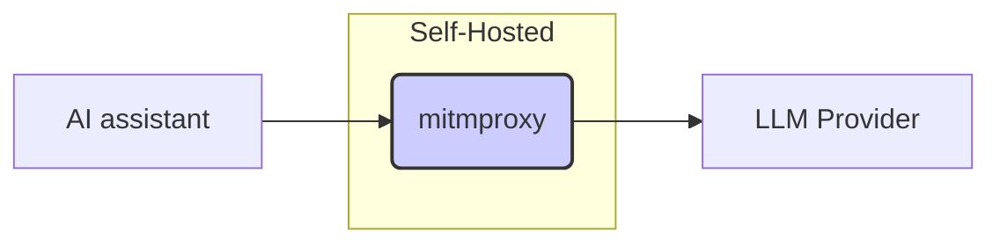

The allure of AI coding assistants like [Zed](https://zed.dev/) is undeniable. They promise streamlined workflows and enhanced productivity, but their inner workings often remain shrouded in mystery. 
This article details how to reverse engineer Zed's LLM client using `mitmproxy`, providing insights into its System prompt, prompting strategies and API interactions with LLM providers.


### Motivation

Before integrating any AI tool deeply into our workflow, understanding its underlying mechanisms is crucial. All existent AI assistants abstract away the complexities of prompt engineering, which simplifies our lifes as end user as we won't need to craft sophisticated prompts to get the outcome we wants.
But not understanding the inner working of these assitants, we end up relying on a complex system without fully grasping its process and logic, hindering our ability to optimize or troubleshoot effectively. 

Enter the realm of HTTP(s) proxies, just like any networked-program, in fact by simply intercepting and observing the API calls made by the assistant, we can demystify its functionality, assess its efficiency, and potentially identify areas for improvement. Furthermore, this allows us to assess:

* **Necessity of the framework:** Is the framework truly essential, or could a simpler approach achieve similar results?
* **Prompt optimization:** Can we craft more efficient or effective prompts than those used by Zed?
* **API call efficiency:** Is the number of API calls made optimal, or are there redundancies?

### Intercepting Zed's API Calls with mitmproxy

`mitmproxy` is a powerful tool for intercepting and inspecting network traffic, including HTTP and HTTPs requests. By setting up `mitmproxy` as a proxy, as depicted in the following diagram, we can capture all of Zed's communication with the LLM provider.



#### Setting Up mitmproxy

1. **Installation:** Follow the installation instructions on the `mitmproxy` website. On MACOS, simply do:

```bash
➜  ~ brew install mitmproxy
```

2. **Interactive UI:** Start the interactive UI by running `mitmweb` in your terminal. Note the URL of the interactive UI (e.g., `http://127.0.0.1:8081/`).

```bash
➜  ~ mitmweb
[10:08:00.911] HTTP(S) proxy listening at *:8080.
[10:08:00.912] Web server listening at http://127.0.0.1:8081/?token=5e67ee3cce6e2a0b49b835323ba71dd6
```

3. **Proxy Configuration:** Configure your system to route traffic through `mitmproxy`, listening on `http://localhost:8080`.

For instance on MACOS, open _System Settings_, in the sidebar click on _Network_, then choose the network you're connectred to on the right panel, and click _Details_, then click _Proxies_.

In the HTTP(s) proxy configuration, set the host to `localhost` and the port to `8080` as depicted below:

{: .center-image }

4. **CA Certificate:** To be able to intercept HTTPS requests, we need to install the `mitmproxy` Certificate Authority (CA) certificate. This certificate is generated as part of the installation of `mitmproxy`, on MACOS it's available under the `~/.mitmproxy` folder. To install it, simply run:

```bash
➜  ~ sudo security add-trusted-cert -d -p ssl -p basic -k /Library/Keychains/System.keychain ~/.mitmproxy/mitmproxy-ca-cert.pem
```

Then you can confirm the certificate was added successfully by checking Keychain Access

{: .center-image }

If you need to setup mitmproxy to intercept HTTP(s) traffic from python programs (e.g. to use with `requests`), you can simply setup the following Environment Variables:

```bash
export REQUESTS_CA_BUNDLE=~/.mitmproxy/mitmproxy-ca-cert.pem
export SSL_CERT_FILE=~/.mitmproxy/mitmproxy-ca-cert.pem
export HTTPS_PROXY="http://127.0.0.1:8080"
```


---

_I hope you enjoyed this article, feel free to leave a comment or reach out on twitter [@bachiirc](https://twitter.com/bachiirc)._
