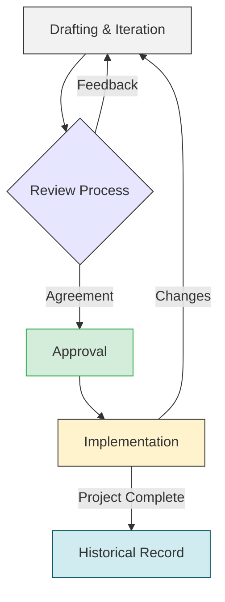

A design document is a technical report that outlines the implementation strategy for a system, detailing it within the context of its trade-offs and constraints. The primary goal is to convince the reader—and, most importantly, yourself—that the proposed design is the optimal solution given the circumstances. The act of writing forces a level of rigor that transforms vague intuitions into a concrete plan.

A well-crafted design document serves as a blueprint for implementation, a communication tool for stakeholders, and a historical record for future teams. This article provides a comprehensive guide to structuring and writing a design document for a production system.

### The Principles of Clarity

Before diving into the structure, let's establish some principles for clear and persuasive technical writing, inspired by the strong writing cultures at tech companies like Amazon.

*   **Write for Your Audience**: Adjust the level of technical detail for your readers. A document for your immediate team can be dense with technical specifics, while a document for leadership should focus more on impact and business goals.
    *   ***Why?***: Tailoring your writing ensures that your message is understood and that you get the right kind of feedback from the right people.

*   **Replace Adjectives with Data**: Instead of saying a system is "fast" or "scalable," quantify it.
    *   ***Why?***: Data provides objective evidence and removes ambiguity, setting clear and measurable goals for the project.
    *   **Before**: The new service will be very fast and significantly more scalable.
    *   **After**: The new service will have a P99 latency of <200ms for up to 10,000 requests per second.

*   **Use Short, Direct Sentences**: Aim for clarity and conciseness. Each sentence should convey a single, clear idea.
    *   ***Why?***: Shorter sentences reduce cognitive load, making the document easier to read and understand. Think subject-verb-object.

*   **Eliminate Weasel Words**: Words like "might," "could," "perhaps," or "it seems" weaken your statements and create uncertainty.
    *   ***Why?***: A design document should be a decisive plan. Be assertive and specific about your proposed solution.
    *   **Before**: It seems like this approach could potentially improve performance.
    *   **After**: This approach will reduce query latency by 50% by introducing a caching layer.

*   **Avoid Jargon and Acronyms**: Write for a broad audience. If you must use a technical term or acronym, define it on its first use.
    *   ***Why?***: Writing for a broad audience makes your document more inclusive and durable as the organization grows and changes.
    *   **Before**: We'll use an ELB to route traffic to the ECS cluster.
    *   **After**: We'll use an Elastic Load Balancer (ELB) to route traffic to the Elastic Container Service (ECS) cluster.

*   **Use an Appendix for Digressions**: If you need to include a complex calculation, a detailed data analysis, or a tangential thought, move it to an appendix. The main body should flow uninterrupted.
    *   ***Why?***: This keeps the main narrative focused and easy to follow, while still making supporting information available to those who need it.

## The Anatomy of a Design Document

A good design document is organized logically, guiding the reader from the problem to the solution without any surprises. The reader should finish the document thinking the proposed solution is the obvious and correct path.

Here is a proven structure that you can adapt for your needs.

---

#### **1. Title and People**

This is the simplest part. Include the title of the project, the author(s), the designated reviewers, and the date of the last update.

*   **Title**: A clear, descriptive name for the project.
*   **Author(s) (Responsible)**: The engineer(s) writing the doc and likely implementing the solution.
*   **Accountable**: The person ultimately answerable for the project's success (e.g., Tech Lead, Engineering Manager).
*   **Reviewer(s) (Consulted)**: Senior engineers, tech leads, or stakeholders who will provide feedback.
*   **Last Updated**: The date the document was last meaningfully changed.

---

#### **2. Overview**

A high-level summary (three paragraphs max) that any engineer in the company can understand. It should briefly describe the problem, the proposed solution, and the impact. Its purpose is to help readers decide if they need to read the rest of the document.

---

#### **3. Context and Problem Statement**

Describe the current situation and the problem you are trying to solve. Why is this project necessary *now*? This section should clearly articulate the pain points or opportunities. It should connect the project to broader technical strategies, product roadmaps, or team goals.

---

#### **4. Goals and Non-Goals**

This section sets clear expectations and defines the project's boundaries.

*   **Goals**:
    *   Describe the user-driven impact. The "user" could be an end-user, another engineering team, or even another system.
    *   Define measurable success metrics. For example, "Reduce database CPU utilization by 30%" or "Achieve a 99.9% uptime for the new service." Link to dashboards if they exist.
*   **Non-Goals**:
    *   Be explicit about what this project will **not** address. This is crucial for managing scope and preventing misunderstandings. For instance, "This project will not address the user interface redesign" or "We will not be deprecating the legacy V1 API in this phase."

---

#### **5. Existing Solution (As-is Architecture)**

Describe the current system and how it works. Use a simple user story or a data flow example to illustrate the current state. A high-level architecture diagram is highly effective here. This helps ground the reader in the present before you introduce changes.

---

#### **6. Proposed Solution (To-be Architecture)**

This is the core of your document. You should provide enough detail for another engineer to read it and implement the solution without you. Use diagrams, user stories, and clear explanations.

Start with the big picture and then drill down into the details. Consider these subsections:

*   **High-Level Architecture**: A diagram showing the new components and their interactions with existing systems.
*   **API Specifications**: Define the contracts for any new or modified APIs. Specify endpoints, request/response formats (e.g., OpenAPI/Swagger snippets), and authentication mechanisms.
*   **Data Model**: Describe the database schema. Include tables, columns, data types, and relationships. For NoSQL databases, describe the document structure and access patterns.
*   **Core Logic**: Detail any complex algorithms, state transitions, or business logic. Pseudocode can be useful here.
*   **Data Flow**: Walk through how data moves through the system for key use cases. For example, "When a user requests a password reset, the `AuthService` generates a token, stores a hashed version in Redis with a 24-hour TTL, and sends the original token to the `NotificationService`."

---

#### **7. Alternative Solutions Considered**

To demonstrate rigor, you must show that you've considered other options. A good practice is to "steel-man" the alternatives—that is, to represent them in their strongest possible form. This demonstrates intellectual honesty and ensures the chosen solution is truly the best one, not just the one you initially favored.

*   **Alternative 1: [Name]**: Briefly describe the alternative.
    *   *Pros*: What are the benefits of this approach?
    *   *Cons*: What are the drawbacks? Why was it not chosen?
*   **Alternative 2: Build vs. Buy**: Did you consider using a third-party service or open-source software instead of building a custom solution? Analyze the trade-offs in terms of cost, features, and operational overhead.

---

#### **8. Cross-Cutting Concerns**

This section addresses the operational realities of running a system in production.

*   **Security**: How does the design prevent common vulnerabilities (e.g., OWASP Top 10)? How is data encrypted at rest and in transit? What are the authentication and authorization strategies?
*   **Data Privacy**: Does this design handle user data? If so, what personally identifiable information (PII) is stored, and how are we protecting it, managing user consent, and complying with regulations like GDPR or CCPA?
*   **Scalability and Performance**: What are the expected load and performance targets (e.g., RPM, latency)? How will the system scale?
*   **Reliability and Availability**: What are the SLOs (Service Level Objectives)? How does the design handle failures? Is there a disaster recovery plan?
*   **Testability**: How will the system be tested? Describe the strategy for unit, integration, and end-to-end testing.
*   **Monitoring and Alerting**: What are the key metrics that will be monitored (the four golden signals: latency, traffic, errors, saturation)? What conditions will trigger an alert?
*   **Deployment Plan**: How will this be released? Will it use feature flags? A phased rollout? What is the rollback plan if things go wrong?
*   **Cost**: Estimate the operational cost of the new system (e.g., servers, databases, third-party services).

---

#### **9. Open Questions**

Be transparent about what you don't know. List any open issues, known unknowns, or contentious decisions you'd like readers to weigh in on. This is also a good place to list potential future work that is out of scope for the current project.

---

## The Lifecycle of a Design Document

A design document is not a static artifact that is written once and then archived. It is a dynamic tool that evolves with the project. Understanding its lifecycle helps set expectations and makes the process more effective.

*   **Drafting & Iteration**: The first draft is rarely perfect. It's a starting point for discussion and clarification. Expect to go through several revisions as you refine your ideas, gather more data, and respond to initial feedback. The goal of the initial phase is to create a solid foundation for a productive review.

*   **The Review Process**: The review is where the design is pressure-tested. Start with a small, trusted group of reviewers (e.g., your immediate team or tech lead) to catch major issues early. Once the document is in a more stable state, expand the review to a wider audience of stakeholders, including other teams that might be impacted, security experts, and senior engineers.

*   **Approval**: "Approval" doesn't mean the design is frozen forever. It signifies that the key stakeholders have reviewed the document, their major concerns have been addressed, and they agree that the proposed path is a reasonable one to take. It is an agreement to proceed with implementation, with the shared understanding that minor details may change as new information emerges.

*   **A Living Document**: During implementation, the design document should be updated to reflect any significant changes or decisions made. This keeps it relevant and useful for the team. After the project is complete, the document becomes an invaluable historical record. It provides context for future engineers who will work on the system, explaining the "why" behind the design and the trade-offs that were made.

---

A great design document is more than a project blueprint; it's a tool for thinking. The process of writing it forces you to clarify your ideas, anticipate challenges, and align your team. By focusing on clarity and embracing a structured approach, you can create documents that not only guide implementation but also build a shared understanding and lead to better engineering outcomes.

_I hope you enjoyed this article. Feel free to leave a comment or reach out on twitter [@bachiirc](https://twitter.com/bachiirc)._
