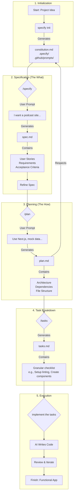

[Spec-driven development](https://github.blog/ai-and-ml/generative-ai/spec-driven-development-using-markdown-as-a-programming-language-when-building-with-ai/) is a methodology that emphasizes on defining a detailed specification for an application or feature before writing any code. This approach involves providing a Large Language Model (LLM) with a comprehensive set of instructions, constraints, and goals. Then, the LLM uses this "spec" to generate the application code, ensuring the final product aligns with the initial vision.
The core idea is that you spend upfront some amount of time to go and define that and then have the LLM build exactly what you wanted per specification.

[Spec Kit](`github.com/github/spec-kit`) is an open-source tool developed at Microsoft and designed to facilitate the Spec-driven development process. It provides a set of templates and a command-line interface (CLI) called `specify` to structure and streamline the creation of these specifications.

The rest of this article walks through how to leverage **Spec Kit** with VS Code to build a simple web application.

### Core Components of the Spec Kit Approach

The Spec Kit methodology is built around four key prompting documents, each serving a distinct purpose in guiding the AI.

*   **Constitution.md:** This document establishes the "non-negotiable principles" and constraints for your project. It's where you define the foundational rules that the AI must follow in every task.
*   **Spec.md:** This is the feature specification, analogous to a Product Requirements Document (PRD). It focuses on the **what** and the **why** of the feature you are building, not the technical implementation. It is generated and maintained by the `/specify` command.
*   **Plan.md:** The plan translates the "what" and "why" from the spec into the **how**. It outlines the technical approach for building the feature, taking into account the rules defined in the constitution. It is generated and maintained by the `/plan` command.
*   **Tasks.md:** This final document breaks down the high-level plan into a series of small, concrete, and actionable tasks for the AI to execute. This granular breakdown is crucial for guiding the AI effectively.It is generated and maintained by the `/tasks` command.


### Spec Kit Workflow Diagram

The diagram below illustrates the different stages of the Spec Kit workflow, from initial idea to a functional application. Each stage builds upon the previous one, and as such creating a clear and structured path for the AI to follow.

1.  **Initialization**: The process begins with a project idea. You run `specify init`, which bootstraps a project by creating the foundational documents from a set of templaces. Most importantly, it generates `constitution.md`, the document that will contain the core principles and constraints for the AI, along with configuration files in the `.specify/` and `.github/prompts/` directories.

2.  **Specification (The What)**: Next, you define the feature's requirements using the `/specify` command. You provide a high-level prompt describing what you want to build (e.g., "I want a podcast site..."). This generates `spec.md`, which details the user stories, functional requirements, and acceptance criteria. This document is a living blueprint that you can refine until it accurately captures the feature's purpose.

3.  **Planning (The How)**: The next step is to create a technical plan. Using the `/plan` command, you provide technical direction (e.g., "Use Next.js, mock data..."). The AI assistant then generates `plan.md`, a technical document that outlines the architecture, dependencies, and file structure. Crucially, this plan must adhere to the rules established in the `constitution.md`.

4.  **Task Breakdown**: With the "what" and "how" defined, the `/tasks` command is used to break down the technical plan into a series of small, actionable steps. This generates `tasks.md`, which serves as a granular checklist for the AI. This file lists concrete actions like "Set up linting" or "Create UI components," providing a clear, step-by-step path for implementation.

5.  **Execution**: Finally, you instruct the AI assistant to `implement the tasks` and it will follow the checklist in `tasks.md` to write code. This stage is iterative; you review the generated code, provide feedback, and repeat until the application is complete and meets all the requirements outlined in the `spec.md`.




This structured workflow ensures that the final application is a direct translation of the initial specification, guided by a consistent set of principles and a well-defined technical plan.

### A Practical Example

This section walks through a practical example of using Spec Kit with an AI assistant (like GitHub Copilot) to build a web application (a podcast landing page) from scratch.

#### 1. Installation and Initialization

First, install the `specify` CLI and initialize a project with `uvx specify init "pod site"`. This will start an interactive setup, prompting the selection of an AI assistant of choice (e.g., Copilot) and helper script language (e.g., PowerShell or Bash).
It will then scaffolds the necessary template files in the new project, including the `.specify` and `.github/prompts` directories.

{: .center-image }


#### 2. Define Your Constitution
One of the important files generated by the setup is the `constitution.md`, under the `.specify/memory` folder which, establishes the project's non-negotiable principles. These principles will guide the AI assistant with subsequent code generation and thus must be updated to match the project purpose.

But instead of editing it manually, you can leverage the AI assistant to edit it by prompting it with something like

```
Let's update this constitution for a web application set of constraints.
```

The AI assistant takes this prompt and updates the constitution with rules that are more suitable for a web application, e.g. "User-Centric & Accessibility First" and "Secure by Design."


#### 3. Specify Your Feature

Next, use the `/specify` command to create a feature specification, focusing on the *what* and *why*, not the *how*. For example:

```
/specify I am building a podcast landing page for VS Code Insider. Make it modern, dark theme, use featured speackers on the main page for featured conversations. Allow discovery of related episodes once I go to the Episodes page. Every episode page has detailed transcript (mock that data) and there should be at least 20 mock episodes.
```

This will make the AI assistant create a new `specs/` folder with a subfolder named after the feature (e.g. `001-i-am-building`) and generates a `spec.md` file within it. This document includes sections for user stories, functional requirements, and acceptance criteria.

Note that the generated file may contain `[NEEDS CLARIFICATION]` markers for ambiguities. Before going any further, such ambiguities need to be addressed. You can ask the AI assistant to refining the `spec.md` and resolve these ambiguities. For example, by prompting:

```
Fill in the clarification items as best as you think
```

or

```
Review the acceptance checklist and then update it in the spec
```

The AI assistant will then update the spec, making reasonable assumptions to create a more robust document. Such further review can add crucial sections like "Out of Scope," "Success Metrics," and "Risks", making the spec even clearer.


#### 4. Create a Technical Plan

Once the specs are finalized, use the `/plan` command to translate them into a technical blueprint. This is where you define the *how*. For example, use the prompt:

```
/plan use Next.js, all data is mocked - no database or auth
```

The assistant will then generate a `plan.md` and `research.md` files, which detail the technical architecture, project structure, dependencies (e.g. Next.js, TypeScript), and testing strategies, all while respecting the rules laid out in the constitution.


#### 5. Break Down the Plan into Tasks

Next, use the `/tasks` command to break down the previous plan into a granular, actionable checklist for the AI assistant to implement. Example prompt:

```
/tasks break down the plan into tasks
```

The assistant will analyze the `plan.md` and generate a `tasks.md` file containing a series of small, concrete steps, and ordered with dependencies in mind, e.g., "Set up linting," "Create failing test stubs for components," "Implement core data structures," "Build UI components".


#### 6. Execute and Review

Finally, instruct the AI assistant to start working on the implementation by prompting it with:

```
implement the tasks
```

The assistant will follow the `tasks.md` checklist, writing code, creating files, and building the application step-by-step. In our example application, it will scaffold a complete Next.js application, including components, pages, tests, and mock data, turning the detailed specification into a functional podcast website.

Note: the process is iterative; you can review the AI's work, provide feedback, and guide it until the final product meets the requirements defined in the spec.


### Benefits of the Spec Kit Approach

*   **Consistency and Standardization:** By defining a constitution, you can enforce standards across hundreds of apps in an organization, enabling engineers to move between projects without having to "relearn brand new tech stacks."
*   **Flexibility and Reusability:** The separation of the spec (what) from the plan (how) is powerful. If your team decides to move from React to ASP.NET Core, "you're not rewriting your spec your spec is the same... what changes is the how." You can reuse the same spec to generate a completely different implementation.
*   **Improved Collaboration:** The spec becomes a "living breathing document that you can use and your team can then refer to" as the single source of truth for a feature's purpose and functionality.
*   **Efficient Development:** While it requires upfront planning, this structured approach avoids the pitfalls of "yolo spec driven development." The granular tasks help "steer it in the right direction" from the start, minimizing time spent fixing incorrect assumptions made by the AI.

### Conclusion

The Spec Kit methodology provides a powerful framework for leveraging AI in software development. By separating concerns into a constitution, spec, plan, and tasks, it creates a structured, repeatable, and scalable process. As demonstrated, this approach allows you to guide an AI assistant to build a complete, well-architected application that aligns precisely with your vision, turning a high-level idea into functional code with remarkable efficiency.

---

_I hope you enjoyed this article, feel free to leave a comment or reach out on twitter [@bachiirc](https://twitter.com/bachiirc)._
