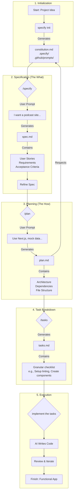

[Spec-driven development](https://github.blog/ai-and-ml/generative-ai/spec-driven-development-using-markdown-as-a-programming-language-when-building-with-ai/) is a methodology that emphasizes on defining a detailed specification for an application or feature before writing any code. This approach involves providing a Large Language Model (LLM) with a comprehensive set of instructions, constraints, and goals. Then, the LLM uses this "spec" to generate the application code, ensuring the final product aligns with the initial vision.
The core idea is that you spend upfront some amount of time to go and define that and then have the LLM build exactly what you wanted per specification.

[Spec Kit](`github.com/github/spec-kit`) is an open-source tool developed at Microsoft and designed to facilitate the Spec-driven development process. It provides a set of templates and a command-line interface (CLI) called `specify` to structure and streamline the creation of these specifications.

The rest of this article walks through how to leverage **Spec Kit** with VS Code to build a simple web application.

### Core Components of the Spec Kit Approach

The Spec Kit methodology is built around four key prompting documents, each serving a distinct purpose in guiding the AI.

*   **Constitution.md:** This document establishes the "non-negotiable principles" and constraints for your project. It's where you define the foundational rules that the AI must follow in every task.
*   **Spec.md:** This is the feature specification, analogous to a Product Requirements Document (PRD). It focuses on the **what** and the **why** of the feature you are building, not the technical implementation. It is generated and maintained by the `/specify` command.
*   **Plan.md:** The plan translates the "what" and "why" from the spec into the **how**. It outlines the technical approach for building the feature, taking into account the rules defined in the constitution. It is generated and maintained by the `/plan` command.
*   **Tasks.md:** This final document breaks down the high-level plan into a series of small, concrete, and actionable tasks for the AI to execute. This granular breakdown is crucial for guiding the AI effectively.It is generated and maintained by the `/tasks` command.


### Spec Kit Workflow Diagram

The diagram below illustrates the different stages of the Spec Kit workflow, from initial idea to a functional application. Each stage builds upon the previous one, and as such creating a clear and structured path for the AI to follow.

1.  **Initialization**: The process begins with a project idea. You run `specify init`, which bootstraps a project by creating the foundational documents from a set of templaces. Most importantly, it generates `constitution.md`, the document that will contain the core principles and constraints for the AI, along with configuration files in the `.specify/` and `.github/prompts/` directories.

2.  **Specification (The What)**: Next, you define the feature's requirements using the `/specify` command. You provide a high-level prompt describing what you want to build (e.g., "I want a podcast site..."). This generates `spec.md`, which details the user stories, functional requirements, and acceptance criteria. This document is a living blueprint that you can refine until it accurately captures the feature's purpose.

3.  **Planning (The How)**: The next step is to create a technical plan. Using the `/plan` command, you provide technical direction (e.g., "Use Next.js, mock data..."). The AI assistant then generates `plan.md`, a technical document that outlines the architecture, dependencies, and file structure. Crucially, this plan must adhere to the rules established in the `constitution.md`.

4.  **Task Breakdown**: With the "what" and "how" defined, the `/tasks` command is used to break down the technical plan into a series of small, actionable steps. This generates `tasks.md`, which serves as a granular checklist for the AI. This file lists concrete actions like "Set up linting" or "Create UI components," providing a clear, step-by-step path for implementation.

5.  **Execution**: Finally, you instruct the AI assistant to `implement the tasks` and it will follow the checklist in `tasks.md` to write code. This stage is iterative; you review the generated code, provide feedback, and repeat until the application is complete and meets all the requirements outlined in the `spec.md`.




This structured workflow ensures that the final application is a direct translation of the initial specification, guided by a consistent set of principles and a well-defined technical plan.

### A Practical Example

This section walks through a practical example of using Spec Kit with an AI assistant (like GitHub Copilot) to build a web application (a podcast landing page) from scratch.

#### 1. Installation and Initialization

First, install the `specify` CLI and initialize a project with `uvx specify init "pod site"`. This will start an interactive setup, prompting the selection of an AI assistant of choice (e.g., Copilot) and helper script language (e.g., PowerShell or Bash).
It will then scaffolds the necessary template files in the new project, including the `.specify` and `.github/prompts` directories.

{: .center-image }


#### 2. Define Your Constitution
One of the important files generated by the setup is the `constitution.md`, under the `.specify/memory` folder which, establishes the project's non-negotiable principles. These principles will guide the AI assistant with subsequent code generation and thus must be updated to match the project purpose.

But instead of editing it manually, you can leverage the AI assistant to edit it by prompting it with something like

```
Let's update this constitution for a web application set of constraints.
```

The AI assistant takes this prompt and updates the constitution with rules that are more suitable for a web application, e.g. "User-Centric & Accessibility First" and "Secure by Design."


#### 3. Specify Your Feature

Next, use the `/specify` command to create a feature specification, focusing on the *what* and *why*, not the *how*. For example:

```
/specify I am building a podcast landing page for VS Code Insider. Make it modern, dark theme, use featured speackers on the main page for featured conversations. Allow discovery of related episodes once I go to the Episodes page. Every episode page has detailed transcript (mock that data) and there should be at least 20 mock episodes.
```

This will make the AI assistant create a new `specs/` folder with a subfolder named after the feature (e.g. `001-i-am-building`) and generates a `spec.md` file within it. This document includes sections for user stories, functional requirements, and acceptance criteria.

Note that the generated file may contain `[NEEDS CLARIFICATION]` markers for ambiguities. Before going any further, such ambiguities need to be addressed. You can ask the AI assistant to refining the `spec.md` and resolve these ambiguities. For example, by prompting:

```
Fill in the clarification items as best as you think
```

or

```
Review the acceptance checklist and then update it in the spec
```

The AI assistant will then update the spec, making reasonable assumptions to create a more robust document. Such further review can add crucial sections like "Out of Scope," "Success Metrics," and "Risks", making the spec even clearer.


#### 4. Create a Technical Plan

Once the specs are finalized, use the `/plan` command to translate them into a technical blueprint. This is where you define the *how*. For example, use the prompt:

```
/plan use Next.js, all data is mocked - no database or auth
```

The assistant will then generate a `plan.md` and `research.md` files, which detail the technical architecture, project structure, dependencies (e.g. Next.js, TypeScript), and testing strategies, all while respecting the rules laid out in the constitution.

Example generated `plan.md`:

<div style="height: 500px; overflow-y: auto; padding: 1em; border: 1px solid #ccc;"  markdown="1">

# Implementation Plan: VS Code Insider Podcast Landing (Next.js, Mock Data Only)

Status: Ready (Constraints validated; ticketization may proceed)
Branch: 001-i-am-building
Scope Constraints: No database, no authentication, all content mocked in-repo; production readiness limited to static showcase & UX validation.

Constraint Confirmation:
- Framework: Next.js (App Router)
- Data Source: Static JSON committed to repo (no remote fetch)
- Auth: None (anonymous-only experience)
- Persistence: None (no runtime writes, no DB)
- Deployment Mode: Static Generation (eligible for `next export`)
- Security Surface: Read-only static assets + client-side filtering

---
## 1. Goals & Success Alignment
| Goal | Spec Reference | Success Metric Link |
|------|----------------|---------------------|
| Landing showcases featured conversations rapidly | FR-001, FR-002 | First visual content <1.5s, skeleton <150ms |
| Discoverability of catalog | FR-005, FR-017 | ≥20 episodes; filter/sort latency <250ms |
| Deep engagement via transcripts + related | FR-007–FR-010, FR-019 | Related or fallback on 100% details; transcript expansion threshold enforced |
| Accessibility & dark theme fidelity | FR-001, FR-014, FR-024/025 | Contrast passes axe; keyboard traversal full coverage |
| Exploration continuity | FR-015 | Back-stack preserved and functional |

---
## 2. Architectural Approach (Mock-Only)
- Framework: Next.js (App Router) + TypeScript.
- Rendering Strategy:
  - `app/page.tsx` (Landing): **Static Generation** (build-time) pulling mock JSON.
  - `app/episodes/page.tsx` (Episodes Listing): Static Generation.
  - `app/episodes/[slug]/page.tsx`: Static Generation with `generateStaticParams` for all episode slugs.
  - No client-side fetching of mock data except for interactive filtering/sorting (in-memory state).
- Data Source: Versioned JSON files under `app/_data/` or `data/` (decide: use `data/`).
  - Single `episodes.json` containing array of Episode objects.
  - Derived maps (byTag, bySpeaker) computed at build time in a helper (`lib/catalog.ts`).
- Theming: CSS variables (prefixed `--color-*`) in a global stylesheet; dark theme only; structure for possible future light theme.
- State Management: Local component state (React hooks) for filters, no global store.
- Routing: Conventional Next.js segment structure; accessible breadcrumbs (ARIA nav) for episode detail.

---
## 3. Data Model (Static JSON)
Episode object (aligns with spec):
```
{
  "slug": "ep-001-getting-productive",
  "title": "Getting Productive in VS Code",
  "shortSummary": "Key habits and insider tips to accelerate setup.",
  "longDescription": "Extended overview paragraph ...",
  "publishDate": "2025-08-14",
  "durationMinutes": 34,
  "speakers": ["Alex Rivera", "Chen Li"],
  "primarySpeaker": "Alex Rivera",
  "tags": ["productivity", "tips"],
  "featured": true,
  "transcriptSegments": [
    { "index": 0, "text": "Intro text ..." },
    { "index": 1, "text": "Discussion continues ..." }
  ]
}
```
Rules enforced by build helper:
- At least 20 items.
- ≥3 and ≤6 episodes where `featured=true` with distinct `primarySpeaker`.
- Transcript expansion threshold logic (segments >6 or word count >600 flagged for collapse).
- Pre-compute related episodes for each slug (store as `relatedSlugs` array OR compute on the fly).

---
## 4. Component Inventory
| Component | Purpose | Key Props | Ties To |
|-----------|---------|-----------|---------|
| `FeaturedConversations` | Landing hero secondary section showcasing curated episodes | episodes[] | FR-002/003 |
| `EpisodeCard` | Reusable summary card | episode | FR-005/006 |
| `EpisodeList` | Listing grid + filters | episodes, filterState | FR-005/017 |
| `FiltersBar` | Tag + Speaker + Sort controls | tags, speakers, onChange | FR-017 |
| `Transcript` | Collapsible transcript render | segments, collapsedDefault | FR-008/019/021 |
| `RelatedEpisodes` | Side/below-the-fold recommendations | currentSlug, relatedEpisodes | FR-009/010/022 |
| `ThemeWrapper` | Provides CSS variables & layout shell | children | FR-001/014 |
| `NavigationBar` | Global nav to Landing / Episodes | currentPath | FR-004/012 |
| `Breadcrumbs` | Episode detail context | trail[] | FR-012 |
| `Skeleton*` (Card, Transcript, Hero) | Loading placeholders | variant | FR-016 |
| `A11ySkipLink` | Skip to main content | targetId | Accessibility |

---
## 5. Pages & Layout Structure
```
app/
  layout.tsx            # Global layout + ThemeWrapper + SkipLink
  globals.css           # CSS reset + variables
  page.tsx              # Landing (hero + FeaturedConversations + RecentEpisodes subset)
  episodes/
    page.tsx            # Episodes listing + FiltersBar + EpisodeList
    [slug]/
      page.tsx          # Episode detail: metadata, Transcript, RelatedEpisodes
  _components/          # All components above
  _data/
    episodes.json       # Source of truth (20+ episodes)
  lib/
    catalog.ts          # Data loading, indexing, related derivation
    filters.ts          # Filter & sort helpers
    transcript.ts       # Expansion logic utilities
    a11y.ts              # ARIA helper constants
```

---
## 6. Related Episodes Algorithm
Implementation (pure function in `catalog.ts`):
1. Compute overlap score = shared tags count.
2. Boost if shared speaker (add +1 virtual tag weight).
3. Sort by overlap desc → publishDate desc → title asc.
4. Exclude current slug; slice top 3. If <3 results, fallback to most recent excluding current (ensuring uniqueness, not duplicating already selected).

---
## 7. Filtering & Sorting (Client-Side Only)
- Tag filter: single-select dropdown (default: All).
- Speaker filter: single-select dropdown (default: All).
- Sort: radio group or dropdown (Newest | Oldest). Default: Newest.
- In-memory: Starting dataset from `episodes.json` imported statically; filtering logic runs instantly (<250ms target for 20 items, trivial).

---
## 8. Transcript Handling
- Collapse condition: wordCount > 600 OR segments.length > 6.
- Render first 3 segments when collapsed; provide button (aria-expanded) toggling full view.
- Maintain focus management: on expand, focus heading of transcript region; on collapse, return focus to toggle.

---
## 9. Theming & Styling
- Global CSS variables: background tiers, text colors, accent, spacing scale (4px multiple).
- Typography scale (1.25 modular): map to h1–h6 & body.
- Skeletons: subtle animated opacity pulse (prefers-reduced-motion: disable animation).
- Focus states: 2px outline offset, accessible color meeting ≥3:1 contrast.

---
## 10. Accessibility Plan
| Item | Approach |
|------|----------|
| Landmark regions | <header>, <nav>, <main>, <aside>, <footer> |
| Skip link | Visible on focus (top of DOM) |
| Carousel / Featured section | If interactive, use roving tabindex; else static list |
| Images | `alt` speaker name + role snippet |
| Transcript | Region labeled via `aria-labelledby` referencing heading |
| Filters | `<fieldset>` + `<legend>` grouping; keyboard focus order logical |
| Color contrast | Pre-check with design tokens; CI axe scan (optional later) |

---
## 11. Performance & Observability (Mock Phase)
- Add `performance.mark()` for: `landing-skeleton`, `landing-first-content`, `detail-transcript-mounted` (optional dev-only logging).
- Validate with Lighthouse locally (document results). No runtime analytics instrumentation v1.

---
## 12. Testing Strategy
| Layer | Tooling (Suggestion) | Coverage |
|-------|----------------------|----------|
| Unit | Vitest / Jest | catalog derivation, filters, transcript logic |
| Component | React Testing Library | Transcript collapse, RelatedEpisodes fallback |
| E2E (optional) | Playwright | Landing load, filter interactions, slug navigation |
| A11y (passive) | Axe (jest-axe) | Landmark & color contrast assertions (where possible) |

Test Cases (sample):
- `catalog.relatedEpisodes()` returns 3 when possible else fallback message condition flagged.
- Transcript short (<600 words) → no toggle.
- Fallback related: only one overlapping tag → still surfaces 1 + fallback recents.
- Filter Tag + Sort Oldest interplay order correct.
- Featured uniqueness: no duplicate primarySpeaker cards.

---
## 13. Incremental Delivery Phases
1. Foundation: Scaffold Next.js app, global layout, theming tokens, import episodes JSON.
2. Data & Helpers: Implement `catalog.ts`, related logic, transcript utilities, baseline tests.
3. Landing Page: Hero + FeaturedConversations + Recent episodes subset + skeleton states.
4. Episodes Listing: FiltersBar + EpisodeList + sorting + accessibility review.
5. Episode Detail: Metadata, Transcript (collapse), RelatedEpisodes, breadcrumbs.
6. Polish: Performance marks, keyboard / screen reader refinements, finalize dark theme tokens.
7. QA Pass: Run test suite, manual a11y traversal, success metrics validation checklist.

---
## 14. Ticket Backlog (Initial Breakdown)
| Ticket | Summary | FR Link |
|--------|---------|--------|
| T-001 | Scaffold Next.js + TypeScript + layout & theme vars | FR-001/014 |
| T-002 | Add episodes.json (20+), validate constraints script | FR-005/019 |
| T-003 | Implement catalog utilities (indexing, related ranking) | FR-009/010/022 |
| T-004 | FeaturedConversations component with uniqueness rule | FR-002/023 |
| T-005 | EpisodeCard + basic metadata rendering | FR-005/006 |
| T-006 | Landing page assembly + recent slice logic | FR-001/002/005 |
| T-007 | FiltersBar + single Tag/Speaker + sort logic | FR-017 |
| T-008 | EpisodeList interaction tests | FR-005/017 |
| T-009 | Episode Detail page skeleton + metadata + navigation | FR-007/012 |
| T-010 | Transcript component collapse/expand logic | FR-008/019/021 |
| T-011 | RelatedEpisodes module + fallback message | FR-009/010 |
| T-012 | Accessibility enhancements (skip link, landmarks, focus) | FR-024/025 |
| T-013 | Loading skeleton components (cards, transcript) | FR-016 |
| T-014 | Performance marks & timing validation | FR-001 metrics |
| T-015 | Test suite (unit + component + minimal e2e) | All core FRs |
| T-016 | Success metrics validation checklist artifact | Metrics Section |

---
## 15. Risks & Contingencies (Implementation Focus)
| Risk | Contingency |
|------|------------|
| Over-fitting mock data for related logic | Add deliberate low-overlap episode to test fallback |
| Transcript size bloat in bundle | Load transcripts inline (acceptable for mock) – revisit if >500KB total |
| CSS specificity creep | Restrict to component-level scoped styles & utility classes |

---
## 16. Definition of Done (Per Phase)
- All mapped FRs implemented & tested.
- Success Metrics table items validated & recorded in a `VALIDATION.md` or README section.
- No unresolved a11y issues (keyboard path + axe assertions pass).
- Static export (optional) builds successfully (`next build`).
- Lighthouse run captured (manual doc) showing initial content <1.5s (local baseline).

---
## 17. Future Extensions (Not in V1)
- Audio streaming & playback continuity
- Episode search (title + transcript indexing)
- Multi-select and free-text filtering
- CMS integration for dynamic content
- Light theme + theme toggle
- Popularity-based recommendations
- Analytics dashboards & event instrumentation

---
## 18. Open Questions (Currently Deferred – intentionally fixed for V1)
None (all prior clarifications resolved in spec). Future additions require spec amendment.

---
Prepared for implementation. Proceed by generating project scaffold and starting with T-001.

</div>

#### 5. Break Down the Plan into Tasks

Next, use the `/tasks` command to break down the previous plan into a granular, actionable checklist for the AI assistant to implement. Example prompt:

```
/tasks break down the plan into tasks
```

The assistant will analyze the `plan.md` and generate a `tasks.md` file containing a series of small, concrete steps, and ordered with dependencies in mind, e.g., "Set up linting," "Create failing test stubs for components," "Implement core data structures," "Build UI components".

Example generated `tasks.md`:

<div style="height: 500px; overflow-y: auto; padding: 1em; border: 1px solid #ccc;"  markdown="1">

    # Tasks: VS Code Insider Podcast Landing (Mock Next.js)

    **Input**: Design documents from `/specs/001-i-am-building/` (plan.md)
    **Prerequisites**: plan.md (available). No data-model.md, contracts/, or research.md present. All endpoints are static pages (no API contracts). All data mocked.

    ## Execution Flow (main)
    ```
    1. Load plan.md (done)
    2. No optional docs → skip contract/entity extraction (entities inferred from plan Episode model)
    3. Generate tasks: Setup → Tests (failing first) → Core Components → Pages → Integration (a11y/perf) → Polish
    4. Apply rules: Different files → [P]; same file sequence unmarked
    5. Number tasks (T001..)
    6. Provide dependency graph + parallel batches
    7. Validate completeness (entities, user journeys covered by integration tests)
    8. Return SUCCESS
    ```

    ## Format: `[ID] [P?] Description`
    [P] indicates can run in parallel (distinct files / no dependency).

    ## Phase 1: Setup
    - [ ] T001 Initialize Next.js + TypeScript project structure (already scaffolded) – verify `package.json`, `tsconfig.json`, `next.config.mjs` match plan.
    - [ ] T002 Add lint & type scripts enforcement (ESLint config extension if needed) in `.eslintrc.json` and ensure `npm run lint` passes.
    - [ ] T003 [P] Add basic Vitest + RTL test setup in `tests/setup.ts` (jest-dom, axe optional comment) & update `package.json` test script.
    - [ ] T004 [P] Add `tests/README.md` documenting test layers (unit, component, a11y) referencing plan section 12.

    ## Phase 2: Tests First (TDD) – MUST FAIL INITIALLY
    Integration stories (derived from Acceptance Scenarios & FRs) before implementing missing logic.
    - [ ] T005 Create integration test: landing shows 3–6 featured unique primary speakers in `tests/integration/landing.featured.test.tsx` (assert uniqueness rule & count range). (FR-002/023)
    - [ ] T006 [P] Integration test: episodes listing shows ≥20 items & default sort newest in `tests/integration/episodes.list.test.tsx` (FR-005/017)
    - [ ] T007 [P] Integration test: filter by single Tag reduces set & resets on clearing in `tests/integration/episodes.filter.tag.test.tsx` (FR-017)
    - [ ] T008 [P] Integration test: filter by Speaker works similarly in `tests/integration/episodes.filter.speaker.test.tsx` (FR-017)
    - [ ] T009 [P] Integration test: episode detail shows transcript + expansion control only when > threshold in `tests/integration/episode.transcript.test.tsx` (FR-008/019/021)
    - [ ] T010 [P] Integration test: related episodes shows 3 or fallback message in `tests/integration/episode.related.test.tsx` (FR-009/010/022)
    - [ ] T011 [P] Integration test: navigation continuity (back stack) from related episode to previous detail in `tests/integration/navigation.explore-continuity.test.tsx` (FR-015)
    - [ ] T012 [P] Accessibility smoke: landmark roles + skip link focus + contrast token presence in `tests/a11y/landing.a11y.test.tsx` (FR-024/025)
    - [ ] T013 [P] Performance marks presence test (mock) verifying `performance.mark` names exist in `tests/integration/perf.marks.test.ts` (Metrics / FR-001)

    ## Phase 3: Core Data & Utilities (after failing tests exist)
    - [ ] T014 Implement catalog utilities & indexing in `lib/catalog.ts` (overlap scoring, related fallback) – ensure tests start passing for related logic.
    - [ ] T015 [P] Implement filter helpers in `lib/filters.ts` including sort logic (newest/oldest) & tag/speaker single-select.
    - [ ] T016 [P] Implement transcript helper in `lib/transcript.ts` (isCollapsible) enforcing thresholds.
    - [ ] T017 Validate dataset rules via a script `scripts/validate-episodes.mjs` (counts, featured uniqueness, threshold flags) and add `npm run validate:data`.

    ## Phase 4: Components (UI Building Blocks)
    - [ ] T018 Create `app/_components/EpisodeCard.tsx` (card metadata layout) – test reuse via integration tests.
    - [ ] T019 [P] Create `app/_components/FeaturedConversations.tsx` (filters featured & uniqueness) per FR-002/023.
    - [ ] T020 [P] Create `app/_components/FiltersBar.tsx` (tag, speaker, sort controls) per FR-017.
    - [ ] T021 [P] Create `app/_components/Transcript.tsx` (collapse/expand, focus restore) per FR-008/019/021.
    - [ ] T022 [P] Create `app/_components/RelatedEpisodes.tsx` (3 or fallback) per FR-009/010.
    - [ ] T023 [P] Create skeleton components (EpisodeCardSkeleton, TranscriptSkeleton, FeaturedSkeleton) in `app/_components/skeletons/` per FR-016.

    ## Phase 5: Pages & Layout
    - [ ] T024 Assemble landing `app/page.tsx` (hero, FeaturedConversations, recent episodes slice) per FR-001/002/005.
    - [ ] T025 [P] Assemble episodes listing `app/episodes/page.tsx` using FiltersBar + EpisodeCard grid per FR-005/017.
    - [ ] T026 Assemble episode detail `app/episodes/[slug]/page.tsx` (metadata, transcript, related) per FR-007/008/009/010/019.
    - [ ] T027 Add breadcrumbs / navigation continuity enhancements (if not already present) in layout or detail page per FR-012/015.

    ## Phase 6: Integration / Accessibility / Performance
    - [ ] T028 Add performance marks (`landing-skeleton`, `landing-first-content`, `detail-transcript-mounted`) in relevant components.
    - [ ] T029 [P] Accessibility refinements: ensure ARIA labels, roles, and focus visible outlines; update any missing alt text.
    - [ ] T030 [P] Add validation script output documentation `VALIDATION.md` capturing success metrics results.

    ## Phase 7: Polish
    - [ ] T031 Add unit tests for catalog, filters, transcript (word threshold) in `tests/unit/` (FR-009/017/019).
    - [ ] T032 [P] Add component tests for Transcript expand/collapse & Related fallback with jest-axe checks in `tests/component/`.
    - [ ] T033 [P] Add README updates (metrics section + how to run validation) in root `README.md`.
    - [ ] T034 [P] Light refactor pass removing duplication (shared tag rendering) & ensure strict TypeScript passes.
    - [ ] T035 Final accessibility manual checklist & record in `VALIDATION.md`.
    - [ ] T036 Prepare release notes summary in `specs/001-i-am-building/VALIDATION.md` linking back to tasks.

    ## Dependencies
    - T001 → T002/T003/T004
    - Tests (T005–T013) must exist & fail before implementing T014–T026
    - T014 precedes T022 (shared related logic) & T024–T026
    - T015 precedes T020 & T025
    - T016 precedes T021 & T026
    - Components (T018–T022) precede pages T024–T026
    - Skeletons (T023) precede perf marks T028 if marks rely on skeleton mount
    - T028 depends on pages assembled (T024–T026)
    - Polish tasks (T031–T036) depend on prior phases

    ## Parallel Execution Examples
    ```
    # Batch 1 (after T001):
    Task: T002 (lint setup)
    Task: T003 (test harness) [P]
    Task: T004 (tests README) [P]

    # Batch 2 (tests phase – all parallel) after T004:
    Tasks: T005 T006 T007 T008 T009 T010 T011 T012 T013 (all [P])

    # Batch 3 (core utilities) after failing tests present:
    Tasks: T015 T016 (parallel) while T014 starts first (sequential due to catalog central role)

    # Batch 4 (components parallel) after T014–T016:
    Tasks: T019 T020 T021 T022 T023 (parallel) while T018 done first (EpisodeCard dependency)

    # Batch 5 (pages) after component batch:
    Tasks: T024 T025 (parallel) then T026 (needs transcript + related + card) then T027

    # Batch 6 (integration/perf/a11y) after pages:
    Tasks: T028 T029 T030 (parallel)

    # Batch 7 (polish) after integration:
    Tasks: T031 T032 T033 T034 T035 (parallel where file isolation) then T036 last summarizing
    ```

    ## Validation Checklist
    - [ ] All integration tests (T005–T013) authored before implementation files modified
    - [ ] Episode entity covered by catalog + transcript + related logic tasks
    - [ ] No [P] tasks mutate same file concurrently
    - [ ] Success metrics captured in VALIDATION.md (T030, T036)
    - [ ] Accessibility criteria verified (T029, T035)

    ## Notes
    - No API contracts; tasks emphasize UI & data logic.
    - Data model implicit; single `Episode` entity plus derived relationships.
    - Adjust if additional docs (data-model.md, contracts/) are added later.
</div>


#### 6. Execute and Review

Finally, instruct the AI assistant to start working on the implementation by prompting it with:

```
implement the tasks
```

The assistant will follow the `tasks.md` checklist, writing code, creating files, and building the application step-by-step. In our example application, it will scaffold a complete Next.js application, including components, pages, tests, and mock data, turning the detailed specification into a functional podcast website.

Note: the process is iterative; you can review the AI's work, provide feedback, and guide it until the final product meets the requirements defined in the spec.


### Benefits of the Spec Kit Approach

The Spec Kit approach offers several significant benefits, promoting a more structured and efficient development workflow. One of the core advantages is the enforcement of **consistency and standardization**. By defining a constitution, organizations can maintain uniform standards across hundreds of applications. This allows engineers to move between projects seamlessly without the need to relearn different technology stacks and coding conventions.

Another powerful aspect is the **flexibility and reusability** that comes from separating the *what* (the spec) from the *how* (the plan). This distinction means that a feature's specification can remain constant even if the underlying technology changes. For instance, if a team decides to migrate from React to ASP.NET Core, they can reuse the existing spec to generate a new implementation without starting from scratch.

This methodology also fosters **improved collaboration**. The spec serves as a "living, breathing document" that acts as the single source of truth for a feature's requirements and functionality. This ensures that everyone on the team has a shared understanding of the goals and can refer back to a consistent reference point.

Finally, the Spec Kit approach drives **efficient development**. While it requires an upfront investment in planning, this structured process avoids the pitfalls of directionless coding. The granular tasks created from the plan help steer the AI in the right direction from the outset, minimizing the time spent correcting incorrect assumptions and ensuring the final product aligns with the initial vision.

### Conclusion

The Spec Kit methodology provides a powerful framework for leveraging AI assistants in software development. By separating concerns into a constitution, spec, plan, and tasks, it creates a structured, repeatable, and scalable process. As demonstrated here, this approach allows you to guide effectively an AI assistant to build a complete, well-architected application that aligns precisely with your vision.

---

_I hope you enjoyed this article, feel free to leave a comment or reach out on twitter [@bachiirc](https://twitter.com/bachiirc)._
