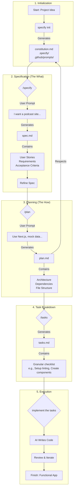

[Spec-driven development](https://github.blog/ai-and-ml/generative-ai/spec-driven-development-using-markdown-as-a-programming-language-when-building-with-ai/) is a methodology that emphasizes on defining a detailed specification for an application or feature before writing any code. This approach involves providing a Large Language Model (LLM) with a comprehensive set of instructions, constraints, and goals. Then, the LLM uses this "spec" to generate the application code, ensuring the final product aligns with the initial vision.
The core idea is that you spend upfront some amount of time to go and define that and then have the LLM build exactly what you wanted per specification.

[Spec Kit](`github.com/github/spec-kit`) is an open-source tool developed at Microsoft and designed to facilitate the Spec-driven development process. It provides a set of templates and a command-line interface (CLI) called `specify` to structure and streamline the creation of these specifications.

The rest of this article walks through how to leverage **Spec Kit** with VS Code to build a simple web application.

### Core Components of the Spec Kit Approach

The Spec Kit methodology is built around four key prompting documents, each serving a distinct purpose in guiding the AI.

*   **Constitution.md:** This document establishes the "non-negotiable principles" and constraints for your project. It's where you define the foundational rules that the AI must follow in every task.
*   **Spec.md:** This is the feature specification, analogous to a Product Requirements Document (PRD). It focuses on the **what** and the **why** of the feature you are building, not the technical implementation. It is generated and maintained by the `/specify` command.
*   **Plan.md:** The plan translates the "what" and "why" from the spec into the **how**. It outlines the technical approach for building the feature, taking into account the rules defined in the constitution. It is generated and maintained by the `/plan` command.
*   **Tasks.md:** This final document breaks down the high-level plan into a series of small, concrete, and actionable tasks for the AI to execute. This granular breakdown is crucial for guiding the AI effectively.It is generated and maintained by the `/tasks` command.


### Spec Kit Workflow Diagram

The diagram below illustrates the different stages of the Spec Kit workflow, from initial idea to a functional application. Each stage builds upon the previous one, and as such creating a clear and structured path for the AI to follow.

1.  **Initialization**: The process begins with a project idea. You run `specify init`, which bootstraps a project by creating the foundational documents from a set of templaces. Most importantly, it generates `constitution.md`, the document that will contain the core principles and constraints for the AI, along with configuration files in the `.specify/` and `.github/prompts/` directories.

2.  **Specification (The What)**: Next, you define the feature's requirements using the `/specify` command. You provide a high-level prompt describing what you want to build (e.g., "I want a podcast site..."). This generates `spec.md`, which details the user stories, functional requirements, and acceptance criteria. This document is a living blueprint that you can refine until it accurately captures the feature's purpose.

3.  **Planning (The How)**: The next step is to create a technical plan. Using the `/plan` command, you provide technical direction (e.g., "Use Next.js, mock data..."). The AI assistant then generates `plan.md`, a technical document that outlines the architecture, dependencies, and file structure. Crucially, this plan must adhere to the rules established in the `constitution.md`.

4.  **Task Breakdown**: With the "what" and "how" defined, the `/tasks` command is used to break down the technical plan into a series of small, actionable steps. This generates `tasks.md`, which serves as a granular checklist for the AI. This file lists concrete actions like "Set up linting" or "Create UI components," providing a clear, step-by-step path for implementation.

5.  **Execution**: Finally, you instruct the AI assistant to `implement the tasks` and it will follow the checklist in `tasks.md` to write code. This stage is iterative; you review the generated code, provide feedback, and repeat until the application is complete and meets all the requirements outlined in the `spec.md`.




This structured workflow ensures that the final application is a direct translation of the initial specification, guided by a consistent set of principles and a well-defined technical plan.

### A Practical Example

This section walks through a practical example of using Spec Kit with an AI assistant (like GitHub Copilot) to build a web application (a podcast landing page) from scratch.

#### 1. Installation and Initialization

First, install the `specify` CLI and initialize a project with `uvx specify init "pod site"`. This will start an interactive setup, prompting the selection of an AI assistant of choice (e.g., Copilot) and helper script language (e.g., PowerShell or Bash).
It will then scaffolds the necessary template files in the new project, including the `.specify` and `.github/prompts` directories.

{: .center-image }


#### 2. Define Your Constitution
One of the important files generated by the setup is the `constitution.md`, under the `.specify/memory` folder which, establishes the project's non-negotiable principles. These principles will guide the AI assistant with subsequent code generation and thus must be updated to match the project purpose.

But instead of editing it manually, you can leverage the AI assistant to edit it by prompting it with something like

```
Let's update this constitution for a web application set of constraints.
```

The AI assistant takes this prompt and updates the constitution with rules that are more suitable for a web application, e.g. "User-Centric & Accessibility First" and "Secure by Design."


Example generated `constitution.md`:

<div style="height: 500px; overflow-y: auto; padding: 1em; border: 1px solid #ccc;"  markdown="1">

    # LetItCook Web Application Constitution

    Defines the non‑negotiable engineering principles, constraints, and governance rules for the LetItCook web platform. This document supersedes ad‑hoc preferences. All architecture, code, and process decisions must trace back to a clause herein or trigger an amendment.

    ## Core Principles

    ### I. User-Centric Simplicity
    We optimize for end-user time, clarity, and trust before internal convenience.
    * Default paths are obvious; advanced power exposed progressively.
    * Latency budgets and UX affordances (loading states, optimistic UI) are design inputs, not afterthoughts.
    * Complexity must pay explicit, measurable value (performance gain, security, or adoption) within one release cycle.

    ### II. API-First & Contract Clarity
    Every feature begins by defining externally visible contracts (HTTP/GraphQL endpoints, events, queues) before implementation.
    * Schemas (OpenAPI / GraphQL SDL / JSON Schema) are version-controlled and reviewed prior to backend code merge.
    * Backwards compatibility: additive changes preferred; breaking changes require a deprecation plan with telemetry gates.
    * Public contracts are never inferred from implementation—tests and spec files are the source of truth.

    ### III. Test-First & Continuous Quality (NON-NEGOTIABLE)
    We enforce Red → Green → Refactor.
    * A failing test (unit or contract) must precede production code for new logic or bug fixes.
    * Minimum coverage thresholds (global 85% lines / 75% branches) are guardrails, not the objective; critical paths (auth, billing, data mutations) must reach 95%+ branch coverage.
    * Flaky tests are treated as production incidents: quarantine <24h, root cause ticket, or reversion.

    ### IV. Observability & Operability
    Systems are designed to be inspectable in <5 minutes during incidents.
    * Structured logging (JSON) with correlation IDs propagated end-to-end (client → edge → services → background jobs).
    * Metrics: RED (Rate, Errors, Duration) for every externally consumed endpoint; SLOs documented with error budget policies.
    * Tracing required for all cross-service calls; no orphan spans.
    * Feature flags instrumented with exposure counters and rollback toggles.

    ### V. Security & Privacy by Default
    Security constraints are part of acceptance criteria, not post-hoc review.
    * Principle of Least Privilege for services, DB roles, cloud IAM.
    * Secrets are never committed; runtime retrieval via secret manager; local dev uses sealed test fixtures.
    * Mandatory threat modeling for: auth changes, data export features, payment flows, admin tooling.
    * PII classification with clear retention + minimization policy; encryption in transit (TLS 1.3) & at rest (AES-256/GCM) required.

    ## II. Architectural & Technical Constraints
    1. Tech Stack
    	* Frontend: React + TypeScript, strictly typed; state managed via data-fetching hooks + localized state (avoid global singletons). Design system tokens in a shared package.
    	* Backend: Node.js (LTS) + TypeScript; business logic isolated in pure modules; framework adapters thin (e.g., Express/Fastify layer <10% LOC).
    	* Persistence: Postgres primary; Redis only for ephemeral caching or rate limiting (must have cache key invalidation plan). No ad-hoc secondary stores without cost-benefit doc.
    	* Messaging/Eventing: Use a single event bus (e.g., Kafka/NATS) with versioned event schemas.
    2. Performance Budgets (Initial Targets)
    	* p95 page TTFB ≤ 350ms (authenticated), p95 API latency ≤ 250ms for standard reads, ≤ 500ms for writes.
    	* Largest Contentful Paint ≤ 2.5s on 4G throttled test device (mid-tier mobile spec).
    	* DB query p95 < 50ms; any >150ms requires an explain plan in PR review.
    3. Availability & Resilience
    	* Target SLO: 99.9% monthly for core user journeys (login, browse, action submit). Breach triggers feature freeze until error budget recovers.
    	* All external calls guarded with circuit breaker + timeout (client-defined < upstream SLA - 30%). Retries use exponential backoff + jitter.
    4. Data & Schema Management
    	* Migrations are forward-only; rollbacks use compensating migrations.
    	* Blue/green or shadow traffic required before destructive schema change (column drop, type change).
    5. Frontend Delivery
    	* Code-split by route + critical feature boundaries; shared chunk < 250KB gzipped.
    	* Accessibility: WCAG 2.1 AA gates in CI (axe-core scan). No regressions allowed.
    6. Security Controls
    	* OWASP Top 10 tests automated (DAST + dependency scanning) in CI nightly.
    	* Third-party package adoption requires: (a) license compatibility check, (b) bundle impact analysis, (c) CVE scan clear.
    7. Privacy & Compliance
    	* Audit log for all admin or sensitive data reads/writes (immutable append store).
    	* Data subject export/delete endpoints must have parity tests (golden fixtures) pre-launch.

    ## III. Development Workflow & Quality Gates
    1. Branching
    	* trunk: Always releasable; feature branches short-lived (<3 days). Long-running branches require explicit approval.
    2. Pull Requests
    	* Must include: (a) Linked issue ref, (b) Test evidence (screenshots for UI, traces for performance-sensitive changes), (c) Risk & rollback notes.
    	* Max review TTL: 24 business hours. After that: escalate or slice smaller.
    3. Automated Gates (Fail = Block Merge)
    	* Lint (ESLint strict), Type check (tsc --noEmit), Unit + contract tests, Coverage thresholds, Dependency vulnerability scan, OpenAPI/Schema drift check, Accessibility scan (frontend diffs), Size budget check (bundle analyzer delta < +10% for shared chunk).
    4. Progressive Delivery
    	* Canary → 5% traffic → observe SLO & error budget for 30 minutes → Gradual ramp. Feature flags wrap risky logic; removal within 2 releases after full rollout.
    5. Incident Response
    	* MTTA target < 5 min (pager on critical alerts); MTTD automated via anomaly detection on key metrics.
    	* Postmortems required for Sev1/Sev2 within 48h; action items tracked; no-repeat policy: repeated incident escalates to architectural review.
    6. Documentation
    	* ADRs (Architecture Decision Records) mandatory for: new data store, cross-service protocol changes, breaking API modification, infra primitives.
    	* README in every package: purpose, public API surface, example usage, owner.
    7. Developer Experience
    	* One-command bootstrap (install + seed + run). Onboarding target: first passing PR in <1 day.

    ## IV. Quality & Measurement
    * Error Budget Policy: If >25% of monthly error budget consumed in first 10 days → freeze net-new feature merges until stabilized.
    * Latency Regression Guard: p95 increases >10% across two releases triggers performance review.
    * Flake Rate: Test suite flakiness (rerun variance) must remain <0.5%; higher mandates stabilization sprint.
    * Security Debt: Open high-severity findings = release block. Medium must have remediation plan within 2 sprints.

    ## Governance
    1. Authority & Supremacy
    	* This Constitution overrides conflicting tribal knowledge or legacy patterns.
    2. Compliance Verification
    	* Every PR review checklist includes: Principles alignment, test evidence, observability instrumentation, security/privacy considerations, rollback strategy.
    3. Amendments
    	* Proposal via Change Request (CR) doc: context, motivation, trade-offs, migration plan, telemetry success criteria. Requires: (a) Tech Lead approval, (b) Security sign-off if touching data or auth, (c) Product acknowledgment if user-facing.
    	* Sunset review for temporary waivers: auto-expire in 30 days unless renewed.
    4. Exception Process
    	* Clearly labeled TODO(WAIVER-ID) with expiry date; tracked in waiver registry. CI fails on expired waivers.
    5. Ownership & Stewardship
    	* Each domain/service has an Owner Trio: Product, Engineering, Quality. Bus factor target ≥ 2 for critical areas.
    6. Ratification & Versioning
    	* Semantic versioning: MAJOR (breaking governance shift), MINOR (new rule), PATCH (clarification/no behavioral change).

    **Version**: 1.0.0 | **Ratified**: 2025-10-04 | **Last Amended**: 2025-10-04

    ---
    Change Log
    * 1.0.0: Initial ratified version capturing core principles, architectural constraints, workflow, and governance.

</div>

#### 3. Specify Your Feature

Next, use the `/specify` command to create a feature specification, focusing on the *what* and *why*, not the *how*. For example:

```
/specify I am building a podcast landing page for VS Code Insider. Make it modern, dark theme, use featured speackers on the main page for featured conversations. Allow discovery of related episodes once I go to the Episodes page. Every episode page has detailed transcript (mock that data) and there should be at least 20 mock episodes.
```

This will make the AI assistant create a new `specs/` folder with a subfolder named after the feature (e.g. `001-i-am-building`) and generates a `spec.md` file within it. This document includes sections for user stories, functional requirements, and acceptance criteria.

Note that the generated file may contain `[NEEDS CLARIFICATION]` markers for ambiguities. Before going any further, such ambiguities need to be addressed. You can ask the AI assistant to refining the `spec.md` and resolve these ambiguities. For example, by prompting:

```
Fill in the clarification items as best as you think
```

or

```
Review the acceptance checklist and then update it in the spec
```

The AI assistant will then update the spec, making reasonable assumptions to create a more robust document. Such further review can add crucial sections like "Out of Scope," "Success Metrics," and "Risks", making the spec even clearer.


Example generated `spec.md`:

<div style="height: 500px; overflow-y: auto; padding: 1em; border: 1px solid #ccc;"  markdown="1">

    # Feature Specification: VS Code Insider Podcast Landing Experience

    **Feature Branch**: `001-i-am-building`
    **Created**: 2025-10-04
    **Status**: Draft
    **Input**: User description: "I am building a podcast landing page for VS Code Insider. Make it modern, dark theme, use featured speackers on the main page for featured conversations. Allow discovery of related episodes once I go to the Episodes page. Every episode page has detailed transcript (mock that data) and there should be at least 20 mock episodes."

    ## Execution Flow (main)
    ```
    1. Parse user description from Input
    → If empty: ERROR "No feature description provided"
    2. Extract key concepts from description
    → Identify: actors, actions, data, constraints
    3. For each unclear aspect:
    → Mark with [NEEDS CLARIFICATION: specific question]
    4. Fill User Scenarios & Testing section
    → If no clear user flow: ERROR "Cannot determine user scenarios"
    5. Generate Functional Requirements
    → Each requirement must be testable
    → Mark ambiguous requirements
    6. Identify Key Entities (if data involved)
    7. Run Review Checklist
    → If any [NEEDS CLARIFICATION]: WARN "Spec has uncertainties"
    → If implementation details found: ERROR "Remove tech details"
    8. Return: SUCCESS (spec ready for planning)
    ```

    ---

    ## ⚡ Quick Guidelines
    - ✅ Focus on WHAT users need and WHY
    - ❌ Avoid HOW to implement (no tech stack, APIs, code structure)
    - 👥 Written for business stakeholders, not developers

    ### Section Requirements
    - **Mandatory sections**: Must be completed for every feature
    - **Optional sections**: Include only when relevant to the feature
    - When a section doesn't apply, remove it entirely (don't leave as "N/A")

    ### For AI Generation
    When creating this spec from a user prompt:
    1. **Mark all ambiguities**: Use [NEEDS CLARIFICATION: specific question] for any assumption you'd need to make
    2. **Don't guess**: If the prompt doesn't specify something (e.g., "login system" without auth method), mark it
    3. **Think like a tester**: Every vague requirement should fail the "testable and unambiguous" checklist item
    4. **Common underspecified areas**:
    - User types and permissions
    - Data retention/deletion policies
    - Performance targets and scale
    - Error handling behaviors
    - Integration requirements
    - Security/compliance needs

    ---

    ## User Scenarios & Testing *(mandatory)*

    ### Primary User Story
    An interested developer lands on the VS Code Insider podcast site, immediately sees a curated set of featured conversations with recognizable speakers, scrolls to explore recent episodes, navigates to the Episodes listing to browse and filter, opens an individual episode to read its full transcript, discovers related episodes, and continues listening/reading without friction.

    ### Secondary User Journeys
    1. A new visitor wants to quickly understand the focus of the podcast and judge production quality using the landing page layout and featured guest credibility.
    2. A returning listener wants to find a specific episode by topic or prominent speaker.
    3. A content curator (internal) wants to confirm that a newly added episode appears with transcript and related episode links.

    ### Acceptance Scenarios
    1. **Given** a first-time visitor on the landing page, **When** they scroll the hero section, **Then** they see a featured speakers carousel or grid with at least 3 highlighted conversations and each links to its episode detail.
    2. **Given** a visitor on the landing page, **When** they click "View All Episodes", **Then** they are taken to the Episodes page listing at least 20 mock episodes in reverse chronological order.
    3. **Given** the Episodes page with ≥20 mock episodes, **When** the user selects an episode, **Then** they are shown an Episode Detail page containing title, description/summary, publication date, duration (mock), speaker(s), tags, and a full transcript section.
    4. **Given** an Episode Detail page, **When** the user scrolls past the transcript header, **Then** a Related Episodes module displays at least 3 other episodes sharing common tags, speaker, or theme.
    5. **Given** an Episode Detail page, **When** there are fewer than 3 qualifying related episodes, **Then** the module clearly states fewer results or provides curated fallback recommendations.
    6. **Given** a transcript section with > X lines (mock length), **When** the user loads the page, **Then** only the first portion (e.g., first segment) is visible with a clear affordance to expand the remainder. [NEEDS CLARIFICATION: Should transcript be fully visible by default or collapsed?]
    6. **Given** a transcript longer than 600 words OR more than 6 segments, **When** the user loads the page, **Then** only the first 3 segments (approx. first 350–450 words) are visible with a clearly labeled "Expand Full Transcript" control; shorter transcripts are fully visible.
    7. **Given** a user on the Episodes page, **When** they apply a Tag filter or choose a Speaker from a dropdown OR change sort (Newest | Oldest), **Then** the list updates in place without resetting scroll position.
    8. **Given** a user on a slow connection (simulated >1s artificial delay of mock data), **When** the landing page loads, **Then** skeleton placeholders render for featured speakers, episode cards, and (on detail pages) transcript segments until mock data resolves, after which content transitions in without layout shift.

    ### Edge Cases
    - No related episodes share tags/speaker → Show curated fallback list: 3 most recent distinct episodes excluding the current one; if fewer than 3 exist, show all available with message "Showing recent episodes".
    - Transcript very short (under threshold) → No expand/collapse control shown.
    - Episode metadata missing a field (e.g., duration) → Field omitted gracefully without placeholder text like "undefined".
    - More than one featured speaker appears in multiple featured episodes → Deduplicate; show at most one episode per primary speaker in Featured section.
    - User loads Episodes page before landing page (direct deep link) → Experience still provides clear context about the podcast identity.
    - Accessibility: Provide keyboard navigation for all interactive elements, ARIA landmarks (banner, main, navigation, complementary), alt text for speaker images, and maintain WCAG 2.1 AA color contrast (≥4.5:1 body text, ≥3:1 large text) as part of this feature scope.

    ## Requirements *(mandatory)*

    ### Functional Requirements
    - **FR-001**: Users MUST be presented with a responsive dark-themed landing page that (a) displays hero title + tagline without horizontal scroll at mobile ≤600px, (b) loads first visual content (hero + at least 1 featured episode card placeholder) within 1.5s in a baseline local mock test, and (c) meets stated contrast ratios.
    - **FR-002**: The landing page MUST display a Featured Speakers (or Featured Conversations) section with at least 3 and up to 6 highlighted episodes.
    - **FR-003**: Each featured conversation MUST link to its corresponding Episode Detail page.
    - **FR-004**: The landing page MUST provide a clear navigation control to the Episodes listing page.
    - **FR-005**: The Episodes page MUST list at least 20 mock episodes in reverse chronological order (newest first) using consistent metadata layout.
    - **FR-006**: Each episode listing MUST show: title, short summary, publication date (mock), duration (mock), primary speaker(s), and tags (mock).
    - **FR-007**: Selecting an episode MUST open an Episode Detail page containing: full title, long description, publication date, duration, speaker list, tags, transcript heading, transcript content (mock), and related episodes module.
    - **FR-008**: The Episode Detail page MUST include a transcript section with at least 3 structured segments (e.g., paragraphs or time blocks) of mock content.
    - **FR-009**: The system MUST provide a Related Episodes module on each Episode Detail page showing at least 3 other episodes sharing a tag or speaker when available.
    - **FR-010**: If fewer than 3 related episodes exist, the module MUST still render with available items and display the fallback message: "No closely related episodes—here are more recent conversations." (Message text fixed.)
    - **FR-011**: The system MUST ensure every episode has a unique identifier (slug) used for navigation.
    - **FR-012**: The system MUST support navigation back to the Episodes list and landing page from any Episode Detail view.
    - **FR-013**: The system MUST mock all content (episodes, transcripts, metadata) without requiring external data sources for this feature scope.
    - **FR-014**: The system MUST maintain dark theme visual consistency: typography scale (base 16px, ratio ~1.25), spacing rhythm (4px multiples), and WCAG 2.1 AA contrast ratios (≥4.5:1 normal text, ≥3:1 large text, ≥3:1 UI components / graphical objects).
    - **FR-015**: The system SHOULD enable continuous exploration: selecting a related episode navigates to its detail page while preserving browser back navigation to the previous episode or list (verified by functional test of history stack).
    - **FR-016**: The system MUST show loading states (skeleton placeholders) while mock data initializes to prevent layout shift and indicate progress.
    - **FR-017**: The system MUST support basic filtering (single Tag OR single Speaker at a time) and sorting (Newest default, Oldest alternative) on the Episodes listing.
    - **FR-018**: The system MUST gracefully degrade if mock data for a field is missing (omit the field rather than show placeholder error text).
    - **FR-019**: The system MUST ensure each transcript is readable and scannable with at least 500 words OR 8 segments (whichever first) for mock data; shorter transcripts are allowed but must not trigger expand/collapse UI.
    - **FR-020**: The system MUST enable internal stakeholders to verify a newly added mock episode appears in both the listing and related recommendations if criteria match.

    ### Assumptions & Clarification Decisions
    - **Transcript Expansion (FR-021)**: Collapsed view shows first 3 segments if >6 segments or >600 words; expand reveals full transcript; collapse control available after expansion.
    - **Related Episodes Ranking (FR-022)**: Rank by (1) descending shared tag count, (2) shared speaker presence, (3) recency (publish date desc). Tie-break: lexical episode title.
    - **Featured Selection (FR-023)**: Manual curation list (up to 6). Fallback if none curated: most recent episodes with unique primary speakers, max one per speaker.
    - **Dark Theme Palette (FR-024)**: Align with VS Code Insider branding: background tiers (#0D1117 primary, #161B22 secondary), accent color (brand blue), highlight color (interactive focus outline with ≥3:1 contrast). No pure white (#FFFFFF) text—use off-white (#F0F3F6) for body.
    - **Accessibility Scope (FR-025)**: WCAG 2.1 AA included in this feature acceptance: keyboard-only navigation, visible focus states, ARIA labels for carousel, semantic headings, alt text for images, transcript region labeled for screen readers.
    - **Fallback Message (FR-010)**: Fixed wording (see requirement) to ensure consistency across QA and content.
    - **Filters Scope (FR-017)**: Only single-selection Tag or Speaker filters in v1; multi-select and full-text search explicitly out-of-scope.
    - **Loading States (FR-016)**: Skeleton placeholders are mandatory for perceived performance: appear <150ms after navigation if data unavailable.
    - **Minimum Transcript (FR-019)**: Mock transcripts targeted at 800–1200 words typical; expansion threshold ensures above-the-fold scan.
    - **Contrast Ratios (FR-014)**: Ratios codified to avoid subjective interpretation during design review.

    ### Key Entities *(include if feature involves data)*
    - **Episode**: Represents a podcast installment; attributes: id/slug, title, short summary, long description, publish date, duration, speakers[], tags[], transcriptSegments[], relatedEpisodeIds[] (derived), featuredFlag (boolean), createdAt (mock), updatedAt (mock).
    - **Speaker**: Represents an individual featured in episodes; attributes: name, role/title (optional), avatar reference (mock), bio snippet (optional), associatedEpisodeIds[].
    - **TranscriptSegment**: Represents a logical part of an episode’s transcript; attributes: sequence number, (optional) timestamp marker (mock), speakerName (optional), textContent.
    - **Tag**: Thematic label for grouping; attributes: slug, displayName, associatedEpisodeIds[].
    - **RelatedEpisodesMapping (Derived)**: Not stored separately—computed via overlapping tags or speakers.

    ---
    ## Success Metrics (Launch Validation)
    | Metric | Target | Validation Method |
    |--------|--------|------------------|
    | Featured module population | 3–6 unique primary speakers | Visual QA on landing |
    | Episode inventory | ≥20 mock episodes | Count in listing |
    | Related episodes presence | ≥3 or fallback message on 100% of detail pages | Automated test sweep |
    | Transcript expansion | Expansion control only when >600 words OR >6 segments | Automated transcript length check |
    | Accessibility contrast | 100% text meets WCAG 2.1 AA (4.5:1 / 3:1) | Automated axe + manual sample |
    | Keyboard navigation | All interactive elements reachable in logical order | Manual keyboard traversal |
    | Initial skeleton render | <150ms after navigation (mock) | Performance mark/log |
    | First visual content | <1.5s hero + first placeholder | Perf marks / Lighthouse |
    | Filter/sort response latency | <250ms mock recompute | Timing harness |
    | Fallback related logic coverage | 1 scenario uses recent episodes message | Test data case |

    ## Out of Scope (V1)
    - Full-text transcript search
    - Multi-select filtering or combined Tag + Speaker
    - Audio playback persistence or advanced streaming optimizations
    - Subscription / email capture forms
    - Analytics dashboards beyond basic navigation logging
    - CMS authoring UI (manual JSON only)
    - Localization / multi-language
    - SEO structured data automation
    - Offline / PWA caching
    - Popularity-based or ML recommendations

    ## Dependencies & Inputs
    - Branding assets (logo, color tokens)
    - Placeholder speaker avatar set
    - Curated featured episodes list (manual JSON)
    - Mock data generation script / static dataset
    - Accessibility reviewer (assigned role)
    - Performance measurement tooling (Lighthouse / custom marks)
    - Supported browsers (evergreen Chrome, Firefox, Edge, Safari last 2 versions)

    ## Risks & Mitigations
    | Risk | Impact | Mitigation |
    |------|--------|-----------|
    | Stale featured content | Reduced engagement | Monthly refresh reminder + fallback to recency |
    | Weak related matches | Exploration drop-off | Fallback recency rule + test coverage |
    | Transcript length variance | Inconsistent UX | Threshold + normalization in mock data |
    | Spec too technical | Stakeholder confusion | Segregate details into appendix |
    | Performance ignored (mock phase) | Later rework | Early perf marks + success metrics gating |
    | Accessibility regressions | Rework / exclusion | Axe + manual keyboard gate |

    ## Appendix (Reference Details)
    Heuristic order for related episodes: shared tag count → shared speaker → recency → title lexical.
    Featured fallback: most recent episodes unique primary speakers ≤6.
    Transcript expansion threshold: >600 words OR >6 segments → collapse to first 3.
    Color tokens conceptual: background-primary #0D1117; background-secondary #161B22; text-primary #F0F3F6; accent brand blue; focus outline ≥3:1 contrast.

    ---

    ## Review & Acceptance Checklist
    *GATE: Automated checks run during main() execution*

    ### Content Quality
    - [ ] No implementation details (languages, frameworks, APIs)
    - [ ] Focused on user value and business needs
    - [ ] Written for non-technical stakeholders
    - [ ] All mandatory sections completed

    ### Requirement Completeness
    - [ ] No [NEEDS CLARIFICATION] markers remain
    - [ ] Requirements are testable and unambiguous
    - [ ] Success criteria are measurable (See Success Metrics)
    - [ ] Scope is clearly bounded (See Out of Scope)
    - [ ] Dependencies and assumptions identified (See Dependencies & Inputs + Assumptions)

    ---

    ## Execution Status
    *Updated by main() during processing*

    - [ ] User description parsed
    - [ ] Key concepts extracted
    - [ ] Ambiguities marked
    - [ ] User scenarios defined
    - [ ] Requirements generated
    - [ ] Entities identified
    - [ ] Review checklist passed

    ---

</div>

#### 4. Create a Technical Plan

Once the specs are finalized, use the `/plan` command to translate them into a technical blueprint. This is where you define the *how*. For example, use the prompt:

```
/plan use Next.js, all data is mocked - no database or auth
```

The assistant will then generate a `plan.md` and `research.md` files, which detail the technical architecture, project structure, dependencies (e.g. Next.js, TypeScript), and testing strategies, all while respecting the rules laid out in the constitution.

Example generated `plan.md`:

<div style="height: 500px; overflow-y: auto; padding: 1em; border: 1px solid #ccc;"  markdown="1">

    # Implementation Plan: VS Code Insider Podcast Landing (Next.js, Mock Data Only)

    Status: Ready (Constraints validated; ticketization may proceed)
    Branch: 001-i-am-building
    Scope Constraints: No database, no authentication, all content mocked in-repo; production readiness limited to static showcase & UX validation.

    Constraint Confirmation:
    - Framework: Next.js (App Router)
    - Data Source: Static JSON committed to repo (no remote fetch)
    - Auth: None (anonymous-only experience)
    - Persistence: None (no runtime writes, no DB)
    - Deployment Mode: Static Generation (eligible for `next export`)
    - Security Surface: Read-only static assets + client-side filtering

    ---
    ## 1. Goals & Success Alignment
    | Goal | Spec Reference | Success Metric Link |
    |------|----------------|---------------------|
    | Landing showcases featured conversations rapidly | FR-001, FR-002 | First visual content <1.5s, skeleton <150ms |
    | Discoverability of catalog | FR-005, FR-017 | ≥20 episodes; filter/sort latency <250ms |
    | Deep engagement via transcripts + related | FR-007–FR-010, FR-019 | Related or fallback on 100% details; transcript expansion threshold enforced |
    | Accessibility & dark theme fidelity | FR-001, FR-014, FR-024/025 | Contrast passes axe; keyboard traversal full coverage |
    | Exploration continuity | FR-015 | Back-stack preserved and functional |

    ---
    ## 2. Architectural Approach (Mock-Only)
    - Framework: Next.js (App Router) + TypeScript.
    - Rendering Strategy:
    - `app/page.tsx` (Landing): **Static Generation** (build-time) pulling mock JSON.
    - `app/episodes/page.tsx` (Episodes Listing): Static Generation.
    - `app/episodes/[slug]/page.tsx`: Static Generation with `generateStaticParams` for all episode slugs.
    - No client-side fetching of mock data except for interactive filtering/sorting (in-memory state).
    - Data Source: Versioned JSON files under `app/_data/` or `data/` (decide: use `data/`).
    - Single `episodes.json` containing array of Episode objects.
    - Derived maps (byTag, bySpeaker) computed at build time in a helper (`lib/catalog.ts`).
    - Theming: CSS variables (prefixed `--color-*`) in a global stylesheet; dark theme only; structure for possible future light theme.
    - State Management: Local component state (React hooks) for filters, no global store.
    - Routing: Conventional Next.js segment structure; accessible breadcrumbs (ARIA nav) for episode detail.

    ---
    ## 3. Data Model (Static JSON)
    Episode object (aligns with spec):
    ```
    {
    "slug": "ep-001-getting-productive",
    "title": "Getting Productive in VS Code",
    "shortSummary": "Key habits and insider tips to accelerate setup.",
    "longDescription": "Extended overview paragraph ...",
    "publishDate": "2025-08-14",
    "durationMinutes": 34,
    "speakers": ["Alex Rivera", "Chen Li"],
    "primarySpeaker": "Alex Rivera",
    "tags": ["productivity", "tips"],
    "featured": true,
    "transcriptSegments": [
        { "index": 0, "text": "Intro text ..." },
        { "index": 1, "text": "Discussion continues ..." }
    ]
    }
    ```
    Rules enforced by build helper:
    - At least 20 items.
    - ≥3 and ≤6 episodes where `featured=true` with distinct `primarySpeaker`.
    - Transcript expansion threshold logic (segments >6 or word count >600 flagged for collapse).
    - Pre-compute related episodes for each slug (store as `relatedSlugs` array OR compute on the fly).

    ---
    ## 4. Component Inventory
    | Component | Purpose | Key Props | Ties To |
    |-----------|---------|-----------|---------|
    | `FeaturedConversations` | Landing hero secondary section showcasing curated episodes | episodes[] | FR-002/003 |
    | `EpisodeCard` | Reusable summary card | episode | FR-005/006 |
    | `EpisodeList` | Listing grid + filters | episodes, filterState | FR-005/017 |
    | `FiltersBar` | Tag + Speaker + Sort controls | tags, speakers, onChange | FR-017 |
    | `Transcript` | Collapsible transcript render | segments, collapsedDefault | FR-008/019/021 |
    | `RelatedEpisodes` | Side/below-the-fold recommendations | currentSlug, relatedEpisodes | FR-009/010/022 |
    | `ThemeWrapper` | Provides CSS variables & layout shell | children | FR-001/014 |
    | `NavigationBar` | Global nav to Landing / Episodes | currentPath | FR-004/012 |
    | `Breadcrumbs` | Episode detail context | trail[] | FR-012 |
    | `Skeleton*` (Card, Transcript, Hero) | Loading placeholders | variant | FR-016 |
    | `A11ySkipLink` | Skip to main content | targetId | Accessibility |

    ---
    ## 5. Pages & Layout Structure
    ```
    app/
    layout.tsx            # Global layout + ThemeWrapper + SkipLink
    globals.css           # CSS reset + variables
    page.tsx              # Landing (hero + FeaturedConversations + RecentEpisodes subset)
    episodes/
        page.tsx            # Episodes listing + FiltersBar + EpisodeList
        [slug]/
        page.tsx          # Episode detail: metadata, Transcript, RelatedEpisodes
    _components/          # All components above
    _data/
        episodes.json       # Source of truth (20+ episodes)
    lib/
        catalog.ts          # Data loading, indexing, related derivation
        filters.ts          # Filter & sort helpers
        transcript.ts       # Expansion logic utilities
        a11y.ts              # ARIA helper constants
    ```

    ---
    ## 6. Related Episodes Algorithm
    Implementation (pure function in `catalog.ts`):
    1. Compute overlap score = shared tags count.
    2. Boost if shared speaker (add +1 virtual tag weight).
    3. Sort by overlap desc → publishDate desc → title asc.
    4. Exclude current slug; slice top 3. If <3 results, fallback to most recent excluding current (ensuring uniqueness, not duplicating already selected).

    ---
    ## 7. Filtering & Sorting (Client-Side Only)
    - Tag filter: single-select dropdown (default: All).
    - Speaker filter: single-select dropdown (default: All).
    - Sort: radio group or dropdown (Newest | Oldest). Default: Newest.
    - In-memory: Starting dataset from `episodes.json` imported statically; filtering logic runs instantly (<250ms target for 20 items, trivial).

    ---
    ## 8. Transcript Handling
    - Collapse condition: wordCount > 600 OR segments.length > 6.
    - Render first 3 segments when collapsed; provide button (aria-expanded) toggling full view.
    - Maintain focus management: on expand, focus heading of transcript region; on collapse, return focus to toggle.

    ---
    ## 9. Theming & Styling
    - Global CSS variables: background tiers, text colors, accent, spacing scale (4px multiple).
    - Typography scale (1.25 modular): map to h1–h6 & body.
    - Skeletons: subtle animated opacity pulse (prefers-reduced-motion: disable animation).
    - Focus states: 2px outline offset, accessible color meeting ≥3:1 contrast.

    ---
    ## 10. Accessibility Plan
    | Item | Approach |
    |------|----------|
    | Landmark regions | <header>, <nav>, <main>, <aside>, <footer> |
    | Skip link | Visible on focus (top of DOM) |
    | Carousel / Featured section | If interactive, use roving tabindex; else static list |
    | Images | `alt` speaker name + role snippet |
    | Transcript | Region labeled via `aria-labelledby` referencing heading |
    | Filters | `<fieldset>` + `<legend>` grouping; keyboard focus order logical |
    | Color contrast | Pre-check with design tokens; CI axe scan (optional later) |

    ---
    ## 11. Performance & Observability (Mock Phase)
    - Add `performance.mark()` for: `landing-skeleton`, `landing-first-content`, `detail-transcript-mounted` (optional dev-only logging).
    - Validate with Lighthouse locally (document results). No runtime analytics instrumentation v1.

    ---
    ## 12. Testing Strategy
    | Layer | Tooling (Suggestion) | Coverage |
    |-------|----------------------|----------|
    | Unit | Vitest / Jest | catalog derivation, filters, transcript logic |
    | Component | React Testing Library | Transcript collapse, RelatedEpisodes fallback |
    | E2E (optional) | Playwright | Landing load, filter interactions, slug navigation |
    | A11y (passive) | Axe (jest-axe) | Landmark & color contrast assertions (where possible) |

    Test Cases (sample):
    - `catalog.relatedEpisodes()` returns 3 when possible else fallback message condition flagged.
    - Transcript short (<600 words) → no toggle.
    - Fallback related: only one overlapping tag → still surfaces 1 + fallback recents.
    - Filter Tag + Sort Oldest interplay order correct.
    - Featured uniqueness: no duplicate primarySpeaker cards.

    ---
    ## 13. Incremental Delivery Phases
    1. Foundation: Scaffold Next.js app, global layout, theming tokens, import episodes JSON.
    2. Data & Helpers: Implement `catalog.ts`, related logic, transcript utilities, baseline tests.
    3. Landing Page: Hero + FeaturedConversations + Recent episodes subset + skeleton states.
    4. Episodes Listing: FiltersBar + EpisodeList + sorting + accessibility review.
    5. Episode Detail: Metadata, Transcript (collapse), RelatedEpisodes, breadcrumbs.
    6. Polish: Performance marks, keyboard / screen reader refinements, finalize dark theme tokens.
    7. QA Pass: Run test suite, manual a11y traversal, success metrics validation checklist.

    ---
    ## 14. Ticket Backlog (Initial Breakdown)
    | Ticket | Summary | FR Link |
    |--------|---------|--------|
    | T-001 | Scaffold Next.js + TypeScript + layout & theme vars | FR-001/014 |
    | T-002 | Add episodes.json (20+), validate constraints script | FR-005/019 |
    | T-003 | Implement catalog utilities (indexing, related ranking) | FR-009/010/022 |
    | T-004 | FeaturedConversations component with uniqueness rule | FR-002/023 |
    | T-005 | EpisodeCard + basic metadata rendering | FR-005/006 |
    | T-006 | Landing page assembly + recent slice logic | FR-001/002/005 |
    | T-007 | FiltersBar + single Tag/Speaker + sort logic | FR-017 |
    | T-008 | EpisodeList interaction tests | FR-005/017 |
    | T-009 | Episode Detail page skeleton + metadata + navigation | FR-007/012 |
    | T-010 | Transcript component collapse/expand logic | FR-008/019/021 |
    | T-011 | RelatedEpisodes module + fallback message | FR-009/010 |
    | T-012 | Accessibility enhancements (skip link, landmarks, focus) | FR-024/025 |
    | T-013 | Loading skeleton components (cards, transcript) | FR-016 |
    | T-014 | Performance marks & timing validation | FR-001 metrics |
    | T-015 | Test suite (unit + component + minimal e2e) | All core FRs |
    | T-016 | Success metrics validation checklist artifact | Metrics Section |

    ---
    ## 15. Risks & Contingencies (Implementation Focus)
    | Risk | Contingency |
    |------|------------|
    | Over-fitting mock data for related logic | Add deliberate low-overlap episode to test fallback |
    | Transcript size bloat in bundle | Load transcripts inline (acceptable for mock) – revisit if >500KB total |
    | CSS specificity creep | Restrict to component-level scoped styles & utility classes |

    ---
    ## 16. Definition of Done (Per Phase)
    - All mapped FRs implemented & tested.
    - Success Metrics table items validated & recorded in a `VALIDATION.md` or README section.
    - No unresolved a11y issues (keyboard path + axe assertions pass).
    - Static export (optional) builds successfully (`next build`).
    - Lighthouse run captured (manual doc) showing initial content <1.5s (local baseline).

    ---
    ## 17. Future Extensions (Not in V1)
    - Audio streaming & playback continuity
    - Episode search (title + transcript indexing)
    - Multi-select and free-text filtering
    - CMS integration for dynamic content
    - Light theme + theme toggle
    - Popularity-based recommendations
    - Analytics dashboards & event instrumentation

    ---
    ## 18. Open Questions (Currently Deferred – intentionally fixed for V1)
    None (all prior clarifications resolved in spec). Future additions require spec amendment.

    ---
    Prepared for implementation. Proceed by generating project scaffold and starting with T-001.

</div>

#### 5. Break Down the Plan into Tasks

Next, use the `/tasks` command to break down the previous plan into a granular, actionable checklist for the AI assistant to implement. Example prompt:

```
/tasks break down the plan into tasks
```

The assistant will analyze the `plan.md` and generate a `tasks.md` file containing a series of small, concrete steps, and ordered with dependencies in mind, e.g., "Set up linting," "Create failing test stubs for components," "Implement core data structures," "Build UI components".

Example generated `tasks.md`:

<div style="height: 500px; overflow-y: auto; padding: 1em; border: 1px solid #ccc;"  markdown="1">

    # Tasks: VS Code Insider Podcast Landing (Mock Next.js)

    **Input**: Design documents from `/specs/001-i-am-building/` (plan.md)
    **Prerequisites**: plan.md (available). No data-model.md, contracts/, or research.md present. All endpoints are static pages (no API contracts). All data mocked.

    ## Execution Flow (main)
    ```
    1. Load plan.md (done)
    2. No optional docs → skip contract/entity extraction (entities inferred from plan Episode model)
    3. Generate tasks: Setup → Tests (failing first) → Core Components → Pages → Integration (a11y/perf) → Polish
    4. Apply rules: Different files → [P]; same file sequence unmarked
    5. Number tasks (T001..)
    6. Provide dependency graph + parallel batches
    7. Validate completeness (entities, user journeys covered by integration tests)
    8. Return SUCCESS
    ```

    ## Format: `[ID] [P?] Description`
    [P] indicates can run in parallel (distinct files / no dependency).

    ## Phase 1: Setup
    - [ ] T001 Initialize Next.js + TypeScript project structure (already scaffolded) – verify `package.json`, `tsconfig.json`, `next.config.mjs` match plan.
    - [ ] T002 Add lint & type scripts enforcement (ESLint config extension if needed) in `.eslintrc.json` and ensure `npm run lint` passes.
    - [ ] T003 [P] Add basic Vitest + RTL test setup in `tests/setup.ts` (jest-dom, axe optional comment) & update `package.json` test script.
    - [ ] T004 [P] Add `tests/README.md` documenting test layers (unit, component, a11y) referencing plan section 12.

    ## Phase 2: Tests First (TDD) – MUST FAIL INITIALLY
    Integration stories (derived from Acceptance Scenarios & FRs) before implementing missing logic.
    - [ ] T005 Create integration test: landing shows 3–6 featured unique primary speakers in `tests/integration/landing.featured.test.tsx` (assert uniqueness rule & count range). (FR-002/023)
    - [ ] T006 [P] Integration test: episodes listing shows ≥20 items & default sort newest in `tests/integration/episodes.list.test.tsx` (FR-005/017)
    - [ ] T007 [P] Integration test: filter by single Tag reduces set & resets on clearing in `tests/integration/episodes.filter.tag.test.tsx` (FR-017)
    - [ ] T008 [P] Integration test: filter by Speaker works similarly in `tests/integration/episodes.filter.speaker.test.tsx` (FR-017)
    - [ ] T009 [P] Integration test: episode detail shows transcript + expansion control only when > threshold in `tests/integration/episode.transcript.test.tsx` (FR-008/019/021)
    - [ ] T010 [P] Integration test: related episodes shows 3 or fallback message in `tests/integration/episode.related.test.tsx` (FR-009/010/022)
    - [ ] T011 [P] Integration test: navigation continuity (back stack) from related episode to previous detail in `tests/integration/navigation.explore-continuity.test.tsx` (FR-015)
    - [ ] T012 [P] Accessibility smoke: landmark roles + skip link focus + contrast token presence in `tests/a11y/landing.a11y.test.tsx` (FR-024/025)
    - [ ] T013 [P] Performance marks presence test (mock) verifying `performance.mark` names exist in `tests/integration/perf.marks.test.ts` (Metrics / FR-001)

    ## Phase 3: Core Data & Utilities (after failing tests exist)
    - [ ] T014 Implement catalog utilities & indexing in `lib/catalog.ts` (overlap scoring, related fallback) – ensure tests start passing for related logic.
    - [ ] T015 [P] Implement filter helpers in `lib/filters.ts` including sort logic (newest/oldest) & tag/speaker single-select.
    - [ ] T016 [P] Implement transcript helper in `lib/transcript.ts` (isCollapsible) enforcing thresholds.
    - [ ] T017 Validate dataset rules via a script `scripts/validate-episodes.mjs` (counts, featured uniqueness, threshold flags) and add `npm run validate:data`.

    ## Phase 4: Components (UI Building Blocks)
    - [ ] T018 Create `app/_components/EpisodeCard.tsx` (card metadata layout) – test reuse via integration tests.
    - [ ] T019 [P] Create `app/_components/FeaturedConversations.tsx` (filters featured & uniqueness) per FR-002/023.
    - [ ] T020 [P] Create `app/_components/FiltersBar.tsx` (tag, speaker, sort controls) per FR-017.
    - [ ] T021 [P] Create `app/_components/Transcript.tsx` (collapse/expand, focus restore) per FR-008/019/021.
    - [ ] T022 [P] Create `app/_components/RelatedEpisodes.tsx` (3 or fallback) per FR-009/010.
    - [ ] T023 [P] Create skeleton components (EpisodeCardSkeleton, TranscriptSkeleton, FeaturedSkeleton) in `app/_components/skeletons/` per FR-016.

    ## Phase 5: Pages & Layout
    - [ ] T024 Assemble landing `app/page.tsx` (hero, FeaturedConversations, recent episodes slice) per FR-001/002/005.
    - [ ] T025 [P] Assemble episodes listing `app/episodes/page.tsx` using FiltersBar + EpisodeCard grid per FR-005/017.
    - [ ] T026 Assemble episode detail `app/episodes/[slug]/page.tsx` (metadata, transcript, related) per FR-007/008/009/010/019.
    - [ ] T027 Add breadcrumbs / navigation continuity enhancements (if not already present) in layout or detail page per FR-012/015.

    ## Phase 6: Integration / Accessibility / Performance
    - [ ] T028 Add performance marks (`landing-skeleton`, `landing-first-content`, `detail-transcript-mounted`) in relevant components.
    - [ ] T029 [P] Accessibility refinements: ensure ARIA labels, roles, and focus visible outlines; update any missing alt text.
    - [ ] T030 [P] Add validation script output documentation `VALIDATION.md` capturing success metrics results.

    ## Phase 7: Polish
    - [ ] T031 Add unit tests for catalog, filters, transcript (word threshold) in `tests/unit/` (FR-009/017/019).
    - [ ] T032 [P] Add component tests for Transcript expand/collapse & Related fallback with jest-axe checks in `tests/component/`.
    - [ ] T033 [P] Add README updates (metrics section + how to run validation) in root `README.md`.
    - [ ] T034 [P] Light refactor pass removing duplication (shared tag rendering) & ensure strict TypeScript passes.
    - [ ] T035 Final accessibility manual checklist & record in `VALIDATION.md`.
    - [ ] T036 Prepare release notes summary in `specs/001-i-am-building/VALIDATION.md` linking back to tasks.

    ## Dependencies
    - T001 → T002/T003/T004
    - Tests (T005–T013) must exist & fail before implementing T014–T026
    - T014 precedes T022 (shared related logic) & T024–T026
    - T015 precedes T020 & T025
    - T016 precedes T021 & T026
    - Components (T018–T022) precede pages T024–T026
    - Skeletons (T023) precede perf marks T028 if marks rely on skeleton mount
    - T028 depends on pages assembled (T024–T026)
    - Polish tasks (T031–T036) depend on prior phases

    ## Parallel Execution Examples
    ```
    # Batch 1 (after T001):
    Task: T002 (lint setup)
    Task: T003 (test harness) [P]
    Task: T004 (tests README) [P]

    # Batch 2 (tests phase – all parallel) after T004:
    Tasks: T005 T006 T007 T008 T009 T010 T011 T012 T013 (all [P])

    # Batch 3 (core utilities) after failing tests present:
    Tasks: T015 T016 (parallel) while T014 starts first (sequential due to catalog central role)

    # Batch 4 (components parallel) after T014–T016:
    Tasks: T019 T020 T021 T022 T023 (parallel) while T018 done first (EpisodeCard dependency)

    # Batch 5 (pages) after component batch:
    Tasks: T024 T025 (parallel) then T026 (needs transcript + related + card) then T027

    # Batch 6 (integration/perf/a11y) after pages:
    Tasks: T028 T029 T030 (parallel)

    # Batch 7 (polish) after integration:
    Tasks: T031 T032 T033 T034 T035 (parallel where file isolation) then T036 last summarizing
    ```

    ## Validation Checklist
    - [ ] All integration tests (T005–T013) authored before implementation files modified
    - [ ] Episode entity covered by catalog + transcript + related logic tasks
    - [ ] No [P] tasks mutate same file concurrently
    - [ ] Success metrics captured in VALIDATION.md (T030, T036)
    - [ ] Accessibility criteria verified (T029, T035)

    ## Notes
    - No API contracts; tasks emphasize UI & data logic.
    - Data model implicit; single `Episode` entity plus derived relationships.
    - Adjust if additional docs (data-model.md, contracts/) are added later.
</div>


#### 6. Execute and Review

Finally, instruct the AI assistant to start working on the implementation by prompting it with:

```
implement the tasks
```

The assistant will follow the `tasks.md` checklist, writing code, creating files, and building the application step-by-step. In our example application, it will scaffold a complete Next.js application, including components, pages, tests, and mock data, turning the detailed specification into a functional podcast website.

Note: the process is iterative; you can review the AI's work, provide feedback, and guide it until the final product meets the requirements defined in the spec.


### Benefits of the Spec Kit Approach

The Spec Kit approach offers several significant benefits, promoting a more structured and efficient development workflow. One of the core advantages is the enforcement of **consistency and standardization**. By defining a constitution, organizations can maintain uniform standards across hundreds of applications. This allows engineers to move between projects seamlessly without the need to relearn different technology stacks and coding conventions.

Another powerful aspect is the **flexibility and reusability** that comes from separating the *what* (the spec) from the *how* (the plan). This distinction means that a feature's specification can remain constant even if the underlying technology changes. For instance, if a team decides to migrate from React to ASP.NET Core, they can reuse the existing spec to generate a new implementation without starting from scratch.

This methodology also fosters **improved collaboration**. The spec serves as a "living, breathing document" that acts as the single source of truth for a feature's requirements and functionality. This ensures that everyone on the team has a shared understanding of the goals and can refer back to a consistent reference point.

Finally, the Spec Kit approach drives **efficient development**. While it requires an upfront investment in planning, this structured process avoids the pitfalls of directionless coding. The granular tasks created from the plan help steer the AI in the right direction from the outset, minimizing the time spent correcting incorrect assumptions and ensuring the final product aligns with the initial vision.

### Conclusion

The Spec Kit methodology provides a powerful framework for leveraging AI assistants in software development. By separating concerns into a constitution, spec, plan, and tasks, it creates a structured, repeatable, and scalable process. As demonstrated here, this approach allows you to guide effectively an AI assistant to build a complete, well-architected application that aligns precisely with your vision.

---

_I hope you enjoyed this article, feel free to leave a comment or reach out on twitter [@bachiirc](https://twitter.com/bachiirc)._
