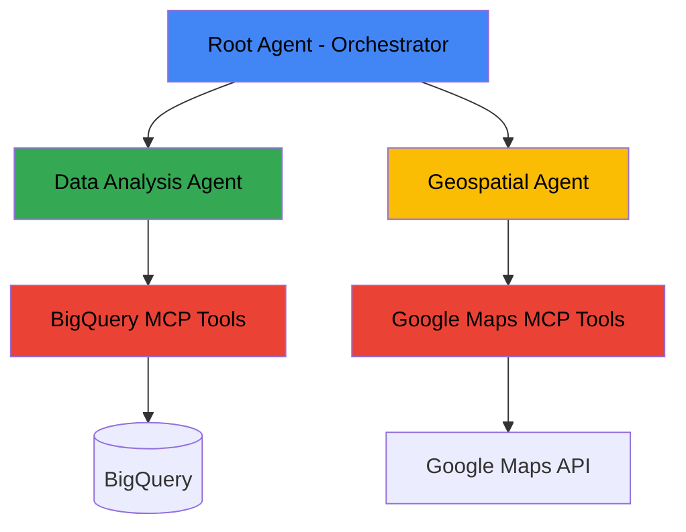

This article demonstrates how to build a sophisticated, collaborative AI agents that can query enterprise data and perform geospatial analysis through standardized tool interfaces. Concretly, we will implement a multi-agent system using Google's Agent Development Kit (ADK), and integrate with Model Context Protocol (MCP) tools to access third-party services like BigQuery and Google Maps.


## Architecture Overview

The multi-agent system follows a hierarchical design pattern where a central Root Agent acts as an intelligent orchestrator, coordinating interactions between specialized sub-agents. This architecture mirrors real-world organizational structures where a manager delegates tasks to domain experts, enabling the system to handle complex, multi-faceted queries that require both data analysis and geospatial capabilities. As depicted in the below diagram, the different components are:

- At the top of the hierarchy sits the **Root Agent (Orchestrator)**, which serves as the primary interface for user interactions. This agent is responsible for understanding user intent, determining which specialized capabilities are needed to fulfill the request, and seamlessly transferring control to the appropriate sub-agent. The orchestrator maintains context throughout the conversation and can coordinate between multiple agents when queries span different domains, such as analyzing sales data by geographic region.

- The **Data Analysis Agent** specializes in querying and interpreting enterprise data stored in BigQuery. It leverages the [BigQuery MCP Tools](https://codelabs.developers.google.com/mcp-toolbox-bigquery-dataset) to access Google Cloud's data warehouse, fetching table schemas, executing SQL queries, and transforming raw data into meaningful business insights. This agent understands natural language questions about business metrics and translates them into SQL queries, abstracting away the technical complexity from end users.

- The **Geospatial Agent** provides location-based intelligence through integration with [Google Maps MCP Tools](https://developers.google.com/maps/ai/mcp). This agent handles queries related to directions, distances, place information, and route optimization. It communicates with the Google Maps API to retrieve real-time geospatial data and presents it in a user-friendly format, enabling the system to answer questions like "What's the route from our warehouse to our distribution center?"



_Multi-Agent System Architecture with MCP Integration for Enterprise Data and Geospatial Services_

The MCP (Model Context Protocol) layer serves as a standardized bridge between the agents and external services. Both the BigQuery MCP Tools and Google Maps MCP Tools implement the MCP specification, which provides a consistent interface for tool discovery, invocation, and response handling.


## Core Technologies

### Agent Development Kit (ADK)

ADK is Google's framework for building reliable, multi-step AI agent systems. Key features include:

- **Agent Hierarchy**: Organize agents in tree structures with parent-child relationships
- **Tool Integration**: Seamless incorporation of external tools and APIs
- **Session Management**: Built-in state management for multi-turn conversations
- **Workflow Agents**: Specialized agents for sequential, parallel, and loop-based workflows

### Model Context Protocol (MCP)

MCP is an open standard that enables LLMs to communicate with external services. It provides:

- **Standardized Interface**: Consistent tool discovery and invocation
- **Client-Server Architecture**: Clear separation between tool consumers and providers
- **Multiple Transport Options**: Support for stdio and Server-Sent Events (SSE)
- **Tool Discovery**: Automatic enumeration of available capabilities

### Integration Technologies

- **BigQuery**: Google Cloud's enterprise data warehouse
- **Google Maps API**: Geospatial services including directions and place details
- **Vertex AI**: Google Cloud's AI platform for model deployment

---

## Implementation Components

### Environment Setup

First, install the prerequisites

```bash
# Install ADK
python3 -m pip install google-adk
```

Then, create a `.env` file to store environment configuration, such as authentication credentials:

```py
GOOGLE_GENAI_USE_VERTEXAI=TRUE
GOOGLE_CLOUD_PROJECT=your-project-id
GOOGLE_CLOUD_LOCATION=us-central1
MODEL=gemini-2.0-flash-exp
GOOGLE_MAPS_API_KEY=your-api-key
```

### BigQuery Integration

The official BigQuery MCP Tools enables ADK-based Agents to access BigQuery and perform:

- **Metadata Fetching**: query table schemas, column types, and data structures
- **Query Execution**: run SQL queries with proper authentication and error handling
- **Result Processing**: handle query results and format them for agent consumption

It should be available after installing the ADK python package, and can be used as follows:

```python
from google.adk.tools.bigquery import BigQueryCredentialsConfig
from google.adk.tools.bigquery import BigQueryToolset

from google.adk.tools.bigquery.bigquery_toolset import BigQueryToolConfig
from google.adk.tools.bigquery.query_tool import WriteMode
import google.auth

# Initialize the tools to use the application default credentials.
application_default_credentials, _ = google.auth.default()
credentials_config = BigQueryCredentialsConfig(
  credentials=application_default_credentials
)

# Initialize BigQuery toolset
bigquery_toolset = BigQueryToolset(credentials_config=credentials_config, tool_filter=[
  'list_dataset_ids',
  'get_dataset_info',
  'list_table_ids',
  'get_table_info',
  'execute_sql',
])

# Initialize BigQuery toolset
bq_toolset = BigQueryToolset(
    project_id="your-project-id",
    dataset_id="your-dataset"
)
```

We can also add a tool for the Agent to save the query and its results in the global state:

```python
from google.adk.tools import ToolContext
from typing import List, Dict

def save_query_results(
    tool_context: ToolContext,
    query: str,
    results: List[Dict]
) -> dict:
    """Save query results to session state for reference."""

    # Store query and results
    tool_context.state["last_query"] = query
    tool_context.state["last_results"] = results
    tool_context.state["result_count"] = len(results)

    return {
        "status": "success",
        "rows_returned": len(results)
    }
```

Using the tools defined previously in an Agent:

```python
from google.adk import Agent

model = os.getenv("MODEL")

# Create agent with BigQuery tools
data_analyst = Agent(
    name="data_analyst",
    model=model,
    description="Analyzes data from BigQuery datasets",
    instruction="""
    You are a data analyst with access to BigQuery.

    When asked about data:
    1. First, fetch the table schema to understand available columns
    2. Generate appropriate SQL queries based on the question
    3. Execute queries and interpret results
    4. Provide clear, business-friendly explanations
    5. save query and results

    Available dataset: thelook_ecommerce
    """,
    tools=[bq_toolset, save_query_results]
)
```


### Google Maps Integration

The Google Maps MCP integration provides geospatial capabilities including:

- **maps_directions**: Get directions between two locations
- **maps_place_details**: Retrieve detailed information about a place
- **maps_geocode**: Convert addresses to coordinates
- **maps_distance_matrix**: Calculate distances between multiple points

Setup and Configuration

```python
import os
from google.adk.tools.mcp_tool.mcp_toolset import MCPToolset, StdioServerParameters, StdioConnectionParams

google_maps_api_key = os.getenv("GOOGLE_MAPS_API_KEY")

if not google_maps_api_key:
    print("WARNING: GOOGLE_MAPS_API_KEY is not set. Please set it as an environment variable or update it in the script.")

maps_toolset = MCPToolset(
  connection_params=StdioConnectionParams(
    server_params=StdioServerParameters(
      command='npx',
      args=[
        "-y",
        "@modelcontextprotocol/server-google-maps",
      ],
      env={
        "GOOGLE_MAPS_API_KEY": google_maps_api_key
      }
    ),
    timeout=15,
  ),
)
```

Create geospatial agent

```python
from google.adk.agents import Agent

model = os.getenv("MODEL")

maps_agent = Agent(
    name="geospatial_assistant",
    model=model,
    description="Provides directions and location information using Google Maps",
    instruction="""
    You help users with location-based queries using Google Maps.

    CAPABILITIES:
    - Get directions between two locations
    - Find place details and information
    - Calculate routes and distances
    - Provide travel time estimates

    When providing directions:
    1. Confirm the origin and destination
    2. Use the maps_directions tool
    3. Present results clearly with distance and duration
    4. Offer alternative routes if available
    """,
    tools=[maps_toolset]
)
```


## Multi-Agent Orchestration

### Hierarchical Agent Tree

The system organizes agents in a tree structure for better control and maintainability.

#### Root Agent Pattern

```python
from google.adk.agents import Agent

model = os.getenv("MODEL")

# Root orchestrator agent
root_agent = Agent(
    name="steering",
    model=model,
    description="Start an education planner.",
    instruction="""
        You are a  conversational agent that empowers parents, educators, and public officials to identify needs, compare resources, and prioritize interventions that directly address educational gaps and needs.
        Ask the user what are important criteria for them in selecting schools.
        If they need educational data such as finding schools with different criteria or rankings, send them to the 'bigquery_agent'.
        """,
    generate_content_config=types.GenerateContentConfig(
        temperature=0,
    ),
    sub_agents=[bigquery_agent, maps_agent]
)
```

## Development Workflow

### Local Development with ADK Web UI

#### Starting the Development Server

```bash
# Navigate to project directory
cd ~/multi-agent-system

# Launch ADK Web UI with auto-reload
adk web --reload_agents

# Output:
# INFO: Started server process [2434]
# INFO: Application startup complete.
# INFO: Uvicorn running on http://127.0.0.1:8000
```

#### Using the Development Interface

The ADK Web UI provides:

1. **Agent Selection**: Choose which agent to interact with
2. **Chat Interface**: Test conversational interactions
3. **Event Inspector**: View agent reasoning and tool calls
4. **State Viewer**: Monitor session state changes
5. **Request/Response Tabs**: Debug communication flow

#### Testing Agent Behavior

```python
# Example test conversation flow

# 1. Start with greeting
User: "hello"
Agent: "Hi! I can help you analyze data or find locations. What would you like to know?"

# 2. Test BigQuery integration
User: "What are our top 5 selling products?"
Agent: [Transfers to data_analyst]
       [Calls fetch_schema for products table]
       [Generates and executes SQL query]
       [Returns formatted results]

# 3. Test Maps integration
User: "How do I get from Paris to Berlin?"
Agent: [Transfers to geospatial_assistant]
       [Calls maps_directions tool]
       [Returns route with distance and duration]

# 4. Test multi-agent coordination
User: "Find our top customers in California and map their locations"
Agent: [Coordinates between data_analyst and geospatial_assistant]
       [Synthesizes results from both agents]
```

#### Tool Call Inspection

When debugging or monitoring, you can inspect tool calls in the ADK Dev UI:

```python
# The Event inspector shows:
# 1. Request structure with parameters
# 2. Tool invocation details
# 3. Response data from Maps API
# 4. Agent's interpretation and response
```

### Command Line Interface

For quick testing without the web UI:

```bash
# Run agent from command line
adk run your-agent-directory

# Interactive session
[user]: hello
[agent]: Hello! How can I help you today?

[user]: exit  # End session
```


---

## Security and Best Practices

### Authentication and Authorization

#### API Key Management

```python
# Never hardcode API keys
# ❌ BAD
google_maps_api_key = "AIza..."

# ✅ GOOD - Use environment variables
import os
google_maps_api_key = os.getenv("GOOGLE_MAPS_API_KEY")

# Validate before use
if not google_maps_api_key:
    raise ValueError("GOOGLE_MAPS_API_KEY environment variable not set")
```

#### BigQuery Credentials

```python
# Use Application Default Credentials (ADC)
# Set GOOGLE_APPLICATION_CREDENTIALS environment variable
os.environ["GOOGLE_APPLICATION_CREDENTIALS"] = "/path/to/service-account-key.json"

# Or use workload identity in GKE/Cloud Run
# No explicit credentials needed
```

### Input Validation

```python
def validate_query_parameters(
    tool_context: ToolContext,
    table_name: str,
    filters: dict
) -> dict:
    """Validate inputs before executing queries."""

    # Whitelist allowed tables
    allowed_tables = ['customers', 'orders', 'products', 'order_items']
    if table_name not in allowed_tables:
        return {"error": f"Table {table_name} not allowed"}

    # Validate filter structure
    for key, value in filters.items():
        if not isinstance(key, str) or len(key) > 100:
            return {"error": "Invalid filter key"}

    return {"status": "valid"}
```

### Error Handling

```python
from google.adk.tools import ToolContext

def robust_bigquery_query(
    tool_context: ToolContext,
    query: str
) -> dict:
    """Execute BigQuery query with comprehensive error handling."""

    try:
        # Execute query
        results = execute_query(query)

        # Save to state
        tool_context.state["last_query_results"] = results

        return {
            "status": "success",
            "rows": len(results),
            "data": results
        }

    except Exception as e:
        # Log error
        print(f"Query execution failed: {str(e)}")

        # Return user-friendly error
        return {
            "status": "error",
            "message": "Query execution failed. Please check your query syntax.",
            "details": str(e)[:200]  # Truncate for safety
        }
```

### Rate Limiting and Quotas

```python
# Implement rate limiting for external API calls
import time
from functools import wraps

def rate_limit(calls_per_minute=60):
    """Decorator to rate limit function calls."""
    min_interval = 60.0 / calls_per_minute
    last_called = [0.0]

    def decorator(func):
        @wraps(func)
        def wrapper(*args, **kwargs):
            elapsed = time.time() - last_called[0]
            if elapsed < min_interval:
                time.sleep(min_interval - elapsed)
            last_called[0] = time.time()
            return func(*args, **kwargs)
        return wrapper
    return decorator

@rate_limit(calls_per_minute=30)
def call_maps_api(origin, destination):
    """Rate-limited Maps API call."""
    # Implementation
    pass
```

---

## Troubleshooting and Optimization

### Common Issues and Solutions

#### MCP Connection Timeouts

```python
# Problem: MCP server takes too long to start
# Solution: Increase timeout value

maps_toolset = MCPToolset(
    connection_params=StdioConnectionParams(
        server_params=StdioServerParameters(
            command='npx',
            args=["-y", "@modelcontextprotocol/server-google-maps"],
            env={"GOOGLE_MAPS_API_KEY": api_key}
        ),
        timeout=30,  # Increased from default 15 seconds
    ),
)
```

#### Tool Discovery Failures

```python
# Problem: Agent can't find specific MCP tools
# Solution: Use tool_filter to explicitly specify tools

mcp_toolset = MCPToolset(
    connection_params=connection_params,
    tool_filter=['maps_directions', 'maps_place_details']  # Explicit list
)
```

#### State Management Issues

```python
# Problem: State not persisting between agent transfers
# Solution: Use tool_context.state correctly

def save_to_state(tool_context: ToolContext, data: dict) -> dict:
    # ✅ CORRECT - Modify state dictionary
    tool_context.state["my_data"] = data

    # ❌ WRONG - Creating new dictionary doesn't update state
    # new_state = {"my_data": data}

    return {"status": "saved"}
```

### Performance Optimization

#### Query Result Caching

```python
# Cache BigQuery results to avoid redundant queries
from functools import lru_cache
import hashlib

@lru_cache(maxsize=100)
def cached_query(query_hash: str, query: str):
    """Execute query with caching."""
    return execute_bigquery_query(query)

def execute_with_cache(query: str):
    query_hash = hashlib.md5(query.encode()).hexdigest()
    return cached_query(query_hash, query)
```

#### Parallel Tool Execution

```python
# Use ParallelAgent for independent data fetching
parallel_fetcher = ParallelAgent(
    name="parallel_fetcher",
    sub_agents=[
        bigquery_agent,  # Fetch sales data
        maps_agent,      # Fetch location data
        weather_agent    # Fetch weather data
    ]
)
# All sub-agents execute simultaneously
```

### Monitoring and Logging

```python
# Implement comprehensive logging
import logging

logging.basicConfig(
    level=logging.INFO,
    format='%(asctime)s - %(name)s - %(levelname)s - %(message)s'
)

def log_query_to_model(request):
    """Callback to log all queries sent to model."""
    logging.info(f"Query to model: {request.instruction[:100]}...")

def log_model_response(response):
    """Callback to log model responses."""
    logging.info(f"Model response received: {len(response.text)} chars")

# Add callbacks to agents
agent = Agent(
    name="monitored_agent",
    before_model_callback=log_query_to_model,
    after_model_callback=log_model_response,
    # ... other parameters
)
```

---

## Conclusion

This multi-agent system demonstrates the power of combining ADK's orchestration capabilities with MCP's standardized tool interfaces. By integrating BigQuery and Google Maps through MCP, the system achieves:

1. **Enterprise Data Access**: Secure, reliable querying of BigQuery datasets
2. **Geospatial Intelligence**: Rich location-based services through Google Maps
3. **Agent Collaboration**: Sophisticated multi-agent workflows for complex tasks
4. **Extensibility**: Easy addition of new tools and capabilities through MCP
5. **Maintainability**: Clean separation of concerns and modular architecture

The implementation patterns and best practices outlined in this document provide a foundation for building production-ready multi-agent systems that can handle real-world enterprise use cases.

### Next Steps

1. **Expand Tool Coverage**: Integrate additional MCP servers for more capabilities
2. **Custom MCP Servers**: Build specialized MCP servers for internal tools
3. **Production Deployment**: Deploy agents to Cloud Run or GKE
4. **Advanced Workflows**: Implement custom workflow agents for complex scenarios
5. **Monitoring and Analytics**: Add comprehensive observability for production systems

This standardization means that agents don't need custom code for each external service—they simply interact with MCP-compliant toolsets that handle the underlying API complexity, authentication, and error handling. This architectural choice significantly reduces development overhead and makes the system easily extensible when new tools or services need to be integrated.

---

I hope you enjoyed this article, feel free to leave a comment or reach out on twitter  [@bachiirc](https://twitter.com/bachiirc).
