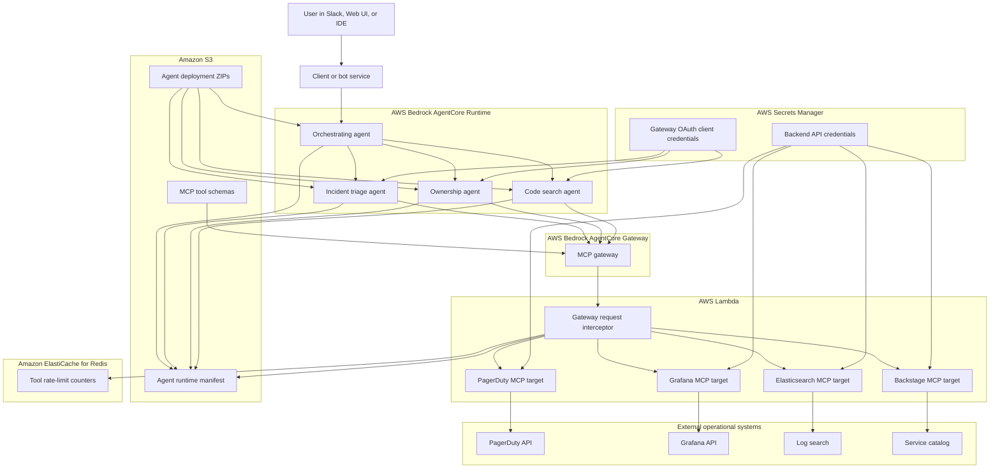

For an oncall agent to be useful, it needs to inspect live operational data, respect permissions, run reliably during incidents, and produce answers based on facts.

This two-part article walks through building such an agent on AWS, by leveraging **AWS Bedrock AgentCore** for hosting agents, **MCP** for tool access, **Lambda** for executing tools, **S3** for deployment artifacts and runtime manifests, **Secrets Manager** for credentials, and **Terraform** as the source of truth.

In this first part, we focus on the system architecture and AWS infrastructure. In [Part 2]({{ "2026/06/22/oncall-agent-aws-ii/" }}), we implement the actual code that runs the agent, MCP tools, agent-to-agent orchestration, tests, and deployment workflow.

## Overall Architecture

The core idea is to split the platform into four layers:

1. **Interaction layer**: Slack, an internal assistant, a web UI, or local AI tooling sends user requests.
2. **Agent runtime layer**: one or more AgentCore runtimes host the actual agents.
3. **Tool gateway layer**: an MCP gateway exposes operational tools through a standard protocol.
4. **System adapter layer**: Lambda functions call PagerDuty, Grafana, Elasticsearch, Backstage, Sourcegraph, deployment APIs, Snowflake, or any other SRE system.



Each subgraph names the AWS service that hosts or runs that part of the platform. This design keeps the model-facing part small. The LLM reasons, chooses tools, and synthesizes the answer. The gateway, Lambda targets, and IAM policies decide what the model can touch.

### Why split agents and tools?

It is tempting to create one large agent with every tool and every instruction. That becomes hard to evaluate and easy to confuse. A better pattern is to create a small number of specialized agents:

- an **orchestrating agent** that plans and delegates
- an **incident triage agent** for PagerDuty, Grafana, logs, and deploy context
- an **ownership agent** for service catalog and team routing
- a **code search agent** for source search and file inspection
- domain agents for specific teams or platforms

Each specialist has narrower prompts, fewer tools, and clearer evaluation cases. The orchestrator can expose those specialists as tools through an agent-to-agent protocol such as A2A.

### Use configuration as the control plane

The reviewed project uses a central `config.yml` file as the source of truth for deployed agents and MCP tool policy. A simplified version looks like this:

```yaml
agents:
  oncall-agent:
    path: agents/oncall-agent
    entrypoint: main.py
    description: Orchestrates specialist agents and answers users.

  sre-agent:
    path: agents/sre-agent
    entrypoint: main.py
    description: Investigates incidents, alerts, deployments, and logs.

tools:
  pagerduty:
    list_open_incidents:
      rate_limit:
        calls_per_min: 60
    get_incident_detail:
      rate_limit:
        calls_per_min: 120

  elasticsearch:
    search_logs:
      disabled: true
    get_log_context:
      rate_limit:
        calls_per_min: 120
```

This gives you one place to answer operational questions:

- Which agents are deployed?
- Where is each agent entrypoint?
- Which tools are enabled?
- Which tools are rate limited?
- Which tools are intentionally disabled?

Terraform can decode this file, build deployment artifacts for each agent, create AgentCore runtimes, publish a manifest to S3, and configure gateway policy. The application code can read the same manifest at runtime.

## AWS Infrastructure

The AWS side has a small number of durable building blocks. The goal is to make every agent deployable, discoverable, and able to call tools without embedding secrets in prompts or source code.

### 1. VPC and networking

Run the agents and Lambda targets inside a VPC when they need private network access. The common shape is:

- one VPC dedicated to the agent platform
- private subnets across supported availability zones
- public subnets only for NAT gateways
- a security group for AgentCore runtimes
- a security group for Lambda targets
- VPC endpoints for S3, CloudWatch Logs, and Bedrock Runtime
- NAT egress for external SaaS APIs such as PagerDuty or Slack

In Terraform:

```hcl
resource "aws_vpc" "agent_vpc" {
  cidr_block           = var.vpc_cidr
  enable_dns_support   = true
  enable_dns_hostnames = true
}

resource "aws_subnet" "private" {
  count                   = length(var.availability_zones)
  vpc_id                  = aws_vpc.agent_vpc.id
  cidr_block              = cidrsubnet(var.vpc_cidr, 8, count.index)
  availability_zone       = var.availability_zones[count.index]
  map_public_ip_on_launch = false
}

resource "aws_security_group" "agent_runtime" {
  vpc_id = aws_vpc.agent_vpc.id

  egress {
    from_port   = 0
    to_port     = 0
    protocol    = "-1"
    cidr_blocks = ["0.0.0.0/0"]
  }
}
```

Do not skip this layer. Incident agents usually need to reach a mix of private systems and external SaaS APIs. The VPC design should make that possible without placing runtimes on public networks.

### 2. S3 buckets for agent artifacts and manifests

AgentCore direct-code deployment needs code artifacts. Store those in a versioned S3 bucket:

```hcl
resource "aws_s3_bucket" "agent_code" {
  bucket = "sre-agents-agent-code-${var.environment}-${var.aws_region}"
}

resource "aws_s3_bucket_versioning" "agent_code" {
  bucket = aws_s3_bucket.agent_code.id

  versioning_configuration {
    status = "Enabled"
  }
}
```

Then upload one ZIP per configured agent:

```hcl
resource "aws_s3_object" "agent_code_objects" {
  for_each = local.agents

  bucket      = aws_s3_bucket.agent_code.bucket
  key         = "agents/${each.key}-code.zip"
  source      = "${path.module}/../../agent_build/${each.key}-code.zip"
  source_hash = filemd5("${path.module}/../../agent_build/${each.key}-code.zip")
}
```

Also publish a runtime manifest. The orchestrating agent can read it to discover subagents:

```hcl
resource "aws_s3_object" "agent_manifest" {
  bucket       = aws_s3_bucket.agent_code.bucket
  key          = "agent_manifest.json"
  content_type = "application/json"

  content = jsonencode({
    agents = {
      for name, info in local.agents : name => merge(info, {
        runtime_name = aws_bedrockagentcore_agent_runtime.agent[name].agent_runtime_name
        runtime_arn  = aws_bedrockagentcore_agent_runtime.agent[name].agent_runtime_arn
        aws_region   = var.aws_region
      })
    }
    tools = local.tools
  })
}
```

This manifest is the bridge between Terraform and application code. It lets an agent discover the rest of the fleet without hard-coded ARNs.

### 3. Bedrock AgentCore runtimes

Create one AgentCore runtime per configured agent:

```hcl
resource "aws_bedrockagentcore_agent_runtime" "agent" {
  for_each           = local.agents
  agent_runtime_name = replace(each.key, "-", "_")
  role_arn           = aws_iam_role.agent_runtime_execution.arn

  protocol_configuration {
    server_protocol = "A2A"
  }

  agent_runtime_artifact {
    code_configuration {
      entry_point = [each.value.entrypoint]
      runtime     = "PYTHON_3_12"

      code {
        s3 {
          bucket     = aws_s3_bucket.agent_code.bucket
          prefix     = aws_s3_object.agent_code_objects[each.key].key
          version_id = aws_s3_object.agent_code_objects[each.key].version_id
        }
      }
    }
  }

  environment_variables = {
    AGENT_NAME                 = each.key
    CONFIGURATION_BUCKET_NAME  = aws_s3_bucket.agent_code.bucket
    AGENT_MANIFEST_S3_KEY      = "agent_manifest.json"
    BEDROCK_MCP_GATEWAY_REGION = var.aws_region
    BEDROCK_MCP_GATEWAY_ID     = aws_bedrockagentcore_gateway.sre_tools.gateway_id
    BEDROCK_MCP_SECRET_ID      = aws_secretsmanager_secret.gateway_oauth.name
  }

  network_configuration {
    network_mode = "VPC"
    network_mode_config {
      subnets         = aws_subnet.private[*].id
      security_groups = [aws_security_group.agent_runtime.id]
    }
  }
}
```

Two practical details matter:

- AgentCore runtime names may have stricter naming rules than your repository paths, so normalize names.
- Use S3 object version IDs in the runtime artifact. That gives Terraform a clean reason to redeploy when code changes.

### 4. MCP gateway

The gateway is the model-safe front door to operational tools. It speaks MCP to agents and invokes Lambda targets behind the scenes.

```hcl
resource "aws_bedrockagentcore_gateway" "sre_tools" {
  name        = var.tools_gateway_name
  description = "Shared SRE MCP gateway"
  role_arn    = aws_iam_role.tools_gateway.arn

  authorizer_type = "CUSTOM_JWT"
  authorizer_configuration {
    custom_jwt_authorizer {
      discovery_url = "${var.gateway_oauth_issuer}/.well-known/openid-configuration"
      allowed_audience = [
        var.gateway_oauth_user_client_id,
        "api://default",
      ]
    }
  }

  protocol_type = "MCP"
  protocol_configuration {
    mcp {
      instructions       = "Expose SRE tools for incident management, observability, deploy data, ownership, code search, and log analysis."
      search_type        = "SEMANTIC"
      supported_versions = ["2025-03-26"]
    }
  }
}
```

The gateway should not know PagerDuty or Grafana secrets. It only routes tool calls. The Lambda target owns the backend-specific auth.

### 5. Lambda-backed MCP targets

Each tool namespace becomes a Lambda target with a JSON schema:

```hcl
resource "aws_bedrockagentcore_gateway_target" "pagerduty" {
  name               = "pagerduty-target"
  gateway_identifier = aws_bedrockagentcore_gateway.sre_tools.gateway_id
  description        = "PagerDuty incident management tools"

  credential_provider_configuration {
    gateway_iam_role {}
  }

  target_configuration {
    mcp {
      lambda {
        lambda_arn = aws_lambda_function.pagerduty.arn

        tool_schema {
          s3 {
            uri = "s3://${aws_s3_bucket.tool_schemas.bucket}/pagerduty/schema.json"
          }
        }
      }
    }
  }
}
```

The schema is not documentation only. It is the contract the model sees. Keep tool names, descriptions, input schemas, and output schemas precise.

### 6. Secrets Manager

Store service credentials in Secrets Manager and inject only secret names into runtimes or Lambda environment variables:

```hcl
resource "aws_secretsmanager_secret" "pagerduty" {
  name = "${var.environment}/sre-tools/pagerduty"
}

resource "aws_lambda_function" "pagerduty" {
  function_name = "pagerduty-mcp-target"
  role          = aws_iam_role.lambda_role.arn
  handler       = "handler.lambda_handler"
  runtime       = "python3.12"

  environment {
    variables = {
      PAGERDUTY_SECRET_NAME = aws_secretsmanager_secret.pagerduty.name
    }
  }
}
```

Then grant the Lambda role permission to read only that secret.

### 7. Request interceptor and rate limits

The reviewed architecture uses a gateway request interceptor backed by Redis. It handles:

- MCP `initialize` responses
- disabled tools
- per-tool fixed-window rate limits
- gateway request logging

That gives you a policy enforcement point before tool Lambda invocation. The policy comes from the same manifest that Terraform generated from `config.yml`.

At a high level:

```python
namespace, tool = tool_name.split("___")
tool_configuration = load_tool_configuration_from_s3()

if tool_configuration[namespace][tool].get("disabled"):
    return disabled_response()

limit = tool_configuration[namespace][tool].get("rate_limit", {}).get("calls_per_min", 120)
current = redis.get(f"{tool_name}:{current_minute}") or 0

if int(current) >= limit:
    return rate_limited_response()

redis.incr(f"{tool_name}:{current_minute}")
return allow_request()
```

This is especially useful for expensive log searches, high-cardinality metrics queries, and tools backed by vendor APIs with strict limits.

### 8. IAM

Keep IAM split by responsibility:

- **Agent runtime role**: invoke Bedrock models, read the agent manifest from S3, read gateway OAuth credentials, discover the gateway, invoke other AgentCore runtimes.
- **Gateway role**: invoke only the registered Lambda targets.
- **Lambda target roles**: read only their own secrets, write logs, and access VPC resources if needed.
- **Invocation access role**: allow approved external clients or bots to invoke AgentCore runtimes.

The most important rule is that the agent runtime should not receive broad cloud permissions. Let tools encapsulate privileged actions and expose only safe, typed operations.

## Infrastructure Implementation

With the building blocks defined, the repository layout can be simple:

```text
oncall-agent/
  agents/
    oncall-agent/
    ownership-agent/
  tools/
    pagerduty/
      handler.py
      schema.json
    grafana/
      handler.py
      schema.json
    common/
  interceptors/
    handler.py
  terraform/
    agentcore/
    dev/
    prod/
  scripts/
    build_deployment_zips.py
    setup_lambdas.sh
  config.yml
```

### Step 1: Decode repository config in Terraform

```hcl
locals {
  agent_config = yamldecode(file("../../config.yml"))
  agents       = local.agent_config["agents"]
  tools        = local.agent_config["tools"]
}
```

This lets Terraform create a runtime for each agent and publish tool policy into the runtime manifest.

### Step 2: Build direct-code deployment ZIPs

For AgentCore direct code deployment, build each agent into an isolated directory:

```python
for agent_name, agent_data in agent_config["agents"].items():
    agent_path = agent_data["path"]
    build_path = f"agent_build/{agent_name}"

    os.system(
        "uv pip install "
        "--python-platform manylinux_2_34_aarch64 "
        "--python-version 3.12 "
        "--only-binary=:all: "
        f"--target={build_path} "
        f"-r {agent_path}/pyproject.toml"
    )
    os.system(f"cp -r {agent_path}/* {build_path}/")
    os.system(f"cp config.yml {build_path}/")
    os.system(f"cd {build_path} && zip -r {agent_name}-code.zip .")
```

The important points are:

- build for the runtime architecture, not your laptop architecture
- include the agent source code
- include shared config needed at runtime
- fail if an agent is missing its dependency file

### Step 3: Build Lambda target artifacts

Each tool Lambda needs:

- its service-specific `handler.py`
- shared handler utilities
- a filtered `schema.json`
- a bundled copy of tool policy
- only the Python dependencies it needs

The deployment script can generate filtered schemas from `config.yml` so disabled tools are not published:

```python
def filter_schema_tools(schema_tools, namespace_policy):
    filtered = []
    for tool in schema_tools:
        tool_name = tool.get("name")
        policy = namespace_policy.get(tool_name, {})
        if policy.get("disabled"):
            continue
        filtered.append(tool)
    return filtered
```

This prevents a disabled tool from being advertised to the model in the first place.

### Step 4: Use environment wrappers

Keep reusable infrastructure in `terraform/agentcore/`, then create small wrappers for environments:

```hcl
module "agentcore" {
  source = "../agentcore"

  environment = "dev"
  vpc_cidr    = "10.0.0.0/16"

  pagerduty_api_token   = var.pagerduty_api_token
  grafana_api_token     = var.grafana_api_token
  sourcegraph_api_token = var.sourcegraph_api_token
}
```

Use separate AWS accounts or workspaces for development and production. Make production apply manual.

### Step 5: Print runtime metadata after deploy

After `terraform apply`, print agent runtime names and ARNs. This makes it easy for Slack bots, local clients, or smoke tests to target the right runtime.

```bash
terraform output -json agent_runtime_metadata \
  | python scripts/print_agent_runtime_metadata.py --label dev-apply
```

## What we have built so far

At this point the platform has:

- a private AWS network for agents and tools
- a versioned S3 deployment bucket
- one AgentCore runtime per configured agent
- an MCP gateway with custom authorization
- Lambda-backed tool targets
- Secrets Manager integration
- Redis-backed request interception and rate limiting
- a generated runtime manifest that agents can use for discovery

In [Part 2]({{ "2026/06/22/oncall-agent-aws-ii/" }}), we will implement the Python agent itself, expose SRE systems as MCP tools, create an orchestrating agent that delegates to specialists, and set up tests and CI for safe rollout.
