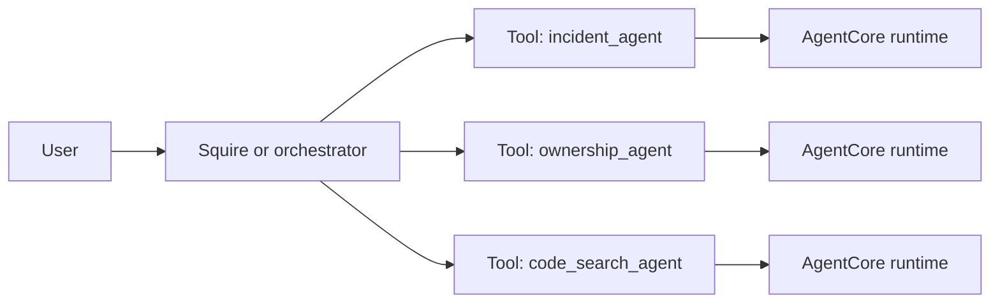

In [Part 1]({{ "genai/2026/06/22/oncall-agent-aws-i/" | absolute_url }}), we designed the overall architecture and AWS infrastructure for a production-grade oncall agent. We created the AgentCore runtimes, MCP gateway, Lambda tool targets, secrets, networking, runtime manifest, and rate-limit interceptor.

This second part focuses on implementation. We will build the agent entrypoint, load tools from the MCP gateway, compose prompts, expose SRE systems as Lambda-backed MCP tools, orchestrate specialist agents, and add tests and CI gates.

## Implementation

The final repository should make the happy path boring:

```bash
make setup-env
make create incident-agent
make dev incident-agent
make test agent=incident-agent
```

Behind those commands, the repo should keep a clear separation between agents, tools, shared libraries, infrastructure, and evaluation data:

```text
oncall-agent/
  agents/
    squire-agent/
      main.py
      pyproject.toml
    incident-agent/
      main.py
      prompts/
      tests/
      evals/
  tools/
    pagerduty/
      handler.py
      schema.json
    grafana/
      handler.py
      schema.json
    common/
      mcp_handler.py
      tool_policy.py
  sre-agent-common/
    a2a_support/
    agentcore/
    input/
    prompt/
    tool/
  scripts/
  terraform/
  config.yml
```

The shared package is important. If every agent reimplements payload parsing, A2A server setup, MCP loading, and prompt loading, the platform becomes inconsistent fast.

## Building the Agent Runtime

An AgentCore direct-code agent can be a small Python program. The application creates a Bedrock AgentCore app, creates a LangChain agent backed by Bedrock, loads tools, wraps the LangChain agent in an A2A server, and mounts that server.

```python
from bedrock_agentcore import BedrockAgentCoreApp
from langchain.agents import create_agent
from langchain_aws import ChatBedrockConverse

from sre_agent_common.a2a_support.server import a2a_server_from_environment
from sre_agent_common.tool.langchain_mcp_tools import load_mcp_registry_tools_sync

MODEL_ID = "us.anthropic.claude-sonnet-4-5-20250929-v1:0"

app = BedrockAgentCoreApp()

agent = create_agent(
    model=ChatBedrockConverse(model=MODEL_ID),
    system_prompt="You are an SRE investigation agent. Gather evidence before answering.",
    tools=load_mcp_registry_tools_sync(),
)

a2a_server = a2a_server_from_environment(
    langchain_agent=agent,
    local_host="0.0.0.0",
    local_port=9000,
)

app.mount("/", a2a_server.asgi_server)


def main():
    app.run(host="0.0.0.0", port=9000)


if __name__ == "__main__":
    main()
```

This is the minimum useful shape. In production, add:

- prompt files instead of one inline prompt
- context-window trimming
- transport retry middleware for tool calls
- structured response models for reports
- health endpoint support
- tests around payload conversion and prompt assembly

### Compose prompts from reusable files

Oncall agents need domain context: what "shard" means, what systems own deployment state, when to use logs, and how to report confidence. Store that context as files rather than a large string in `main.py`.

```python
from pathlib import Path

PROMPTS_DIR = Path(__file__).resolve().parent / "prompts"


def load_prompt(name: str) -> str:
    return (PROMPTS_DIR / name).read_text(encoding="utf-8").strip()


def build_system_prompt() -> str:
    sections = [
        load_prompt("identity.md"),
        load_prompt("investigation_workflow.md"),
        load_prompt("tool_guidance.md"),
        load_prompt("triage_report_format.md"),
    ]
    return "\n\n".join(section for section in sections if section)
```

The investigation prompt should be explicit:

```markdown
# Operating Rules

- Always gather evidence with tools before answering.
- Prefer targeted queries over broad scans.
- Separate facts from inference.
- Label uncertain conclusions with confidence.
- Never invent commands, URLs, owners, rollbacks, or environment details.

# Investigation Method

1. Identify the concrete entity: incident ID, service, cluster, shard, host, or alert.
2. Query the highest-signal system first.
3. Correlate evidence across tools before forming conclusions.
4. Highlight impact, blast radius, next action, and missing evidence.
```

This is not just style. It reduces unsupported answers during incidents.

### Convert client payloads into model messages

Most production agents receive more than a raw string. They receive:

- the next user request
- prior conversation history
- optional system context
- channel metadata
- user identity or scope

Normalize that into the input shape your agent framework expects:

```python
def convert_invocation_payload_into_langchain_input(payload, history_to_inject=None):
    history = []

    messages = payload.history.messages if payload.history else []
    for message in messages:
        if message.role == "user":
            history.append({"role": "user", "content": message.text})
        elif message.role == "assistant":
            history.append({"role": "assistant", "content": message.text})

    if history_to_inject:
        history.extend(history_to_inject)

    history.append({"role": "user", "content": payload.next_request})
    return {"messages": history}
```

Also guard the context window. If the request is too large, trim older history and insert a notice:

```python
MAX_INPUT_CHARS = 350_000
TRUNCATED_HISTORY_NOTICE = "Earlier conversation history was truncated."


def estimate_input_chars(system_prompt, messages):
    return len(system_prompt) + len(json.dumps(messages, separators=(",", ":")))


def trim_messages_to_budget(system_prompt, messages):
    messages = list(messages)
    trimmed = False

    while len(messages) > 1 and estimate_input_chars(system_prompt, messages) > MAX_INPUT_CHARS:
        messages.pop(0)
        trimmed = True

    if trimmed:
        messages = messages[:-1] + [
            {"role": "system", "content": TRUNCATED_HISTORY_NOTICE},
            messages[-1],
        ]

    if estimate_input_chars(system_prompt, messages) > MAX_INPUT_CHARS:
        raise ValueError("Request exceeds the configured model input budget.")

    return messages
```

Failing cleanly is better than letting a long Slack thread turn into a model invocation error.

## Loading MCP Tools

Agents should not hard-code every tool endpoint. They should discover the gateway endpoint from AgentCore, exchange OAuth client credentials for a bearer token, and create MCP client connections.

```python
from langchain_mcp_adapters.client import MultiServerMCPClient
from langchain_mcp_adapters.sessions import StreamableHttpConnection


async def load_mcp_tools(gateway_url: str, bearer_token: str, allowed_tools=None):
    client = MultiServerMCPClient(
        {
            "sre_tools": StreamableHttpConnection(
                url=gateway_url,
                transport="streamable_http",
                headers={"Authorization": f"Bearer {bearer_token}"},
            )
        }
    )
    tools = await client.get_tools()

    if allowed_tools is None:
        return tools

    return [
        tool
        for tool in tools
        if any(allowed_name in tool.name for allowed_name in allowed_tools)
    ]
```

In AgentCore, resolve the bearer token from Secrets Manager:

```python
async def get_bearer_token(secret_id, region):
    secret = await load_gateway_oauth_secret_from_secrets_manager(secret_id, region)
    return await exchange_client_credentials_for_access_token(
        client_id=secret.client_id,
        client_secret=secret.client_secret,
        token_url=secret.token_url,
        scope=secret.scope,
    )
```

This keeps gateway credentials out of the agent prompt, tool schemas, and code.

## Implementing MCP Tool Targets

Each tool target has two files:

- `schema.json`: the contract the model sees
- `handler.py`: the Lambda implementation

### Define a precise schema

For a PagerDuty target, a schema might expose only safe read operations:

```json
[
  {
    "name": "list_open_incidents",
    "description": "List PagerDuty incidents that are currently triggered or acknowledged.",
    "inputSchema": {
      "type": "object",
      "properties": {
        "service_ids": {
          "type": "array",
          "items": { "type": "string" },
          "description": "Optional PagerDuty service IDs to scope the query."
        },
        "urgency": {
          "type": "string",
          "description": "Optional urgency filter such as high or low."
        },
        "limit": {
          "type": "integer",
          "minimum": 1,
          "maximum": 100
        }
      }
    }
  }
]
```

Avoid vague tools like `run_query` or `call_api` unless the user is trusted and the backend has strong authorization. Oncall agents are most reliable when tools encode operational intent.

### Write a small Lambda handler

The tool implementation should focus on backend logic:

```python
import json
import os
from urllib import parse, request

import boto3

from common.mcp_handler import create_lambda_handler

PAGERDUTY_API_BASE_URL = "https://api.pagerduty.com"
PAGERDUTY_SECRET_NAME = os.environ["PAGERDUTY_SECRET_NAME"]


def get_pagerduty_api_token():
    client = boto3.client("secretsmanager")
    response = client.get_secret_value(SecretId=PAGERDUTY_SECRET_NAME)
    secret_string = response["SecretString"]
    payload = json.loads(secret_string)
    return payload["api_token"]


def pagerduty_get(path, params=None):
    query = parse.urlencode(params or {}, doseq=True)
    url = f"{PAGERDUTY_API_BASE_URL}{path}"
    if query:
        url = f"{url}?{query}"

    req = request.Request(
        url,
        headers={
            "Authorization": f"Token token={get_pagerduty_api_token()}",
            "Accept": "application/vnd.pagerduty+json;version=2",
        },
    )
    with request.urlopen(req, timeout=10) as response:
        return json.loads(response.read().decode("utf-8"))


def list_open_incidents(service_ids=None, urgency=None, limit=100):
    params = {
        "statuses[]": ["triggered", "acknowledged"],
        "limit": min(int(limit), 100),
    }
    if service_ids:
        params["service_ids[]"] = service_ids
    if urgency:
        params["urgencies[]"] = [urgency]

    data = pagerduty_get("/incidents", params)
    return {
        "count": len(data.get("incidents", [])),
        "incidents": [
            {
                "id": incident.get("id"),
                "title": incident.get("title") or incident.get("summary"),
                "status": incident.get("status"),
                "urgency": incident.get("urgency"),
                "service": (incident.get("service") or {}).get("summary"),
                "html_url": incident.get("html_url"),
            }
            for incident in data.get("incidents", [])
        ],
    }


lambda_handler = create_lambda_handler(
    {"list_open_incidents": list_open_incidents},
    handler_name="pagerduty_mcp_lambda",
)
```

The shared `create_lambda_handler` handles gateway event parsing, tool-name extraction, argument extraction, response wrapping, and error wrapping.

### Keep disabled tools out of the schema

When building Lambda artifacts, generate the deployed schema from `config.yml`:

```python
def filter_schema_tools(schema_tools, namespace_policy):
    filtered = []
    for tool in schema_tools:
        policy = namespace_policy.get(tool["name"], {})
        if policy.get("disabled"):
            continue
        filtered.append(tool)
    return filtered
```

This gives you two layers of safety:

- disabled tools are not advertised to agents
- the interceptor can still reject disabled tool calls

## Implementing the Orchestrator

Once you have multiple specialist agents, expose each one as a tool to the orchestrating agent.



The orchestrator loads the manifest from S3:

```python
def load_agent_manifest_from_s3(bucket, key):
    response = boto3.client("s3").get_object(Bucket=bucket, Key=key)
    return json.loads(response["Body"].read().decode("utf-8"))
```

Then it turns each subagent into a LangChain tool:

```python
from langchain_core.tools import tool


def subagent_tool_generator(definition, session_id):
    @tool(
        definition.runtime_name,
        description=definition.description,
        args_schema=definition.input_jsonschema,
    )
    async def subagent_tool(**kwargs):
        return await invoke_a2a_client(definition, kwargs, session_id)

    return subagent_tool
```

The orchestrator prompt should teach routing behavior:

```markdown
# Routing

- Use the incident agent for active PagerDuty incidents, alerts, metrics, logs, and deploy context.
- Use the ownership agent for team, service, escalation, and Slack channel questions.
- Use the code search agent for implementation details, configuration, and ownership clues in source code.
- Ask a clarifying question only when there is no concrete entity to investigate.
```

This turns "agent sprawl" into a manageable platform.

## Local Development

A good local workflow should set up credentials, fetch non-secret runtime config, and run AgentCore's local development server.

```makefile
dev:
	aws sts get-caller-identity >/dev/null
	aws s3 cp s3://$(DEV_AGENT_BUCKET)/agent_env_configuration - > .agent-env
	export AGENT_NAME=$(agent); \
	export AGENT_MANIFEST_LOCAL_PATH=$(PWD)/config.yml; \
	cd agents/$(agent) && uv run agentcore dev
```

Then run a sample client:

```bash
make dev incident-agent
make client
```

For a deployed runtime:

```bash
make client agent_runtime_arn="arn:aws:bedrock-agentcore:us-west-2:123456789012:runtime/incident_agent"
```

## Scaffolding a New Agent

Do not make engineers remember every file to create. Provide a command:

```bash
make create incident-agent
```

The scaffolder should:

1. Add the agent to `config.yml`.
2. Create `agents/incident-agent/`.
3. Generate `pyproject.toml`.
4. Add the shared agent package dependency.
5. Create `main.py`.
6. Generate AgentCore local config.
7. Print the next command to run.

The generated `main.py` can start as a small template:

```python
from bedrock_agentcore import BedrockAgentCoreApp
from langchain.agents import create_agent
from langchain_aws import ChatBedrockConverse

from sre_agent_common.a2a_support.server import a2a_server_from_environment
from sre_agent_common.tool.langchain_mcp_tools import load_mcp_registry_tools_sync

app = BedrockAgentCoreApp()

agent = create_agent(
    model=ChatBedrockConverse(model="us.anthropic.claude-sonnet-4-5-20250929-v1:0"),
    system_prompt="Edit this prompt for your agent.",
    tools=load_mcp_registry_tools_sync({"backstage", "pagerduty"}),
)

server = a2a_server_from_environment(agent, "0.0.0.0", 9000)
app.mount("/", server.asgi_server)


def main():
    app.run(host="0.0.0.0", port=9000)
```

## Tests and Evaluations

Test the platform in layers.

### Unit tests

Unit-test deterministic code:

- prompt assembly
- payload parsing
- context trimming
- schema filtering
- tool policy loading
- Lambda event parsing

Example:

```python
def test_trim_messages_preserves_latest_request():
    messages = [
        {"role": "user", "content": "old" * 100_000},
        {"role": "user", "content": "what is broken right now?"},
    ]

    trimmed = trim_messages_to_budget("system prompt", messages)

    assert trimmed[-1]["content"] == "what is broken right now?"
```

### Tool tests

For every Lambda target, test:

- unknown tools return a structured error
- missing required arguments return an error
- backend responses are normalized
- secrets are loaded from the expected source
- disabled tools are filtered

### Agent evals

Agent behavior needs evals beyond unit tests. Useful layers are:

- **deterministic tool-call assertions**: the agent should call `get_incident_detail` when given an incident ID
- **golden snapshots**: a known prompt should produce a stable report structure
- **degradation cases**: poor inputs should not produce invented facts
- **LLM-as-judge rubrics**: judge evidence quality, concision, and actionability

Keep eval data next to the agent:

```text
agents/incident-agent/evals/
  test_cases.yaml
  degradation_cases.yaml
  rubric.yaml
  golden/
  test_deterministic.py
  test_golden_snapshots.py
  test_llm_judge.py
```

## CI and Deployment

The CI pipeline should follow the same shape as local development:

1. Lint Python.
2. Format-check Terraform.
3. Build direct-code deployment ZIPs.
4. Build Lambda target artifacts.
5. Run unit tests.
6. Run targeted evals.
7. Run Terraform tests.
8. Plan development infrastructure.
9. Apply development infrastructure.
10. Plan production infrastructure.
11. Manually apply production.

Example pipeline jobs:

```yaml
build:agent-zips:
  stage: build
  image: python:3.12-slim
  script:
    - pip install uv pyyaml
    - python scripts/build_deployment_zips.py
  artifacts:
    paths:
      - agent_build/*

test:repo:
  stage: test
  image: python:3.12-slim
  script:
    - pip install uv
    - uv sync --extra dev
    - uv run pytest --cov=tools --cov=agents

terraform:plan:dev:
  stage: plan
  script:
    - ./scripts/setup_lambdas.sh
    - cd terraform/dev && terraform plan
```

Print runtime metadata after apply so humans and bots can smoke test the deployment:

```bash
terraform output -json agent_runtime_metadata \
  | python scripts/print_agent_runtime_metadata.py --label dev-apply
```

## Production Checklist

Before giving an oncall agent broad access, check the following:

- **Tool boundaries**: every tool has a narrow schema and a safe output shape.
- **Secrets**: credentials live in Secrets Manager, not prompts or config files.
- **IAM**: agents cannot call arbitrary AWS APIs.
- **Rate limits**: expensive or vendor-limited tools have per-minute limits.
- **Prompt rules**: the agent must gather evidence before answering.
- **Evidence citations**: final reports identify the tool and query behind important claims.
- **Context limits**: long conversations are trimmed or rejected cleanly.
- **Evals**: incident, ownership, code search, and failure cases have test coverage.
- **Rollout**: development apply is automatic or easy; production apply is manual.
- **Observability**: CloudWatch logs, latency, error rate, and tool failures are visible.

## Final Thoughts

The most reusable idea is the separation of responsibilities:

- AgentCore hosts agents.
- MCP standardizes tool access.
- Lambda adapts internal systems into typed tools.
- Terraform owns deployment state.
- S3 publishes runtime manifests.
- Secrets Manager owns credentials.
- Redis-backed interception enforces runtime tool policy.
- Evals keep behavior from drifting.

That architecture lets you add new SRE capabilities without continuously rewriting the agent. Add a tool schema and Lambda handler for a new system, register it in Terraform, expose it through the gateway, and give the right specialist agent clear instructions for when to use it.
