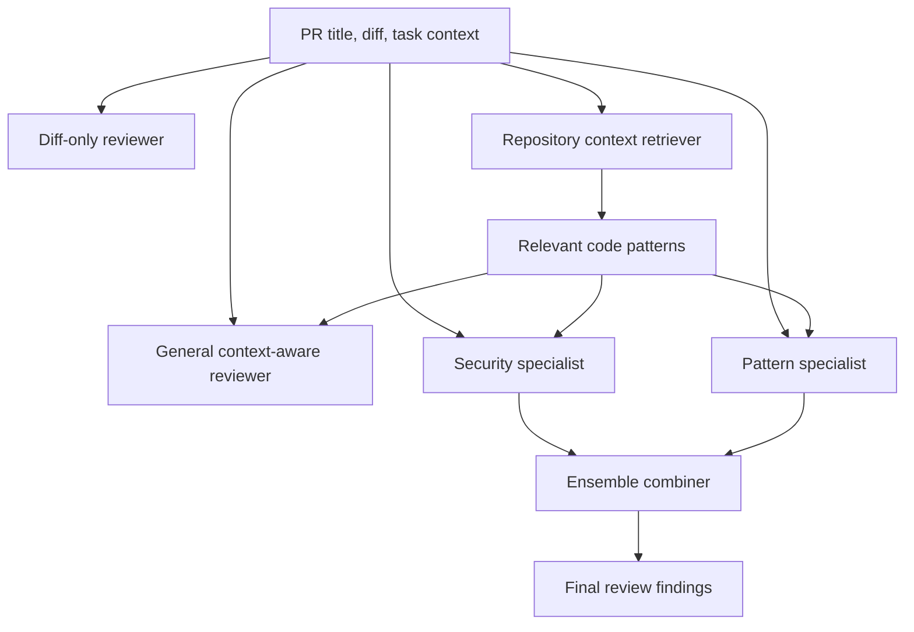
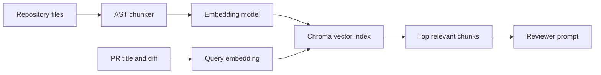
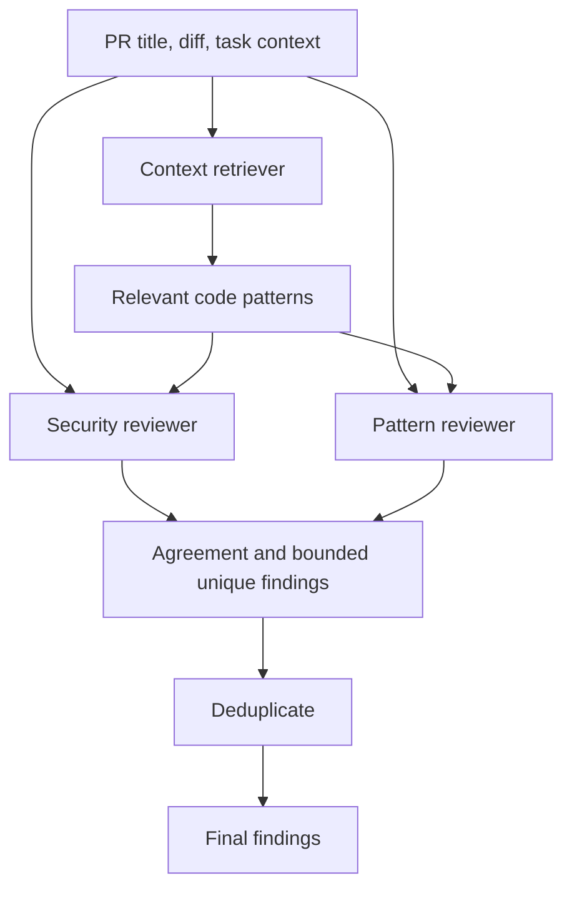
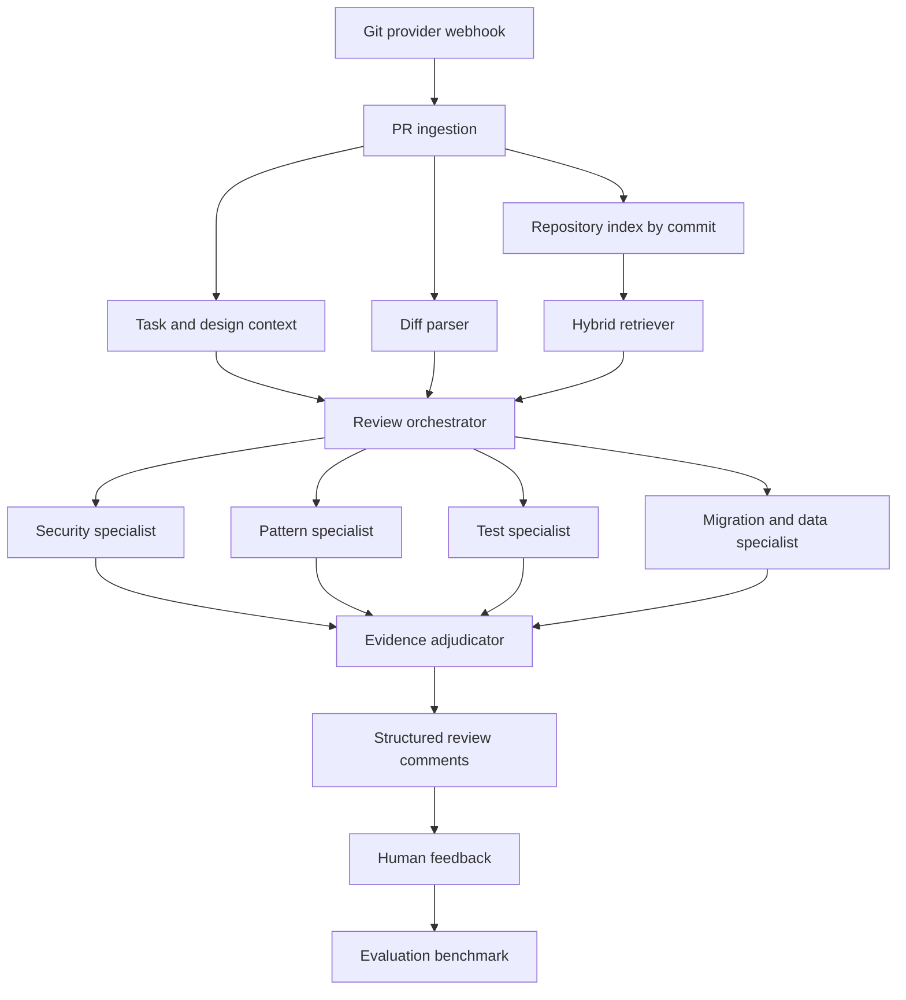

AI coding assistants make it easy to generate more code than a team can carefully review by hand. That changes the bottleneck. The hard question is no longer only "can we write the code?", but also "can we review it with enough context to catch missed requirements, security gaps, and codebase-specific pattern violations?"

This article builds a self-contained AI code review workflow in three steps:

1. Start with a **diff-only reviewer**.
2. Add **task and repository context**.
3. Build a small **context retrieval engine** and a **specialized reviewer ensemble**.

The implementation is intentionally compact. It uses a synthetic FastAPI codebase and synthetic pull requests so the whole workflow can be explained in one article. The same pattern can be adapted to real repositories, GitHub/GitLab pull requests, internal tickets, and team review standards.

## What We Are Building

The system receives a pull request title, a diff, and optional task requirements. It can review the change in several modes:

- **Diff-only**: the model sees only the changed code.
- **Context-aware**: the model also sees task requirements and existing codebase patterns.
- **Selective-context**: the system retrieves only the most relevant repository chunks.
- **Specialized ensemble**: security and pattern-compliance reviewers run separately, then their findings are combined.

The high-level flow looks like this:



## Prerequisites

The code examples use Python, OpenAI models, and Chroma for the in-memory vector index:

```bash
pip install openai chromadb pandas python-dotenv
export OPENAI_API_KEY="..."
```

The article explains the reviewer implementation first. To run the complete example, assemble one Python file in this order: Appendix A, Appendix B, Reviewer Implementations, Evaluation, then the `run_benchmark()` entry point. The example makes API calls for completions and embeddings, so running the full evaluation will use tokens.

## Review Fixture Overview

The reviewer implementations below are evaluated against a synthetic FastAPI service and a 15-PR benchmark. The service fixture contains 11 known-good files that encode the local patterns an AI reviewer should use as evidence: authentication, authorization, parameterized SQL, rate limiting, secrets, safe file paths, upload validation, inventory locking, HTML escaping, JSON serialization, Pydantic constraints, generic error responses, explicit CORS origins, constant-time secret comparison, and redirect allowlists.

The PR fixture contains deliberately flawed changes across those same concerns. The main article keeps the fixture out of the way so the reviewer implementations are the focus. The complete application code is in [Appendix A](#appendix-a-application-code-fixture), and the complete PR fixture is in [Appendix B](#appendix-b-pull-request-fixture).

In code, the appendices define the two shared inputs used by every reviewer: `TOY_REPOSITORY: dict[str, str]` and `SAMPLE_PRS: list[dict]`.

## Reviewer Implementations

The review system has several interchangeable implementations. They share the same PR data model and output schema, but differ in how much context they use and how specialized the reviewer prompt is.

### General Reviewer

The first reviewer is deliberately simple. It can run in diff-only mode or context-aware mode. The code path is the same; the only difference is whether we pass task and repository context.

```python
import os
from openai import OpenAI

client = OpenAI(api_key=os.getenv("OPENAI_API_KEY"))


DEFAULT_REVIEW_PROMPT = """You are a code security reviewer.
Review code changes and identify security vulnerabilities, bugs, and critical issues.

PR Title: {title}

{task_section}

Code Changes:
{diff}

{context_section}

{instructions}

For each issue found, respond in this exact format:

ISSUE: <brief description>
SEVERITY: <high|medium|low>

Focus on actual vulnerabilities, bugs, and requirement violations.
Avoid minor style comments."""


def parse_findings(content: str) -> list[dict]:
    findings = []
    current_issue = None

    for raw_line in content.strip().splitlines():
        line = raw_line.strip().replace("###", "").replace("**", "").strip()
        upper = line.upper()

        if upper.startswith("ISSUE:"):
            current_issue = line[6:].strip()
        elif upper.startswith("SEVERITY:") and current_issue:
            findings.append({
                "issue": current_issue,
                "severity": line[9:].strip().lower(),
            })
            current_issue = None

    return findings


def review(
    pr: dict,
    context: str | None = None,
    task_context: str | None = None,
    custom_prompt: str | None = None,
) -> dict:
    has_context = bool(context and context.strip())
    has_task = bool(task_context and task_context.strip())

    task_section = f"TASK REQUIREMENTS:\n{task_context}" if has_task else ""
    context_section = (
        "EXISTING CODEBASE PATTERNS:\n"
        f"{context}"
        if has_context else ""
    )

    if has_context and has_task:
        instructions = """Review process:
1. Read the task requirements.
2. Study the existing codebase patterns.
3. Compare the new code against both.
4. Report missing requirements and pattern violations.
5. Focus on auth, authorization, SQL, secrets, validation, rate limits, and error handling."""
    elif has_context:
        instructions = """Review process:
1. Study the existing codebase patterns.
2. Compare the new code against those patterns.
3. Report security and reliability deviations."""
    else:
        instructions = "Review only what is visible in the code changes."

    prompt_template = custom_prompt or DEFAULT_REVIEW_PROMPT
    prompt = prompt_template.format(
        title=pr["title"],
        diff=pr["diff"],
        task_section=task_section,
        context_section=context_section,
        instructions=instructions,
    )

    response = client.chat.completions.create(
        model="gpt-4o-mini",
        messages=[
            {"role": "system", "content": "You are an expert code reviewer."},
            {"role": "user", "content": prompt},
        ],
        temperature=0,
        max_tokens=800,
    )

    content = response.choices[0].message.content
    return {
        "pr_id": pr["id"],
        "approach": "context-aware" if has_context else "diff-only",
        "findings": parse_findings(content),
        "raw": content,
    }
```

For the profile update example, diff-only review can usually spot that authentication is missing. Context-aware review can be more precise: it can compare the new endpoint to existing `delete_user` and `update_email` endpoints and cite the local `Depends(get_current_user)` pattern.

### Full-Context Reviewer

The general reviewer can also run with full repository context. This version concatenates every baseline file and passes that text into the same `review(...)` function. It is simple and useful as a comparison point, but it does not scale well once the repository grows.

```python
def full_repository_context(_: dict) -> str:
    return "\n\n".join(
        f"# {path}\n{content}"
        for path, content in TOY_REPOSITORY.items()
    )
```

### Selective-Context Reviewer

Passing the whole repository as context does not scale. It is expensive, noisy, and often less effective than retrieving the few snippets that matter. The context engine has four stages:



#### Chunking Python Code

The chunker uses Python's `ast` module to extract functions, async functions, classes, and tests. This preserves useful metadata such as symbol name, file path, and line range.

```python
import ast
from dataclasses import dataclass
from typing import Optional


@dataclass
class Chunk:
    content: str
    type: str
    name: str
    file_path: str
    line_start: int
    line_end: int


class CodeChunker(ast.NodeVisitor):
    def __init__(self, source_code: str, file_path: str):
        self.source_code = source_code
        self.file_path = file_path
        self.source_lines = source_code.splitlines()
        self.chunks: list[Chunk] = []

    def _source_segment(self, node: ast.AST) -> str:
        if not hasattr(node, "lineno") or not hasattr(node, "end_lineno"):
            return ""
        start = node.lineno - 1
        end = node.end_lineno
        return "\n".join(self.source_lines[start:end])

    def visit_FunctionDef(self, node: ast.FunctionDef):
        chunk_type = "test" if node.name.startswith("test_") else "function"
        self.chunks.append(Chunk(
            content=self._source_segment(node),
            type=chunk_type,
            name=node.name,
            file_path=self.file_path,
            line_start=node.lineno,
            line_end=node.end_lineno or node.lineno,
        ))

    def visit_AsyncFunctionDef(self, node: ast.AsyncFunctionDef):
        self.chunks.append(Chunk(
            content=self._source_segment(node),
            type="function",
            name=node.name,
            file_path=self.file_path,
            line_start=node.lineno,
            line_end=node.end_lineno or node.lineno,
        ))

    def visit_ClassDef(self, node: ast.ClassDef):
        self.chunks.append(Chunk(
            content=self._source_segment(node),
            type="class",
            name=node.name,
            file_path=self.file_path,
            line_start=node.lineno,
            line_end=node.end_lineno or node.lineno,
        ))
        self.generic_visit(node)


def chunk_code(source_code: str, file_path: str) -> list[Chunk]:
    try:
        tree = ast.parse(source_code)
    except SyntaxError:
        return []

    chunker = CodeChunker(source_code, file_path)
    chunker.visit(tree)
    return chunker.chunks


def chunk_repository(repo_files: dict[str, str]) -> list[Chunk]:
    chunks = []
    for file_path, source_code in repo_files.items():
        if file_path.endswith(".py"):
            chunks.extend(chunk_code(source_code, file_path))
    return chunks
```

This simple chunker is enough for the demo. For production, preserve more context: imports, decorators, owning class, tests, route paths, call graph hints, and CODEOWNERS metadata.

#### Embedding Chunks

Each chunk is embedded with a rich text representation that includes both metadata and source:

```python
def embed_chunks(
    chunks: list[Chunk],
    model: str = "text-embedding-3-large",
) -> list[dict]:
    texts = [
        f"{chunk.type}: {chunk.name}\n"
        f"file: {chunk.file_path}:{chunk.line_start}-{chunk.line_end}\n\n"
        f"{chunk.content}"
        for chunk in chunks
    ]

    embeddings = []
    batch_size = 100
    for start in range(0, len(texts), batch_size):
        batch = texts[start:start + batch_size]
        response = client.embeddings.create(model=model, input=batch)
        embeddings.extend(item.embedding for item in response.data)

    embedded = []
    for chunk, text, embedding in zip(chunks, texts, embeddings):
        embedded.append({
            "chunk": chunk,
            "text": text,
            "embedding": embedding,
            "metadata": {
                "type": chunk.type,
                "name": chunk.name,
                "file_path": chunk.file_path,
                "line_start": chunk.line_start,
                "line_end": chunk.line_end,
            },
        })

    return embedded
```

The repository fixture in this article yields 22 AST chunks, and `text-embedding-3-large` produces 3,072-dimensional embeddings for each chunk.

#### Vector Retrieval with Chroma

Now store those embeddings in an in-memory Chroma collection and retrieve context by embedding the PR title and diff.

```python
import chromadb
from chromadb.config import Settings


class ContextRetriever:
    def __init__(self, collection_name: str = "code_chunks"):
        self.client = chromadb.Client(Settings(
            anonymized_telemetry=False,
            is_persistent=False,
        ))
        self.collection_name = collection_name
        self.collection = None

    def create_index(self, embedded_chunks: list[dict]):
        try:
            self.client.delete_collection(self.collection_name)
        except Exception:
            pass

        self.collection = self.client.create_collection(
            name=self.collection_name,
            metadata={"description": "Code chunks for AI review context"},
        )

        self.collection.add(
            ids=[f"chunk_{idx}" for idx in range(len(embedded_chunks))],
            embeddings=[item["embedding"] for item in embedded_chunks],
            documents=[item["text"] for item in embedded_chunks],
            metadatas=[item["metadata"] for item in embedded_chunks],
        )

    def retrieve(self, query: str, n_results: int = 5) -> list[dict]:
        if self.collection is None:
            raise ValueError("Index not created. Call create_index() first.")

        response = client.embeddings.create(
            model="text-embedding-3-large",
            input=query,
        )
        query_embedding = response.data[0].embedding

        results = self.collection.query(
            query_embeddings=[query_embedding],
            n_results=n_results,
        )

        retrieved = []
        for idx in range(len(results["ids"][0])):
            retrieved.append({
                "content": results["documents"][0][idx],
                "metadata": results["metadatas"][0][idx],
                "distance": results["distances"][0][idx],
            })
        return retrieved

    def retrieve_for_pr(self, pr: dict, n_results: int = 10) -> str:
        query = f"{pr['title']}\n\n{pr['diff']}"
        results = self.retrieve(query, n_results=n_results)

        context_parts = []
        for item in results:
            meta = item["metadata"]
            context_parts.append(
                f"# {meta['type']}: {meta['name']} "
                f"({meta['file_path']}:{meta['line_start']}-{meta['line_end']})\n"
                f"{item['content']}"
            )

        return "\n\n".join(context_parts)
```

Build the index through a reusable helper. The evaluation runner will call this once and pass the returned context function to each context-aware reviewer:

```python
def build_selective_context_fn(repo: dict[str, str]):
    chunks = chunk_repository(repo)
    embedded_chunks = embed_chunks(chunks)

    context_index = ContextRetriever()
    context_index.create_index(embedded_chunks)

    def context_fn(pr: dict) -> str:
        return context_index.retrieve_for_pr(pr, n_results=10)

    return context_fn
```

The evaluation section will run this implementation against the same PR set as the diff-only and full-context reviewers.

### Specialized Reviewers

A general reviewer is useful, but it can be noisy. A better architecture is to split review work across specialists with narrower prompts.

The two specialists below use the same `review` function, but with different prompt templates:

- **Security reviewer**: focuses on vulnerabilities.
- **Pattern reviewer**: focuses on task and codebase convention violations.

```python
SECURITY_AGENT_PROMPT = """You are a security expert.
Your only focus is finding security vulnerabilities in code changes.

PR Title: {title}

{task_section}

Code Changes:
{diff}

{context_section}

Security analysis checklist:
- SQL injection through string-built queries.
- XSS through unescaped user-controlled content.
- Authentication bypass.
- Missing authorization checks.
- Hardcoded secrets or credentials.
- Weak randomness or weak cryptography.
- Path traversal.
- Insecure deserialization.
- CORS misconfiguration.
- Timing attacks in secret comparison.
- Open redirects.
- Information disclosure.
- Sensitive data in logs.

For each security vulnerability found, respond exactly as:

ISSUE: <brief security issue>
SEVERITY: <high|medium|low>

Report only real security vulnerabilities and missing required security controls."""


PATTERN_AGENT_PROMPT = """You are a codebase pattern compliance reviewer.
Your only focus is finding violations of task requirements and established codebase patterns.

PR Title: {title}

{task_section}

Code Changes:
{diff}

{context_section}

Pattern analysis checklist:
- Authentication and authorization patterns.
- Parameterized database query patterns.
- Error handling and logging patterns.
- Input validation patterns.
- Secrets management patterns.
- Transaction and locking patterns.
- Rate limiting patterns.
- Safe file path construction.

For each pattern violation found, respond exactly as:

ISSUE: <brief pattern violation>
SEVERITY: <high|medium|low>

Report only task requirement violations or deviations from established codebase patterns."""


def review_security(pr: dict, context: str, task_context: str) -> dict:
    result = review(
        pr,
        context=context,
        task_context=task_context,
        custom_prompt=SECURITY_AGENT_PROMPT,
    )
    result["agent"] = "security"
    return result


def review_pattern(pr: dict, context: str, task_context: str) -> dict:
    result = review(
        pr,
        context=context,
        task_context=task_context,
        custom_prompt=PATTERN_AGENT_PROMPT,
    )
    result["agent"] = "pattern"
    return result
```

The ensemble flow:



### Ensemble Reviewer

A naive ensemble would concatenate every finding from every specialist. That improves recall, but it can flood the developer with noisy comments. The combiner below uses agreement as the core signal, then adds a bounded number of unique high or medium severity findings.

```python
def word_overlap(left: str, right: str) -> float:
    left_words = keywords(left)
    right_words = keywords(right)
    if not left_words or not right_words:
        return 0.0
    return len(left_words & right_words) / max(len(left_words), len(right_words))


def already_covered(finding: dict, existing: list[dict], threshold: float = 0.50) -> bool:
    return any(
        word_overlap(finding["issue"], item["issue"]) >= threshold
        for item in existing
    )


def deduplicate_findings(findings: list[dict]) -> list[dict]:
    unique = []
    for finding in findings:
        if finding.get("severity") not in {"high", "medium"}:
            continue
        if not already_covered(finding, unique):
            unique.append(finding)
    return unique


def review_ensemble(pr: dict, context: str, task_context: str) -> dict:
    security_review = review_security(pr, context, task_context)
    pattern_review = review_pattern(pr, context, task_context)

    security_findings = security_review["findings"]
    pattern_findings = pattern_review["findings"]

    agreed = []
    for sec in security_findings:
        for pat in pattern_findings:
            if word_overlap(sec["issue"], pat["issue"]) > 0.40:
                agreed.append(sec if len(sec["issue"]) >= len(pat["issue"]) else pat)
                break

    # Add one strong unique finding from each specialist as a recall safety net.
    for findings in (security_findings, pattern_findings):
        for finding in findings:
            if finding.get("severity") in {"high", "medium"} and not already_covered(finding, agreed):
                agreed.append(finding)
                break

    final_findings = deduplicate_findings(agreed)

    return {
        "pr_id": pr["id"],
        "agent": "ensemble",
        "findings": final_findings,
        "security_count": len(security_findings),
        "pattern_count": len(pattern_findings),
        "final_count": len(final_findings),
    }
```

The ensemble reviewer is stricter than a simple concatenation of specialist findings. The evaluation section below compares that stricter behavior against the general reviewer and the context-based implementations.

## Evaluation

With the implementations defined, we can compare them against the same pull request set. The evaluator below is intentionally lightweight: it matches expected issues to generated findings through keyword overlap. That is enough for a compact example, but a production benchmark should use labeled examples, line-level evidence, and a stricter adjudication process.

### Evaluation Harness

```python
def keywords(text: str) -> set[str]:
    normalized = (
        text.lower()
        .replace("-", " ")
        .replace("_", " ")
        .replace("(", " ")
        .replace(")", " ")
        .replace(".", " ")
        .replace(",", " ")
    )
    return {word for word in normalized.split() if len(word) > 3}


def issues_match(expected: str, found: str, threshold: float = 0.30) -> bool:
    expected_words = keywords(expected)
    found_words = keywords(found)
    if not expected_words:
        return False

    overlap = expected_words & found_words
    keyword_score = len(overlap) / len(expected_words)

    if expected.lower() in found.lower() or found.lower() in expected.lower():
        keyword_score = max(keyword_score, 0.70)

    return keyword_score >= threshold


def evaluate_review(review_result: dict, expected_issues: list[str]) -> dict:
    found_issues = [finding["issue"] for finding in review_result["findings"]]

    matched_expected = set()
    matched_found = set()

    for expected_idx, expected in enumerate(expected_issues):
        for found_idx, found in enumerate(found_issues):
            if found_idx in matched_found:
                continue
            if issues_match(expected, found):
                matched_expected.add(expected_idx)
                matched_found.add(found_idx)
                break

    true_positives = len(matched_expected)
    false_positives = max(0, len(found_issues) - len(matched_found))
    false_negatives = max(0, len(expected_issues) - len(matched_expected))

    return {
        "true_positives": true_positives,
        "false_positives": false_positives,
        "false_negatives": false_negatives,
        "found_count": len(found_issues),
    }


def calculate_metrics(evaluations: list[dict]) -> dict:
    tp = sum(item["true_positives"] for item in evaluations)
    fp = sum(item["false_positives"] for item in evaluations)
    fn = sum(item["false_negatives"] for item in evaluations)

    precision = tp / (tp + fp) if tp + fp else 0.0
    recall = tp / (tp + fn) if tp + fn else 0.0
    f1 = 2 * precision * recall / (precision + recall) if precision + recall else 0.0

    return {
        "precision": precision,
        "recall": recall,
        "f1": f1,
        "true_positives": tp,
        "false_positives": fp,
        "false_negatives": fn,
    }


def evaluate_reviewer(prs: list[dict], context_fn=None) -> dict:
    evaluations = []
    reviews = []

    for pr in prs:
        context = context_fn(pr) if context_fn else None
        result = review(
            pr,
            context=context,
            task_context=pr.get("task_context"),
        )
        reviews.append(result)
        evaluations.append(evaluate_review(result, pr["expected_issues"]))

    return {
        "reviews": reviews,
        "metrics": calculate_metrics(evaluations),
    }


def evaluate_ensemble(prs: list[dict], context_fn) -> dict:
    evaluations = []
    reviews = []

    for pr in prs:
        context = context_fn(pr)
        result = review_ensemble(
            pr,
            context=context,
            task_context=pr.get("task_context", ""),
        )
        reviews.append(result)
        evaluations.append(evaluate_review(result, pr["expected_issues"]))

    return {
        "reviews": reviews,
        "metrics": calculate_metrics(evaluations),
    }
```

### Running the Comparison

Use this entry point at the bottom of the assembled script to build the retrieval index and run each implementation against the same PR set:

```python
def run_benchmark() -> dict[str, dict]:
    selective_context_fn = build_selective_context_fn(TOY_REPOSITORY)

    results = {
        "Diff-only": evaluate_reviewer(SAMPLE_PRS, context_fn=None),
        "Full context": evaluate_reviewer(SAMPLE_PRS, context_fn=full_repository_context),
        "Selective context": evaluate_reviewer(SAMPLE_PRS, context_fn=selective_context_fn),
        "Specialized ensemble": evaluate_ensemble(SAMPLE_PRS, selective_context_fn),
    }

    return results


if __name__ == "__main__":
    for name, result in run_benchmark().items():
        metrics = result["metrics"]
        print(
            f"{name}: "
            f"precision={metrics['precision']:.2%}, "
            f"recall={metrics['recall']:.2%}, "
            f"f1={metrics['f1']:.2%}"
        )
```

### Benchmark Reproducibility

The reference numbers below come from one controlled run with `gpt-4o-mini`, `temperature=0`, `text-embedding-3-large`, `n_results=10` retrieved chunks, and the keyword-overlap matcher in the evaluation harness. Hosted model behavior can still change over time, so treat the percentages as reference results for comparing the approaches, not permanent constants.

The matcher is intentionally simple. It is good enough to show relative movement between reviewer designs, but production evaluation should use a reviewed golden set with line-level expected findings, severity labels, duplicate-finding rules, and human adjudication for borderline matches.

### Benchmark Comparison

Against the 15 pull requests defined in Appendix B, the implementations behaved like this:

| Implementation | Context strategy | Precision | Recall | F1 Score |
|---|---|---:|---:|---:|
| Diff-only reviewer | PR diff only | 31.37% | 53.33% | 39.51% |
| Full-context reviewer | All repository chunks | 36.71% | 96.67% | 53.21% |
| Selective-context reviewer | Retrieved top chunks | 44.12% | 100.00% | 61.22% |
| Specialized ensemble reviewer | Retrieved top chunks + security/pattern specialists | 60.00% | 90.00% | 72.00% |

The progression shows three useful effects. First, adding repository context improves recall because the reviewer can see requirements and local patterns that are absent from the diff. Second, selective retrieval beats dumping all context because fewer irrelevant chunks distract the model. Third, the ensemble trades a small amount of recall for much higher precision, which is usually the better direction for code review tooling.

The context-size comparison explains why retrieval matters even in this compact fixture:

| Context mode | Size |
|---|---:|
| Full context | 10,036 characters across 11 files and 22 AST chunks |
| Selective context | At most 10 retrieved chunks per PR |
| Chunk reduction | At least 54.5% before prompt formatting |

The exact metrics will vary with model, prompt, benchmark, and matcher. The important engineering habit is to compare implementations on the same PR set and keep the benchmark stable as prompts and retrievers evolve.

## Why Context Changes the Review

Diff-only review has a fundamental limitation: it cannot know whether a change violates a requirement it cannot see. It also cannot know the local conventions of a repository unless those conventions appear directly in the diff.

For example, this endpoint is clearly incomplete if the reviewer knows the task and codebase patterns:

```python
@app.put("/api/users/{user_id}")
def update_user(user_id: int, profile: UserProfile):
    db.update_user(user_id, profile)
    return {"status": "success"}
```

The context-aware reviewer can compare it to:

```python
@app.delete("/api/users/{user_id}")
def delete_user(user_id: int, current_user: User = Depends(get_current_user)):
    if current_user.id != user_id and not current_user.is_admin:
        raise HTTPException(status_code=403, detail="Unauthorized")
    db.delete_user(user_id)
    return {"status": "deleted"}
```

The resulting finding is not just "missing auth." It is:

- this endpoint mutates user data;
- similar endpoints require `Depends(get_current_user)`;
- similar endpoints enforce user-or-admin authorization;
- the task explicitly marked authentication and authorization as required.

That is the difference between a generic review and a useful review.

## Production Architecture

The same pattern scales into a production review system:



A production reviewer should ingest:

- PR title and description;
- linked ticket or design document;
- changed files and surrounding unchanged code;
- relevant existing implementation patterns;
- tests near the changed code;
- team standards and secure coding rules;
- prior accepted review comments;
- ownership and service criticality metadata.

The retriever should combine vector search with code-aware signals:

- exact symbol and path matching;
- decorators, route paths, SQL strings, and error messages;
- files near the diff;
- imports and call graph edges;
- tests and fixtures touching the same code;
- repository revision and commit SHA filters.

The output schema should also be stricter than a free-form review comment:

```yaml
category: auth_bypass
severity: high
confidence: high
changed_file: app/api/users.py
changed_lines: [1, 4]
evidence:
  - source: task
    text: "User must be authenticated."
  - source: repository
    file: app/api/users.py
    symbol: delete_user
recommendation: "Add Depends(get_current_user) and enforce user-or-admin authorization."
```

This gives developers the claim, the evidence, and the suggested fix.

## Practical Lessons

### Context Beats Prompt Cleverness

A carefully written diff-only prompt still has to guess. Task context and repository context reduce guessing.

### Selective Context Beats Context Dumping

Full context can improve recall, but it also adds noise. Retrieved context gives the reviewer fewer things to inspect, and those things are more likely to be relevant.

### Specialization Improves Trust

Specialized agents make the review surface clearer. A security reviewer should report security issues. A pattern reviewer should report project convention violations. A test reviewer should focus on test gaps.

### The Combiner Is Part of the Product

Running multiple reviewers is easy. Combining their findings is the harder engineering problem. Agreement, severity filtering, deduplication, and a cap on unique speculative findings all affect whether developers trust the final comments.

### Evaluation Needs a Golden Set

Every team adopting AI review should maintain a benchmark of real or realistic PRs:

- security regressions caught in review;
- incidents caused by code changes;
- common framework mistakes;
- migration and rollout failures;
- accepted human review comments.

That benchmark becomes the feedback loop for prompts, retrieval, specialist design, and review policy.

## Conclusion

AI code review works best when it is built as an evidence system, not as a chatbot reading a diff.

The progression is:

1. Add task and repository context.
2. Retrieve relevant code instead of dumping the whole repository.
3. Split review work across focused specialists.
4. Combine findings with precision and deduplication in mind.
5. Measure the system against expected issues.

The same pattern applies beyond code review. Useful engineering agents need the same ingredients: the right context, a constrained job, grounded evidence, structured output, and an evaluation loop.

## Appendix A: Application Code Fixture

This appendix contains the application fixture used by the reviewer examples. It defines the synthetic FastAPI repository that retrieval and full-context review consume.

The repository is small, but it covers every pattern used by the benchmark PRs: authentication, authorization, parameterized SQL, rate limiting, secrets, safe file paths, file upload validation, inventory locking, HTML escaping, safe serialization, Pydantic constraints, generic error responses, explicit CORS origins, constant-time secret comparison, and redirect allowlists.

```python
TOY_REPOSITORY = {}
```

### `app/api/users.py`

This file defines user lookup and mutation endpoints. It establishes the most important user-data rule in the toy codebase: any endpoint that mutates a user must authenticate the caller and enforce user-or-admin authorization. It also shows the database write error-handling pattern expected from user mutation endpoints.

Known review trap: the synthetic profile-update PR adds a new user mutation endpoint but omits `Depends(get_current_user)`, omits the authorization check, and does not wrap the database write in the expected error-handling pattern.

```python
TOY_REPOSITORY["app/api/users.py"] = '''
from fastapi import FastAPI, Depends, HTTPException
from app.auth import get_current_user
from app.models import User, UserProfile
from app import db
import logging

app = FastAPI()
logger = logging.getLogger(__name__)


@app.get("/api/users/{user_id}")
def get_user(user_id: int):
    return db.get_user(user_id)


@app.delete("/api/users/{user_id}")
def delete_user(user_id: int, current_user: User = Depends(get_current_user)):
    if current_user.id != user_id and not current_user.is_admin:
        raise HTTPException(status_code=403, detail="Unauthorized")
    db.delete_user(user_id)
    return {"status": "deleted"}


@app.post("/api/users/{user_id}/email")
def update_email(user_id: int, new_email: str, current_user: User = Depends(get_current_user)):
    if current_user.id != user_id:
        raise HTTPException(status_code=403, detail="Cannot modify other users")
    try:
        db.update_user_email(user_id, new_email)
        return {"status": "updated"}
    except DatabaseError as exc:
        logger.error(f"Failed to update email for user {user_id}: {exc}")
        raise HTTPException(status_code=500, detail="Internal server error")
'''
```

### `app/api/products.py`

This file gives the reviewer a safe search pattern. Search input is inserted into a SQL query through placeholders and a parameter tuple, rather than direct string formatting. Public search endpoints are also rate limited because they are easy to abuse for scraping or denial-of-service traffic.

Known review trap: the synthetic user-search PR builds SQL with an f-string and user-controlled input. It also omits rate limiting for a public search endpoint.

```python
TOY_REPOSITORY["app/api/products.py"] = '''
from fastapi import FastAPI, Request
from app.auth import limiter
from app import db

app = FastAPI()


@app.get("/api/products/search")
@limiter.limit("20/minute")
def search_products(request: Request, name: str, category: str):
    results = db.execute(
        "SELECT * FROM products WHERE name LIKE ? AND category = ?",
        (f"%{name}%", category)
    )
    return results
'''
```

### `app/api/auth.py`

This file defines authentication-sensitive endpoints. It shows four patterns that the reviewer should preserve: authentication endpoints are rate limited, failed login logs do not include raw passwords, reset tokens use `secrets`, and OAuth redirects are checked against an explicit allowlist after basic `code` validation.

Known review trap: the synthetic login, password-reset, and OAuth callback PRs skip some combination of `@limiter.limit`, secure token generation, raw-credential log hygiene, redirect allowlist validation, and OAuth code validation.

```python
TOY_REPOSITORY["app/api/auth.py"] = '''
from fastapi import FastAPI, HTTPException, Request
from fastapi.responses import RedirectResponse
from app.auth import limiter, verify_password
from app import db
import secrets
import logging

app = FastAPI()
logger = logging.getLogger(__name__)

ALLOWED_REDIRECTS = [
    "https://app.company.com",
    "https://app.company.com/dashboard",
    "https://www.company.com",
]


@app.post("/api/auth/login")
@limiter.limit("5/minute")
def login(request: Request, username: str, password: str):
    user = db.get_user_by_username(username)
    if not user or not verify_password(password, user.password_hash):
        logger.warning(f"Failed login attempt for username={username}")
        raise HTTPException(status_code=401, detail="Invalid credentials")
    token = secrets.token_urlsafe(32)
    db.save_session(user.id, token)
    return {"token": token}


@app.post("/api/auth/reset-password")
@limiter.limit("3/minute")
def request_password_reset(request: Request, email: str):
    token = secrets.token_urlsafe(32)
    db.save_reset_token(email, token)
    db.enqueue_password_reset_email(email, token)
    return {"status": "sent"}


@app.get("/api/oauth/callback")
@limiter.limit("10/minute")
def oauth_callback(request: Request, code: str, redirect_url: str = "https://app.company.com"):
    if not code or len(code) < 16:
        raise HTTPException(status_code=400, detail="Invalid OAuth code")

    token = db.exchange_oauth_code(code)
    db.save_session(token.user_id, token.value)
    if redirect_url not in ALLOWED_REDIRECTS:
        raise HTTPException(status_code=400, detail="Invalid redirect URL")
    return RedirectResponse(url=redirect_url)
'''
```

### `app/api/files.py`

This file demonstrates safe file handling. User-controlled filenames are sanitized before storage, file size and extension are checked before writes, and download paths are joined to a fixed base directory, normalized with `os.path.abspath`, and checked with `startswith` before the file is opened.

Known review trap: the synthetic upload and download PRs construct paths directly from user-controlled filenames. One also omits try-except file handling; the other omits the rate limit used on download routes.

```python
TOY_REPOSITORY["app/api/files.py"] = '''
from fastapi import FastAPI, HTTPException, Request, UploadFile
from app.auth import limiter
from app import db
import os
import logging

app = FastAPI()
logger = logging.getLogger(__name__)

UPLOAD_DIR = "/var/uploads"
ALLOWED_EXTENSIONS = {".jpg", ".png", ".pdf", ".txt"}
MAX_UPLOAD_BYTES = 5 * 1024 * 1024


def sanitize_filename(filename: str) -> str:
    filename = filename.replace("/", "_").replace("\\\\", "_")
    return "".join(ch for ch in filename if ch.isalnum() or ch in "._-")


@app.post("/api/upload")
def upload_file(file: UploadFile):
    try:
        safe_name = sanitize_filename(file.filename)
        extension = os.path.splitext(safe_name)[1].lower()
        if extension not in ALLOWED_EXTENSIONS:
            raise HTTPException(status_code=400, detail="Unsupported file type")

        content = file.file.read()
        if not content or len(content) > MAX_UPLOAD_BYTES:
            raise HTTPException(status_code=400, detail="Invalid file size")

        save_path = os.path.join(UPLOAD_DIR, safe_name)
        safe_path = os.path.abspath(save_path)
        if not safe_path.startswith(os.path.abspath(UPLOAD_DIR)):
            raise HTTPException(status_code=400, detail="Invalid file path")

        db.save_file(safe_path, content)
        return {"filename": safe_name, "size": len(content)}
    except HTTPException:
        raise
    except Exception as exc:
        logger.error(f"Failed to upload file {file.filename}: {exc}")
        raise HTTPException(status_code=500, detail="Upload failed")


@app.get("/api/downloads/{filename}")
@limiter.limit("30/minute")
def download_file(request: Request, filename: str):
    base_dir = UPLOAD_DIR
    file_path = os.path.join(base_dir, filename)
    safe_path = os.path.abspath(file_path)

    if not safe_path.startswith(os.path.abspath(base_dir)):
        raise HTTPException(status_code=400, detail="Invalid file path")

    try:
        with open(safe_path, "rb") as f:
            return f.read()
    except FileNotFoundError:
        raise HTTPException(status_code=404, detail="File not found")
'''
```

### `app/config.py`

This file establishes the configuration and secrets-management pattern. Sensitive values are loaded from environment variables, while safe defaults are used only for non-secret configuration such as host and port values.

Known review trap: the synthetic email-notification PR hardcodes SMTP credentials directly in application code and does not wrap the SMTP call in try-except logging.

```python
TOY_REPOSITORY["app/config.py"] = '''
import os

DATABASE_URL = os.getenv("DATABASE_URL")
DATABASE_PASSWORD = os.getenv("DATABASE_PASSWORD")
SMTP_HOST = os.getenv("SMTP_HOST", "smtp.gmail.com")
SMTP_PORT = int(os.getenv("SMTP_PORT", "587"))
SMTP_USER = os.getenv("SMTP_USER")
SMTP_PASSWORD = os.getenv("SMTP_PASSWORD")
JWT_SECRET = os.getenv("JWT_SECRET_KEY")
API_KEY = os.getenv("API_KEY")
'''
```

### `app/api/posts.py`

This file gives the reviewer the safe rendering pattern for user-generated content. Text that will be rendered as HTML is escaped before storage or response construction.

Known review trap: the synthetic comment PR interpolates raw comment text into an HTML string and accepts unbounded, possibly empty input.

```python
TOY_REPOSITORY["app/api/posts.py"] = '''
from fastapi import FastAPI, Depends, HTTPException
from app.auth import get_current_user
from app.models import User
from app import db
import html

app = FastAPI()


@app.get("/api/posts/{post_id}")
def get_post(post_id: int):
    return db.get_post(post_id)


@app.post("/api/posts")
def create_post(content: str, current_user: User = Depends(get_current_user)):
    if not content or len(content) > 5000:
        raise HTTPException(status_code=400, detail="Invalid post content")
    safe_content = html.escape(content)
    return db.create_post(user_id=current_user.id, content=safe_content)


@app.post("/api/posts/{post_id}/comments")
def create_comment(post_id: int, content: str, current_user: User = Depends(get_current_user)):
    if not content or len(content) > 1000:
        raise HTTPException(status_code=400, detail="Invalid comment content")
    safe_content = html.escape(content)
    db.add_comment(post_id=post_id, user_id=current_user.id, content=safe_content)
    return {"status": "created", "content": safe_content}
'''
```

### `app/api/inventory.py`

This file establishes the inventory concurrency pattern. Inventory changes run inside a transaction and lock the row before checking or modifying quantity.

Known review trap: the synthetic purchase PR reads inventory, mutates it, and saves it without a `FOR UPDATE` lock. It also mutates inventory without authenticating the caller.

```python
TOY_REPOSITORY["app/api/inventory.py"] = '''
from fastapi import FastAPI, Depends, HTTPException
from app.auth import get_current_user
from app.models import User
from app import db

app = FastAPI()


@app.post("/api/inventory/{item_id}/reserve")
def reserve_inventory(item_id: int, quantity: int, current_user: User = Depends(get_current_user)):
    with db.transaction():
        item = db.query(
            "SELECT * FROM inventory WHERE id = ? FOR UPDATE",
            (item_id,)
        )
        if not item or item.quantity < quantity:
            raise HTTPException(status_code=400, detail="Insufficient inventory")
        db.execute(
            "UPDATE inventory SET quantity = quantity - ? WHERE id = ?",
            (quantity, item_id)
        )
        return {"status": "reserved", "remaining": item.quantity - quantity}
'''
```

### `app/api/sessions.py`

This file gives the reviewer the safe serialization pattern. Session-like data is serialized with JSON and deserialized inside error handling.

Known review trap: the synthetic session PR uses `pickle.dumps` and `pickle.loads` on client-controlled data and does not catch serialization errors.

```python
TOY_REPOSITORY["app/api/sessions.py"] = '''
from fastapi import FastAPI, HTTPException
import json
import logging

app = FastAPI()
logger = logging.getLogger(__name__)


@app.post("/api/session")
def save_session(data: dict):
    try:
        return {"session": json.dumps(data)}
    except (TypeError, ValueError) as exc:
        logger.error(f"Failed to serialize session: {exc}")
        raise HTTPException(status_code=400, detail="Invalid session data")


@app.get("/api/session")
def load_session(session: str):
    try:
        return json.loads(session)
    except json.JSONDecodeError as exc:
        logger.error(f"Failed to deserialize session: {exc}")
        raise HTTPException(status_code=400, detail="Invalid session data")
'''
```

### `app/models.py`

This file defines the Pydantic model rules. Numeric fields use explicit range constraints, and privilege fields are server-controlled rather than accepted from request models.

Known review trap: the synthetic age-field PR adds an unconstrained `age: int` and accepts `is_admin` from client input.

```python
TOY_REPOSITORY["app/models.py"] = '''
from pydantic import BaseModel, Field, EmailStr


class User(BaseModel):
    id: int
    username: str = Field(..., min_length=1, max_length=50)
    is_admin: bool = False


class UserProfile(BaseModel):
    name: str = Field(..., min_length=1, max_length=100)
    email: EmailStr
    bio: str = Field(default="", max_length=500)
    height_cm: int = Field(..., ge=50, le=300)
    weight_kg: float = Field(..., ge=20.0, le=500.0)


class Product(BaseModel):
    name: str = Field(..., min_length=1, max_length=200)
    price: float = Field(..., ge=0.01)
    stock: int = Field(..., ge=0)
    rating: float = Field(..., ge=0.0, le=5.0)
'''
```

### `app/main.py`

This file captures the CORS rule. Browser origins must be explicitly listed; wildcard origins are not allowed when credentials are enabled.

Known review trap: the synthetic CORS PR configures `allow_origins=["*"]` with `allow_credentials=True` and adds a database endpoint without error handling.

```python
TOY_REPOSITORY["app/main.py"] = '''
from fastapi import FastAPI, HTTPException
from fastapi.middleware.cors import CORSMiddleware
from app import db
import logging
import os

app = FastAPI()
logger = logging.getLogger(__name__)

ALLOWED_ORIGINS = os.getenv("ALLOWED_ORIGINS", "https://app.company.com").split(",")

app.add_middleware(
    CORSMiddleware,
    allow_origins=ALLOWED_ORIGINS,
    allow_credentials=True,
    allow_methods=["GET", "POST", "PUT", "DELETE"],
    allow_headers=["*"],
)


@app.get("/api/data/{data_id}")
def get_data_by_id(data_id: int):
    try:
        return db.get_data(data_id)
    except DatabaseError as exc:
        logger.error(f"Failed to load data {data_id}: {exc}")
        raise HTTPException(status_code=500, detail="Internal server error")
'''
```

### `app/security.py`

This file gives the reviewer constant-time comparison and generic error-response patterns. Secrets are checked with `hmac.compare_digest`, and internal exceptions are logged without being returned to callers.

Known review trap: the synthetic API-key PR uses normal string equality for secret comparison. The synthetic error-message PR returns raw exception text to the caller.

```python
TOY_REPOSITORY["app/security.py"] = '''
from fastapi import HTTPException
import hmac
import logging
import os

logger = logging.getLogger(__name__)


def validate_api_key(key: str) -> bool:
    valid_key = os.getenv("API_KEY")
    if not key or not valid_key or len(key) != len(valid_key):
        return False
    return hmac.compare_digest(key, valid_key)


def raise_generic_server_error(message: str, exc: Exception):
    logger.error(f"{message}: {exc}")
    raise HTTPException(status_code=500, detail="Internal server error")
'''
```

## Appendix B: Pull Request Fixture

This appendix contains the pull request fixture used by the evaluation harness. The PRs are deliberately flawed review inputs, not changes that should be merged.

The fixture contains fifteen pull requests. Each PR has a normal product goal plus known issues inserted to test whether the reviewer can connect the diff to task requirements and local code conventions.

```python
SAMPLE_PRS = []
```

### `pr_001_auth_bypass`: Add user profile update endpoint

**Purpose.** This PR adds a profile update endpoint that mutates user-owned data. The code shape is intentionally plausible: accept a `UserProfile`, write it through the database layer, and return a small success payload.

**Review traps.** The endpoint does not follow the repository's mandatory `Depends(get_current_user)` pattern for user mutations, and it does not wrap the database write in the try-except logging pattern used by safer write endpoints. A context-aware reviewer should connect the missing authentication to nearby user mutation examples rather than treating it as a generic style preference.

**Expected findings.**
- violates mandatory Depends(get_current_user) authentication pattern
- missing try-except error handling around the database write, unlike other write endpoints

```python
SAMPLE_PRS.append({
    "id": "pr_001_auth_bypass",
    "title": "Add user profile update endpoint",
    "diff": '''
@@ -15,6 +15,12 @@ def get_user(user_id: int):
     return db.get_user(user_id)


+@app.put("/api/users/{user_id}")
+def update_user(user_id: int, profile: UserProfile):
+    db.update_user(user_id, profile)
+    return {"status": "success"}
+
+
 @app.delete("/api/users/{user_id}")
 def delete_user(user_id: int, current_user: User = Depends(get_current_user)):
     if current_user.id != user_id and not current_user.is_admin:
''',
    "task_context": '''
TASK-001: Add User Profile Update Endpoint

Description:
Implement PUT /api/users/{user_id} endpoint to allow users to update their profile information (name, bio, avatar, etc.)

Requirements:
- Accept user_id in URL and UserProfile object in request body
- Update user profile in database
- Return success status

Security Requirements (CRITICAL):
- User must be authenticated to update profile
- User can only update their own profile (unless admin)
- Follow existing authentication patterns used in delete_user and change_password endpoints

Additional Requirement:
- Wrap the database update in error handling, matching the try-except + logging pattern used elsewhere for write operations

Acceptance Criteria:
- Endpoint accepts PUT requests
- Profile data is validated
- User authentication is enforced
- Authorization check prevents updating other users' profiles
''',
    "expected_issues": [
        "violates mandatory Depends(get_current_user) authentication pattern",
        "missing try-except error handling around the database write, unlike other write endpoints",
    ],
})
```

### `pr_002_sql_injection`: Add user search functionality

**Purpose.** This PR adds a name-search endpoint. Search is a common place where unsafe SQL appears because the feature itself is simple, but the query combines user input with wildcard matching.

**Review traps.** The SQL string is built with an f-string instead of parameterized placeholders, and the new public search endpoint has no rate limit. The test is designed to reward reviewers that compare the diff to safe search patterns elsewhere in the codebase.

**Expected findings.**
- violates parameterized query pattern
- missing rate limiting on the new search endpoint, unlike other public-facing endpoints

```python
SAMPLE_PRS.append({
    "id": "pr_002_sql_injection",
    "title": "Add user search functionality",
    "diff": '''
@@ -20,6 +20,14 @@ def list_users():
     return db.get_all_users()


+@app.get("/api/users/search")
+def search_users(query: str):
+    sql = f"SELECT * FROM users WHERE name LIKE '%{query}%'"
+    results = db.execute(sql)
+    return results
+
+
 @app.get("/api/users/{user_id}")
 def get_user(user_id: int):
     return db.get_user(user_id)
''',
    "task_context": '''
TASK-002: Add User Search Functionality

Description:
Implement GET /api/users/search endpoint to allow searching users by name with partial matching

Requirements:
- Accept 'query' parameter with search term
- Search users table for names matching the query
- Support partial matching (LIKE pattern)
- Return list of matching users

Security Requirements (CRITICAL):
- Prevent SQL injection vulnerabilities
- Follow existing database query patterns
- Use parameterized queries like other endpoints in the codebase

Additional Requirement:
- Apply rate limiting to the search endpoint, matching the @limiter.limit() pattern used on other public-facing endpoints

Acceptance Criteria:
- Endpoint accepts query parameter
- Returns matching users
- Partial name matching works
- SQL queries use safe parameterized approach
''',
    "expected_issues": [
        "violates parameterized query pattern",
        "missing rate limiting on the new search endpoint, unlike other public-facing endpoints",
    ],
})
```

### `pr_003_hardcoded_secret`: Add email notification service

**Purpose.** This PR introduces an SMTP notification helper. It appears operationally complete because it sets host, port, username, password, connects, sends, and returns success.

**Review traps.** The SMTP password is hardcoded instead of loaded from environment configuration, and the external SMTP call is not wrapped in the expected try-except logging behavior. The useful reviewer should flag both the obvious credential leak and the missing resilience pattern.

**Expected findings.**
- violates environment variable pattern for secrets
- missing try-except error handling around the SMTP call, unlike other external service calls

```python
SAMPLE_PRS.append({
    "id": "pr_003_hardcoded_secret",
    "title": "Add email notification service",
    "diff": '''
@@ -1,6 +1,7 @@
 from fastapi import FastAPI
 from typing import Optional
 import smtplib
+from email.mime.text import MIMEText

 app = FastAPI()

@@ -10,3 +11,15 @@ def send_notification(user_email: str, message: str):
+    smtp_server = "smtp.gmail.com"
+    smtp_port = 587
+    smtp_user = "notifications@company.com"
+    smtp_password = "MyP@ssw0rd123!"
+
+    server = smtplib.SMTP(smtp_server, smtp_port)
+    server.login(smtp_user, smtp_password)
+    server.sendmail(smtp_user, user_email, message)
+    server.quit()
+    return {"status": "sent"}
''',
    "task_context": '''
TASK-003: Add Email Notification Service

Description:
Implement email notification functionality to send alerts to users via SMTP

Requirements:
- Create send_notification endpoint that accepts user email and message
- Connect to Gmail SMTP server
- Send email using company notification account
- Return success status after sending

Security Requirements (CRITICAL):
- SMTP credentials MUST be loaded from environment variables
- Follow existing pattern for secrets management (database, API keys, etc.)
- NEVER commit credentials to source control

Configuration:
- SMTP server: smtp.gmail.com:587
- Use environment variables for credentials
- Credentials should be in .env file (not in code)

Acceptance Criteria:
- Email sending functionality works
- SMTP credentials loaded from environment
- No hardcoded passwords in code
- Follows os.getenv() pattern used throughout codebase

Additional Requirement:
- Wrap the SMTP connection/send in try-except with logging, matching the error handling pattern used for other external calls
''',
    "expected_issues": [
        "violates environment variable pattern for secrets",
        "missing try-except error handling around the SMTP call, unlike other external service calls",
    ],
})
```

### `pr_004_missing_error_handling`: Add file upload endpoint

**Purpose.** This PR adds a file upload endpoint that reads an uploaded file and stores it through the database layer. It is intentionally short, which makes it look like a normal endpoint implementation during a quick review.

**Review traps.** File operations are not guarded by the required try-except pattern, and the save path is built directly from `file.filename`. That filename is user controlled, so the endpoint also misses the path traversal protection used by safer file access code.

**Expected findings.**
- missing try-except pattern required for all file operations
- builds the upload path directly from an unsanitized filename, missing the path traversal protection used by other file access endpoints

```python
SAMPLE_PRS.append({
    "id": "pr_004_missing_error_handling",
    "title": "Add file upload endpoint",
    "diff": '''
@@ -15,3 +15,11 @@ def get_document(doc_id: int):
     return db.get_document(doc_id)
+
+
+@app.post("/api/upload")
+def upload_file(file: UploadFile):
+    content = file.file.read()
+    save_path = f"./uploads/{file.filename}"
+    db.save_file(save_path, content)
+    return {"filename": file.filename, "size": len(content)}
''',
    "task_context": '''
TASK-004: Add File Upload Endpoint

Description:
Implement POST /api/upload endpoint to allow users to upload files to the server

Requirements:
- Accept file uploads via UploadFile parameter
- Save uploaded files to database
- Return filename and file size in response

Security & Quality Requirements (CRITICAL):
- Implement error handling for file I/O operations
- Validate file type (only allow specific extensions)
- Validate file size (prevent DOS attacks from large files)
- Validate filename (prevent path traversal attacks)
- Check for empty files
- Follow existing file upload patterns in the codebase

Acceptance Criteria:
- File upload functionality works
- Try-except blocks handle I/O errors
- File type validation implemented
- File size limits enforced
- Filename validation prevents security issues
- Matches error handling pattern from other upload endpoints

Additional Requirement:
- Validate and sanitize the filename before constructing a filesystem path, matching the path traversal protection pattern used by other file access endpoints
''',
    "expected_issues": [
        "missing try-except pattern required for all file operations",
        "builds the upload path directly from an unsanitized filename, missing the path traversal protection used by other file access endpoints",
    ],
})
```

### `pr_005_race_condition`: Optimize inventory decrement

**Purpose.** This PR rewrites inventory decrement logic in the name of optimization. The branch condition is compact and appears to preserve the happy path for successful purchases.

**Review traps.** Inventory is read and written without the mandatory `FOR UPDATE` locking pattern, which allows concurrent purchases to oversell stock. The endpoint also mutates inventory without the authentication used by other state-changing endpoints.

**Expected findings.**
- violates mandatory FOR UPDATE locking pattern for inventory
- missing authentication on the purchase endpoint, unlike other endpoints that mutate data

```python
SAMPLE_PRS.append({
    "id": "pr_005_race_condition",
    "title": "Optimize inventory decrement",
    "diff": '''
@@ -10,8 +10,8 @@ def purchase_item(item_id: int, quantity: int):
     inventory = db.get_inventory(item_id)
-    if inventory.quantity < quantity:
+    if inventory.quantity >= quantity:
+        inventory.quantity -= quantity
+        db.save_inventory(inventory)
-        raise HTTPException(400, "Insufficient stock")
-    inventory.quantity -= quantity
-    db.save_inventory(inventory)
     return {"status": "purchased"}
''',
    "task_context": '''
TASK-005: Optimize Inventory Decrement Logic

Description:
Refactor inventory checking logic in purchase_item endpoint to be more efficient

Requirements:
- Check if inventory quantity is sufficient before purchase
- Decrement inventory quantity after validation
- Save updated inventory to database
- Return purchase success status

Concurrency Requirements (CRITICAL):
- Handle concurrent purchase requests safely
- Prevent race conditions where multiple users buy the last item
- Follow existing inventory locking patterns from other purchase endpoints
- Ensure atomic read-modify-write operations

References:
- See how other inventory operations handle concurrency
- Review cart checkout and reservation endpoints

Acceptance Criteria:
- Inventory quantity checked before purchase
- Inventory decremented correctly
- Race conditions prevented
- Follows database locking pattern from other inventory operations

Additional Requirement:
- Require authentication on the purchase endpoint, matching the current_user pattern used by other write endpoints
''',
    "expected_issues": [
        "violates mandatory FOR UPDATE locking pattern for inventory",
        "missing authentication on the purchase endpoint, unlike other endpoints that mutate data",
    ],
})
```

### `pr_006_xss_vulnerability`: Add user comment feature

**Purpose.** This PR adds comments to posts and returns an HTML fragment containing the submitted comment. Returning the stored comment makes the endpoint convenient for optimistic UI updates.

**Review traps.** User-supplied comment text is interpolated into HTML without `html.escape()`, creating an XSS path. The endpoint also accepts any string without checking for empty content or enforcing a length limit.

**Expected findings.**
- violates html.escape() pattern for user content
- missing input validation on the comment content (no empty-check or length limit)

```python
SAMPLE_PRS.append({
    "id": "pr_006_xss_vulnerability",
    "title": "Add user comment feature",
    "diff": '''
@@ -20,3 +20,11 @@ def get_post(post_id: int):
     return db.get_post(post_id)
+
+
+@app.post("/api/posts/{post_id}/comments")
+def add_comment(post_id: int, comment: str):
+    db.add_comment(post_id, comment)
+    return {"comment": comment, "html": f"<div>{comment}</div>"}
''',
    "task_context": '''
TASK-006: Add User Comment Feature

Description:
Allow users to post comments on blog posts

Requirements:
- Accept post_id and comment text as parameters
- Save comment to database
- Return comment data with HTML-formatted version for display

Security Requirements (CRITICAL):
- Prevent XSS (Cross-Site Scripting) attacks
- Sanitize user-generated content before rendering
- Follow existing HTML rendering patterns in the codebase

References:
- See how user bios are displayed
- See how post content is rendered
- Follow the established sanitization pattern

Acceptance Criteria:
- Comments can be posted
- Comments stored in database
- HTML output is safe from XSS
- Follows html.escape() pattern from other user content endpoints

Additional Requirement:
- Reject empty comments and enforce a maximum length, following the input validation pattern used elsewhere
''',
    "expected_issues": [
        "violates html.escape() pattern for user content",
        "missing input validation on the comment content (no empty-check or length limit)",
    ],
})
```

### `pr_007_weak_crypto`: Add password reset tokens

**Purpose.** This PR adds password reset token generation. It uses a six-digit token because that is easy to email and easy for a user to type back into a reset form.

**Review traps.** The token is generated with `random.randint`, which is not suitable for security tokens, rather than the `secrets` module. The reset request endpoint also lacks rate limiting, making brute-force and inbox-spam attacks easier.

**Expected findings.**
- violates secrets module requirement for tokens
- missing rate limiting on the password reset request endpoint, unlike other authentication endpoints

```python
SAMPLE_PRS.append({
    "id": "pr_007_weak_crypto",
    "title": "Add password reset tokens",
    "diff": '''
@@ -1,5 +1,6 @@
 from fastapi import FastAPI
 import hashlib
+import random

 @app.post("/api/auth/reset-password")
 def request_reset(email: str):
+    token = str(random.randint(100000, 999999))
+    db.save_reset_token(email, token)
+    send_email(email, f"Reset token: {token}")
     return {"status": "sent"}
''',
    "task_context": '''
TASK-007: Implement Password Reset Token Generation

Description:
Add functionality to generate and send password reset tokens when users forget their password

Requirements:
- Generate a unique reset token for the user
- Store token in database associated with user's email
- Send token to user's email
- Token should be easy to type (6-digit number format)

Security Requirements (CRITICAL):
- Token MUST be cryptographically secure and unpredictable
- Follow existing token generation patterns in the codebase
- Use same approach as session tokens, API keys, and verification tokens
- Token must be resistant to brute force attacks

References:
- See how login endpoint generates session tokens
- See how registration generates verification tokens
- Follow the established pattern for ALL authentication tokens

Acceptance Criteria:
- Token generation works
- Token stored in database
- Email sent with token
- Token generation uses cryptographically secure random source
- Matches security pattern from other token-generating endpoints

Additional Requirement:
- Apply rate limiting to the password reset request endpoint, matching the pattern used on other authentication endpoints
''',
    "expected_issues": [
        "violates secrets module requirement for tokens",
        "missing rate limiting on the password reset request endpoint, unlike other authentication endpoints",
    ],
})
```

### `pr_008_missing_rate_limit`: Add login endpoint

**Purpose.** This PR adds a login endpoint with username/password authentication and basic failed-login logging. The happy path returns a token when the database authenticates the credentials.

**Review traps.** authentication endpoints are supposed to use the mandatory `@limiter.limit()` pattern, but this login endpoint does not. The failed-login log line also includes the raw password, exposing credentials to logs.

**Expected findings.**
- violates mandatory @limiter.limit() pattern for auth endpoints
- logs the raw password on failed login attempts, exposing credentials in logs

```python
SAMPLE_PRS.append({
    "id": "pr_008_missing_rate_limit",
    "title": "Add login endpoint",
    "diff": '''
@@ -10,3 +10,15 @@ def health_check():
     return {"status": "healthy"}
+
+
+import logging
+logger = logging.getLogger(__name__)
+
+
+@app.post("/api/auth/login")
+def login(username: str, password: str):
+    user = db.authenticate(username, password)
+    if user:
+        return {"token": create_token(user)}
+    logger.warning(f"Failed login attempt: {username}:{password}")
+    raise HTTPException(401, "Invalid credentials")
''',
    "task_context": '''
TASK-008: Add Login Endpoint

Description:
Implement POST /api/auth/login endpoint for user authentication

Requirements:
- Accept username and password
- Authenticate against database
- Generate and return session token on success
- Return 401 error on invalid credentials

Security Requirements (CRITICAL):
- Implement rate limiting to prevent brute force attacks
- Follow existing auth endpoint security patterns
- Protect against credential stuffing attacks

References:
- See how admin login endpoint implements rate limiting
- See how password reset endpoint prevents abuse
- Follow the @limiter.limit() pattern used on all auth endpoints

Acceptance Criteria:
- Login functionality works
- Rate limiting applied (5 attempts per minute)
- Brute force protection implemented
- Matches rate limiting pattern from other authentication endpoints

Additional Requirement:
- Never log raw credentials; log only the username (or nothing) on failed attempts
''',
    "expected_issues": [
        "violates mandatory @limiter.limit() pattern for auth endpoints",
        "logs the raw password on failed login attempts, exposing credentials in logs",
    ],
})
```

### `pr_009_insecure_deserialization`: Add session management

**Purpose.** This PR adds session save/load helpers that serialize a dictionary, return it to the client, then deserialize it on a later request. It is compact and convenient for examples.

**Review traps.** Session data is serialized with `pickle`, violating the required JSON serialization pattern. Deserialization is also performed without try-except handling, so malformed or malicious session values can cause unsafe behavior or unhandled failures.

**Expected findings.**
- violates mandatory json serialization pattern
- missing try-except error handling around session serialization/deserialization

```python
SAMPLE_PRS.append({
    "id": "pr_009_insecure_deserialization",
    "title": "Add session management",
    "diff": '''
@@ -1,4 +1,5 @@
 from fastapi import FastAPI, Cookie
+import pickle

 @app.post("/api/session")
 def save_session(data: dict):
+    session_data = pickle.dumps(data)
+    return {"session": session_data.hex()}
+
+
+@app.get("/api/session")
+def load_session(session: str):
+    session_data = bytes.fromhex(session)
+    data = pickle.loads(session_data)
+    return data
''',
    "task_context": '''
TASK-009: Add Session Management

Description:
Implement session serialization and deserialization for storing user session data

Requirements:
- Serialize session data for storage
- Deserialize session data for retrieval
- Support saving and loading session state

Security Requirements (CRITICAL):
- Use safe serialization formats
- Prevent arbitrary code execution vulnerabilities
- Follow existing serialization patterns in the codebase

References:
- See how cache data is serialized
- See how user preferences are stored
- Follow the JSON serialization pattern used throughout

Acceptance Criteria:
- Session data can be serialized
- Session data can be deserialized
- Safe serialization method used (not pickle)
- Matches json.dumps/loads pattern from other data serialization

Additional Requirement:
- Wrap session serialization/deserialization in try-except with logging, matching the error handling pattern used elsewhere
''',
    "expected_issues": [
        "violates mandatory json serialization pattern",
        "missing try-except error handling around session serialization/deserialization",
    ],
})
```

### `pr_010_missing_input_validation`: Add user age field

**Purpose.** This PR extends the user profile model with an `age` field and an `is_admin` field. Adding fields to a Pydantic model looks harmless because the model already validates basic types.

**Review traps.** Numeric fields require explicit `Field()` constraints, but `age` is an unconstrained integer. The `is_admin` field is client controlled, creating a mass-assignment path for privilege escalation.

**Expected findings.**
- violates mandatory Field() constraint pattern for numeric fields
- accepts a client-controlled is_admin field, enabling privilege escalation via mass assignment

```python
SAMPLE_PRS.append({
    "id": "pr_010_missing_input_validation",
    "title": "Add user age field",
    "diff": '''
@@ -15,6 +15,8 @@ class UserProfile(BaseModel):
     name: str
     email: str
+    age: int
+    is_admin: bool = False

 @app.post("/api/users")
 def create_user(profile: UserProfile):
''',
    "task_context": '''
TASK-010: Add Age Field to User Profile

Description:
Extend UserProfile model to include age field for better demographics

Requirements:
- Add age field to UserProfile Pydantic model
- Accept age in user creation endpoint
- Store age in database

Data Quality Requirements (CRITICAL):
- Validate age is within reasonable range
- Prevent negative or unrealistic ages
- Follow existing field validation patterns

References:
- See how other numeric fields are validated (height, weight, rating)
- Follow Field() constraint pattern used in Product and Discount models

Acceptance Criteria:
- Age field added to model
- Age validation implemented
- Age constraints prevent invalid values (realistic age range)
- Matches Field(ge=, le=) pattern from other integer fields

Additional Requirement:
- Never trust client-supplied privilege fields (e.g. is_admin); such fields must be server-controlled
''',
    "expected_issues": [
        "violates mandatory Field() constraint pattern for numeric fields",
        "accepts a client-controlled is_admin field, enabling privilege escalation via mass assignment",
    ],
})
```

### `pr_011_info_disclosure`: Improve error messages

**Purpose.** This PR changes the error returned by a user lookup endpoint to include more detail. The intent is developer-friendly troubleshooting, but it moves internal exception text into an API response.

**Review traps.** The endpoint violates the logger-plus-generic-message pattern by exposing `str(e)` to the caller. It also lacks rate limiting, which makes repeated probing and user enumeration easier.

**Expected findings.**
- violates logger.error + generic message pattern
- missing rate limiting on the endpoint, making user enumeration easier

```python
SAMPLE_PRS.append({
    "id": "pr_011_info_disclosure",
    "title": "Improve error messages",
    "diff": '''
@@ -20,7 +20,8 @@ def get_user(user_id: int):
     try:
         return db.get_user(user_id)
     except Exception as e:
-        raise HTTPException(500, "Internal error")
+        raise HTTPException(500, f"Database error: {str(e)}")
''',
    "task_context": '''
TASK-011: Improve Error Messages for Debugging

Description:
Enhance error messages to help debug production issues more effectively

Requirements:
- Include more detailed error information in responses
- Help identify root cause of failures
- Make debugging easier for support team

Security Requirements (CRITICAL):
- Do NOT expose sensitive information to end users
- Log detailed errors internally only
- Return generic messages to clients
- Follow existing error handling patterns

References:
- See how database errors are handled in other endpoints
- See how API errors are logged vs returned
- Follow the logger.error() + generic HTTPException pattern

Acceptance Criteria:
- Detailed errors logged for internal debugging
- Generic error messages returned to users
- No sensitive data exposed in responses
- Matches logging pattern from other error handlers

Additional Requirement:
- Apply rate limiting to this endpoint to prevent user enumeration, matching the pattern used on other public endpoints
''',
    "expected_issues": [
        "violates logger.error + generic message pattern",
        "missing rate limiting on the endpoint, making user enumeration easier",
    ],
})
```

### `pr_012_path_traversal`: Add file download endpoint

**Purpose.** This PR adds a file download endpoint that returns a `FileResponse` for a requested filename. The implementation is the simplest possible version of a download feature.

**Review traps.** The path is constructed from user input without `os.path.abspath` normalization and a `startswith` boundary check. The endpoint is also missing rate limiting even though file download routes are abuse-prone.

**Expected findings.**
- violates mandatory os.path.abspath + startswith validation pattern
- missing rate limiting on the file download endpoint

```python
SAMPLE_PRS.append({
    "id": "pr_012_path_traversal",
    "title": "Add file download endpoint",
    "diff": '''
@@ -10,3 +10,9 @@ def upload_file(file: UploadFile):
     save_file(file)
     return {"status": "uploaded"}
+
+
+@app.get("/api/files/{filename}")
+def download_file(filename: str):
+    file_path = f"./uploads/{filename}"
+    return FileResponse(file_path)
''',
    "task_context": '''
TASK-012: Add File Download Endpoint

Description:
Implement GET /api/files/{filename} to allow downloading uploaded files

Requirements:
- Accept filename as URL parameter
- Retrieve file from uploads directory
- Return file for download

Security Requirements (CRITICAL):
- Prevent path traversal attacks
- Validate file paths to prevent access to system files
- Follow existing file access security patterns

References:
- See how user uploads are accessed
- See how reports are downloaded
- Follow the os.path.abspath + startswith validation pattern

Acceptance Criteria:
- File download functionality works
- Path validation prevents traversal attacks
- Only files in uploads directory can be accessed
- Matches path validation pattern from other file access endpoints

Additional Requirement:
- Apply rate limiting to the file download endpoint, matching the pattern used on other public-facing endpoints
''',
    "expected_issues": [
        "violates mandatory os.path.abspath + startswith validation pattern",
        "missing rate limiting on the file download endpoint",
    ],
})
```

### `pr_013_cors_misconfiguration`: Enable CORS for API

**Purpose.** This PR enables browser access to API data by adding CORS middleware and a new data-by-id endpoint. It represents a common product request: make the API usable from more frontends.

**Review traps.** CORS is configured with `allow_origins=["*"]` while credentials are enabled, violating the explicit-origin whitelist pattern. The new data lookup endpoint also has no try-except around its database call.

**Expected findings.**
- violates explicit allow_origins whitelist pattern
- new /api/data/{data_id} endpoint has no try-except around its database call

```python
SAMPLE_PRS.append({
    "id": "pr_013_cors_misconfiguration",
    "title": "Enable CORS for API",
    "diff": '''
@@ -1,8 +1,20 @@
 from fastapi import FastAPI
+from fastapi.middleware.cors import CORSMiddleware

 app = FastAPI()

+app.add_middleware(
+    CORSMiddleware,
+    allow_origins=["*"],
+    allow_credentials=True,
+    allow_methods=["*"],
+)

 @app.get("/api/data")
 def get_data():
+    return db.get_public_data()
+
+
+@app.get("/api/data/{data_id}")
+def get_data_by_id(data_id: int):
+    return db.get_data(data_id)
''',
    "task_context": '''
TASK-013: Enable CORS for Frontend Integration

Description:
Configure CORS middleware to allow frontend application to access the API

Requirements:
- Add CORS middleware to FastAPI application
- Allow credentials for authenticated requests
- Support all HTTP methods needed by frontend

Security Requirements (CRITICAL):
- Specify explicit list of allowed origins
- Do NOT use wildcard origins with credentials
- Follow existing CORS configuration patterns

References:
- See production API CORS configuration
- Review security policy on allowed origins
- Use environment-based origin whitelist

Acceptance Criteria:
- CORS middleware configured
- Explicit origin whitelist defined
- Credentials allowed only for whitelisted domains
- Matches explicit allow_origins pattern from production config

Additional Requirement:
- Wrap the new lookup endpoint's database call in try-except with logging, matching the error handling pattern used elsewhere
''',
    "expected_issues": [
        "violates explicit allow_origins whitelist pattern",
        "new /api/data/{data_id} endpoint has no try-except around its database call",
    ],
})
```

### `pr_014_timing_attack`: Add API key validation

**Purpose.** This PR adds API key validation for a protected endpoint. It reads the expected key from the environment and compares the supplied header value to it.

**Review traps.** Secret comparison uses normal string equality instead of `hmac.compare_digest`, which can leak timing information. The input key is also not validated for expected length or format before comparison.

**Expected findings.**
- violates mandatory hmac.compare_digest pattern for secrets
- missing input validation on the key parameter (no length/format check) before comparison

```python
SAMPLE_PRS.append({
    "id": "pr_014_timing_attack",
    "title": "Add API key validation",
    "diff": '''
@@ -10,3 +10,10 @@ def protected_endpoint(api_key: str = Header()):
+
+
+def validate_api_key(key: str) -> bool:
+    valid_key = os.getenv("API_KEY")
+    return key == valid_key
''',
    "task_context": '''
TASK-014: Add API Key Validation

Description:
Implement validate_api_key function to check API keys for protected endpoints

Requirements:
- Accept API key as parameter
- Compare against valid API key from environment
- Return boolean indicating if key is valid

Security Requirements (CRITICAL):
- Prevent timing attacks on key comparison
- Use constant-time comparison for secrets
- Follow existing secret comparison patterns

References:
- See how passwords are verified
- See how session tokens are validated
- Follow the hmac.compare_digest() pattern for all secret comparisons

Acceptance Criteria:
- API key validation function implemented
- Constant-time comparison used
- Timing attack vulnerability prevented
- Matches hmac.compare_digest pattern from password/token verification

Additional Requirement:
- Validate the key format/length before comparison, following the input validation pattern used elsewhere
''',
    "expected_issues": [
        "violates mandatory hmac.compare_digest pattern for secrets",
        "missing input validation on the key parameter (no length/format check) before comparison",
    ],
})
```

### `pr_015_unvalidated_redirect`: Add OAuth callback

**Purpose.** This PR adds an OAuth callback that exchanges an authorization code, saves the resulting token, and redirects the user to a requested URL. The control flow matches many OAuth examples at a glance.

**Review traps.** The redirect target is not checked against the required `ALLOWED_REDIRECTS` whitelist, creating an open redirect. The OAuth code parameter is also used without basic validation before token exchange.

**Expected findings.**
- violates mandatory ALLOWED_REDIRECTS whitelist validation
- missing input validation on the OAuth code parameter

```python
SAMPLE_PRS.append({
    "id": "pr_015_unvalidated_redirect",
    "title": "Add OAuth callback",
    "diff": '''
@@ -20,3 +20,11 @@ def oauth_login():
     return redirect_to_oauth()
+
+
+@app.get("/api/auth/callback")
+def oauth_callback(code: str, redirect_url: str):
+    token = exchange_code_for_token(code)
+    save_token(token)
+    return RedirectResponse(url=redirect_url)
''',
    "task_context": '''
TASK-015: Add OAuth Callback Handler

Description:
Implement OAuth callback endpoint to handle redirects after authentication

Requirements:
- Accept OAuth code and redirect_url parameters
- Exchange code for access token
- Save token for user
- Redirect user to specified URL

Security Requirements (CRITICAL):
- Validate redirect URLs to prevent open redirect attacks
- Only allow redirects to trusted domains
- Follow existing redirect validation patterns

References:
- See how login endpoint handles post-auth redirects
- See how SAML callback validates relay_state
- Follow the ALLOWED_REDIRECTS whitelist pattern

Acceptance Criteria:
- OAuth callback functionality works
- Redirect URL validation implemented
- Only whitelisted domains allowed
- Matches ALLOWED_REDIRECTS pattern from other redirect endpoints

Additional Requirement:
- Validate the format of the OAuth code parameter before using it, following the input validation pattern used elsewhere
''',
    "expected_issues": [
        "violates mandatory ALLOWED_REDIRECTS whitelist validation",
        "missing input validation on the OAuth code parameter",
    ],
})
```

This dataset is compact enough to fit in a single article, but it covers the review failures that matter most in backend API code: missing authentication, unsafe SQL, leaked secrets, path traversal, open redirects, missing rate limits, weak token generation, unsafe serialization, input validation gaps, race conditions, CORS mistakes, timing attacks, and incomplete error handling.

_I hope you enjoyed this article. Feel free to leave a comment or reach out on twitter [@bachiirc](https://twitter.com/bachiirc)._
