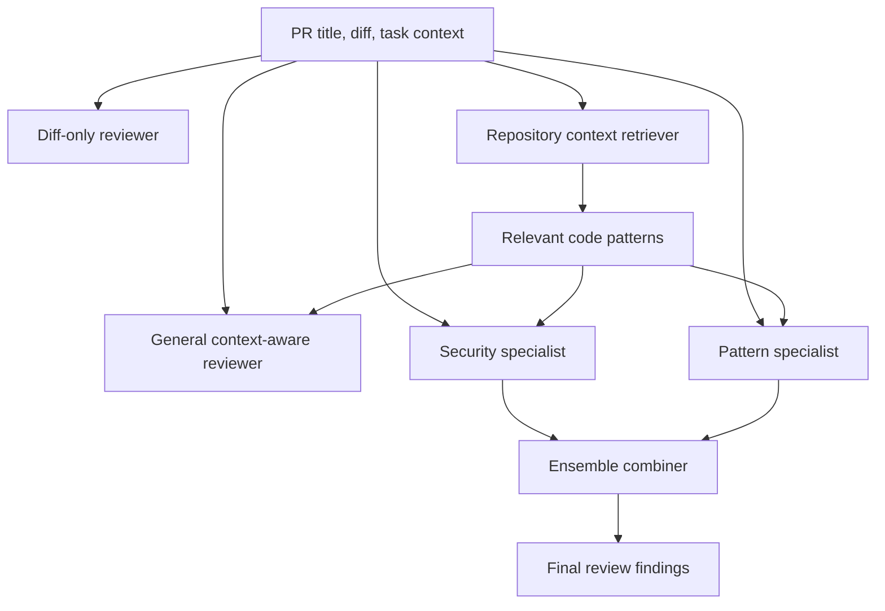
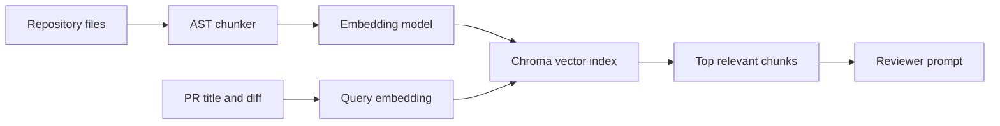
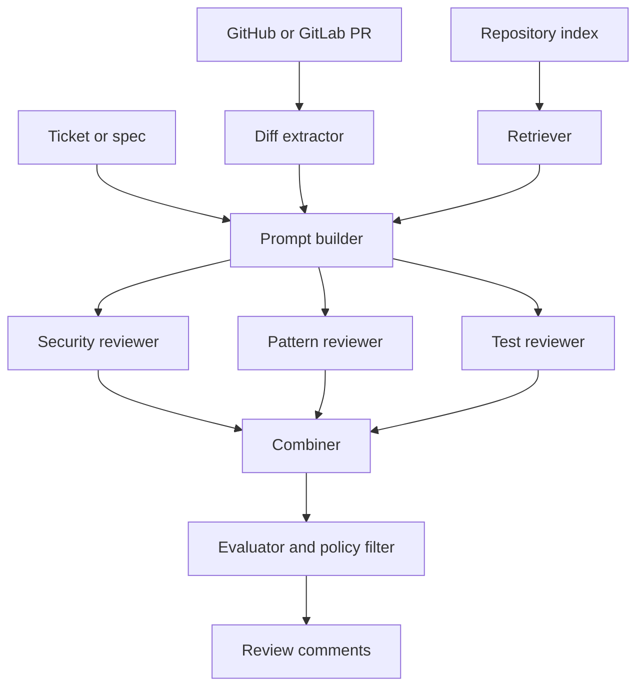

AI coding assistants make it easy to generate more code than a team can carefully review by hand. That changes the bottleneck. The hard question is no longer only "can we write the code?", but also "can we review it with enough context to catch missed requirements, security gaps, and codebase-specific pattern violations?"

## AI Review

In this article, we will build an agentic AI Review system that receives a pull request to generate a code review. It will use different strategies to improve the quality of reviews, the high-level flow looks like this:



We will use this system to run different experiments in which the agent will rely on different type of information about the Pull Requst (title, diff, some context) and then we compare the results. The different agents and the information they will be using are explained below:

| Reviewer design | What it does |
|---|---|
| **Diff-only reviewer** | Reviews only the pull request title, task context, and changed lines. This is the cheapest baseline and mirrors what a reviewer can do from a patch alone, but it cannot reliably catch violations of repository-specific patterns that are not visible in the diff. |
| **Full-context reviewer** | Sends the entire synthetic repository alongside the PR diff. This gives the model access to every local convention and reference implementation, making it useful as an upper-bound context baseline, but it is expensive and becomes noisy as the codebase grows. |
| **Selective-context reviewer** | Indexes the repository into AST-based chunks, embeds those chunks, and retrieves only the most relevant code for each PR. This tests whether retrieval can preserve most of the useful repository evidence while avoiding the token cost and distraction of full-context review. |
| **Specialized reviewer ensemble** | Runs narrower reviewers for security and codebase-pattern compliance, then combines overlapping and high-signal findings. This design tests whether focused reviewer roles can improve recall without simply concatenating every possible comment into a noisy final review. |

The complete ai review agent code can be found in [ai-code-review-agents](https://github.com/dzlab/snippets/tree/master/ai-code-review-agents).

## Run The Experiment

Install `uv` first if it is not already available. Then clone the snippets repository and run the companion project:

```bash
git clone https://github.com/dzlab/snippets.git
cd snippets/ai-code-review-agents
uv sync
cp .env.example .env
```

Set `OPENAI_API_KEY` in `.env`, then run:

```bash
uv run python run_experiment.py --dry-run
uv run python run_experiment.py --mode all --limit 3
uv run python run_experiment.py --mode all
```

`uv sync` creates the virtual environment and installs dependencies. Use `--limit` while iterating to control token usage. The dry run validates the fixture and chunking without making API calls.

## Benchmark Dataset

The benchmark dataset used for comparison consists of a synthetic FastAPI service and 15 deliberately flawed pull requests. The [service fixtures](https://github.com/dzlab/snippets/tree/master/ai-code-review-agents/fixtures/repository) contains 11 known-good files that encode the local patterns an AI reviewer should use as evidence: authentication, authorization, parameterized SQL, rate limiting, secrets, safe file paths, upload validation, inventory locking, HTML escaping, JSON serialization, Pydantic constraints, generic error responses, explicit CORS origins, constant-time secret comparison, and redirect allowlists.
The [pull request fixtures](https://github.com/dzlab/snippets/tree/master/ai-code-review-agents/fixtures/prs) covers 15 pull request diffs.


The point of this dataset is not to model a real application perfectly; but to create a stable benchmark where agentic reviewer designs can be compared against known expected issues.

The complete fixture code can be found [here](https://github.com/dzlab/snippets/tree/master/ai-code-review-agents/fixtures).


## Agentic Code Reviewer

The agentic code reviewer is implemented as a set of reviewer variants. They share the same inputs and output schema, but differ in how much context they use and how narrowly each reviewer is prompted.

### General Reviewer

The first reviewer is deliberately simple. It can run in diff-only mode or context-aware mode. The code path is the same; the only difference is whether `context` is empty.

The important part is the prompt assembly in [`reviewers.py`](https://github.com/dzlab/snippets/blob/master/ai-code-review-agents/src/reviewers.py):

```python
def review(pr, openai_client, model, context=None, task_context=None, custom_prompt=None):
    has_context = bool(context and context.strip())
    has_task = bool(task_context and task_context.strip())

    task_section = f"TASK REQUIREMENTS:\n{task_context}" if has_task else ""
    context_section = (
        "EXISTING CODEBASE PATTERNS:\n"
        f"{context}"
        if has_context else ""
    )

    prompt = (custom_prompt or DEFAULT_REVIEW_PROMPT).format(
        title=pr["title"],
        diff=pr["diff"],
        task_section=task_section,
        context_section=context_section,
        instructions=review_instructions(has_context, has_task),
    )

    response = openai_client.chat.completions.create(
        model=model,
        messages=[
            {"role": "system", "content": "You are an expert code reviewer."},
            {"role": "user", "content": prompt},
        ],
        temperature=0,
        max_tokens=800,
    )
    return parse_findings(response.choices[0].message.content)
```

The full implementation returns metadata and raw model output as well, but this is the core idea: the reviewer is a function from pull request plus optional context to structured findings.

### Full-Context Reviewer

The full-context reviewer concatenates every repository file and sends all of it to the same general reviewer:

```python
def full_repository_context(repo):
    context = "\n\n".join(
        f"# {path}\n{content}"
        for path, content in repo.items()
    )
    return lambda _: context
```

This is useful as a baseline because it is easy to reason about. It is also the design that stops scaling first. Large repositories make prompts expensive, noisy, and more likely to include irrelevant patterns.

### Selective-Context Reviewer

Selective context uses retrieval to pass only the code chunks most relevant to the PR. The companion project implements this in [`context.py`](https://github.com/dzlab/snippets/blob/master/ai-code-review-agents/src/context.py).



The chunker extracts functions, async functions, and classes with file and line metadata:

```python
@dataclass(frozen=True)
class Chunk:
    content: str
    type: str
    name: str
    file_path: str
    line_start: int
    line_end: int


def chunk_repository(repo_files: dict[str, str]) -> list[Chunk]:
    chunks = []
    for file_path, source_code in repo_files.items():
        if file_path.endswith(".py"):
            chunks.extend(chunk_code(source_code, file_path))
    return chunks
```

Then the runner builds a retrieval function once and reuses it for every PR:

```python
def build_selective_context_fn(repo, openai_client, embedding_model, n_results):
    chunks = chunk_repository(repo)
    embedded_chunks = embed_chunks(chunks, openai_client, model=embedding_model)

    retriever = ContextRetriever(openai_client, embedding_model=embedding_model)
    retriever.create_index(embedded_chunks)

    def context_fn(pr: dict) -> str:
        return retriever.retrieve_for_pr(pr, n_results=n_results)

    return context_fn
```

The repository fixture in the experiment yields 22 AST chunks. The default run retrieves up to 10 chunks per PR, which gives the reviewer enough evidence without dumping the entire codebase into every prompt.

### Specialized Reviewers

A general reviewer is useful, but it can be noisy. A better architecture is to split review work across specialists with narrower prompts.

The companion implementation has two specialists:

- **Security reviewer**: focuses on vulnerabilities such as SQL injection, XSS, auth bypass, secrets, weak randomness, path traversal, unsafe deserialization, CORS, timing attacks, open redirects, information disclosure, and sensitive logs.
- **Pattern reviewer**: focuses on local conventions such as auth patterns, parameterized queries, error handling, validation, secrets management, transactions, rate limits, and file path handling.

The implementation uses the same `review(...)` function with different prompt templates:

```python
ECURITY_AGENT_PROMPT = """You are a security expert.
Your only focus is finding security vulnerabilities in code changes.

PR Title: {title}

{task_section}

Code Changes:
{diff}

{context_section}

Security analysis checklist:
- SQL injection through string-built queries.
- XSS through unescaped user-controlled content.
- Authentication bypass.
- Missing authorization checks.
- Hardcoded secrets or credentials.
- Weak randomness or weak cryptography.
- Path traversal.
- Insecure deserialization.
- CORS misconfiguration.
- Timing attacks in secret comparison.
- Open redirects.
- Information disclosure.
- Sensitive data in logs.

For each security vulnerability found, respond exactly as:

ISSUE: <brief security issue>
SEVERITY: <high|medium|low>

Report only real security vulnerabilities and missing required security controls.
```

```python
PATTERN_AGENT_PROMPT = """You are a codebase pattern compliance reviewer.
Your only focus is finding violations of task requirements and established codebase patterns.

PR Title: {title}

{task_section}

Code Changes:
{diff}

{context_section}

Pattern analysis checklist:
- Authentication and authorization patterns.
- Parameterized database query patterns.
- Error handling and logging patterns.
- Input validation patterns.
- Secrets management patterns.
- Transaction and locking patterns.
- Rate limiting patterns.
- Safe file path construction.

For each pattern violation found, respond exactly as:

ISSUE: <brief pattern violation>
SEVERITY: <high|medium|low>

Report only task requirement violations or deviations from established codebase patterns."""
```

The narrow prompts make the model's job clearer. The security reviewer does not need to comment on style. The pattern reviewer does not need to rediscover generic vulnerability classes unless they also violate local policy.

### Ensemble Reviewer

A naive ensemble would concatenate every finding from every specialist. That improves recall, but it can flood the developer with noisy comments.

The combiner in [`reviewers.py`](https://github.com/dzlab/snippets/blob/master/ai-code-review-agents/src/reviewers.py) uses agreement as the core signal, then adds a bounded number of unique high or medium severity findings:

```python
def review_ensemble(pr, openai_client, model, context, task_context):
    security_review = review_security(pr, openai_client, model, context, task_context)
    pattern_review = review_pattern(pr, openai_client, model, context, task_context)

    agreed = []
    for sec in security_review["findings"]:
        for pat in pattern_review["findings"]:
            if word_overlap(sec["issue"], pat["issue"]) > 0.40:
                agreed.append(sec if len(sec["issue"]) >= len(pat["issue"]) else pat)
                break

    for findings in (security_review["findings"], pattern_review["findings"]):
        for finding in findings:
            if finding.get("severity") in {"high", "medium"} and not already_covered(finding, agreed):
                agreed.append(finding)
                break

    return deduplicate_findings(agreed)
```

This is stricter than concatenation. It preserves the benefit of specialization while keeping the final result closer to what a developer can actually act on.

## Evaluation

The evaluation harness compares generated findings against expected issues using keyword overlap. It is intentionally lightweight; the point is to make reviewer designs comparable, not to build a perfect grader.

The core matching function in [`evaluation.py`](https://github.com/dzlab/snippets/blob/master/ai-code-review-agents/src/evaluation.py) looks like this:

```python
def issues_match(expected: str, found: str, threshold: float = 0.30) -> bool:
    expected_words = keywords(expected)
    found_words = keywords(found)
    if not expected_words:
        return False

    overlap = expected_words & found_words
    keyword_score = len(overlap) / len(expected_words)

    if expected.lower() in found.lower() or found.lower() in expected.lower():
        keyword_score = max(keyword_score, 0.70)

    return keyword_score >= threshold
```

And the benchmark runner compares every reviewer against the same `SAMPLE_PRS` fixture:

```python
def run_benchmark(args):
    selective_context_fn = build_selective_context_fn(
        TOY_REPOSITORY,
        openai_client=openai_client,
        embedding_model=args.embedding_model,
        n_results=args.n_results,
    )

    return {
        "Diff-only": evaluate_reviewer(SAMPLE_PRS, openai_client, args.model),
        "Full context": evaluate_reviewer(
            SAMPLE_PRS,
            openai_client,
            args.model,
            context_fn=full_repository_context(TOY_REPOSITORY),
        ),
        "Selective context": evaluate_reviewer(
            SAMPLE_PRS,
            openai_client,
            args.model,
            context_fn=selective_context_fn,
        ),
        "Specialized ensemble": evaluate_ensemble(
            SAMPLE_PRS,
            openai_client,
            args.model,
            context_fn=selective_context_fn,
        ),
    }
```

### Benchmark Comparison

Against the 15 pull requests in the companion fixture, the different AI reviewer implementations behaved like this:

| Implementation | Context strategy | Precision | Recall | F1 Score |
|---|---|---:|---:|---:|
| Diff-only reviewer | PR diff only | 31.37% | 53.33% | 39.51% |
| Full-context reviewer | All repository chunks | 36.71% | 96.67% | 53.21% |
| Selective-context reviewer | Retrieved top chunks | 44.12% | 100.00% | 61.22% |
| Specialized ensemble reviewer | Retrieved top chunks + security/pattern specialists | 60.00% | 90.00% | 72.00% |

The progression shows three useful effects. First, adding repository context improves recall because the reviewer can see requirements and local patterns that are absent from the diff. Second, selective retrieval beats dumping all context because fewer irrelevant chunks distract the model. Third, the ensemble trades a small amount of recall for much higher precision, which is usually the better direction for code review tooling.

### Benchmark Reproducibility

The previous reference numbers come from one controlled run with `gpt-4o-mini`, `temperature=0`, `text-embedding-3-large`, `n_results=10` retrieved chunks, and the keyword-overlap matcher in the evaluation harness. If you rerun the benchmark with a different review model, the exact percentages may shift slightly even when the prompts, fixtures, and retrieval settings stay the same. Hosted model behavior can also change over time, so treat the percentages as reference results for comparing approaches, not permanent constants.

Production evaluation should use a reviewed golden set with line-level expected findings, severity labels, duplicate-finding rules, and human adjudication for borderline matches.


## Why Context Changes The Review

Diff-only review has a fundamental limitation: it cannot know whether a change violates a requirement it cannot see. It also cannot know the local conventions of a repository unless those conventions appear directly in the diff.

For example, this endpoint is clearly incomplete if the reviewer knows the task and codebase patterns:

```python
@app.put("/api/users/{user_id}")
def update_user(user_id: int, profile: UserProfile):
    db.update_user(user_id, profile)
    return {"status": "success"}
```

The context-aware reviewer can compare it to existing user mutation endpoints that require `Depends(get_current_user)` and user-or-admin authorization. The resulting finding is not just "missing auth." It is:

> This endpoint violates the repository's user mutation pattern: user update routes must authenticate with `Depends(get_current_user)` and verify that the caller is modifying their own account or is an admin.

That is the difference between generic review and codebase-aware review. The first notices a smell. The second explains the local contract being violated.

## Production Architecture

The implementation in this article is intentionally small, but the core architecture can be used to build a production system. For instance, we can extend it to something like below:



This production-grade version adds the following components:

- **Repository indexing by commit SHA**: build and query the index for the exact revision under review, so findings cite code that actually existed when the PR was analyzed.
- **Semantic and lexical retrieval**: combine embedding search with keyword or symbol search, because security rules, framework names, migrations, and error messages are often easier to find lexically.
- **CODEOWNERS and ownership metadata**: use ownership signals to prioritize local conventions, route findings to the right reviewers, and avoid treating all files as equally important.
- **Framework-aware chunking**: chunk routes, models, serializers, migrations, templates, and tests according to framework boundaries instead of relying only on generic AST nodes.
- **Test and migration awareness**: retrieve related tests and database changes so the reviewer can detect missing coverage, unsafe rollout paths, and schema/application mismatches.
- **Severity calibration**: map findings to team-specific severity rules so blocking issues, warnings, and optional cleanup comments are separated consistently.
- **Duplicate suppression**: merge overlapping findings across specialists and repeated code locations so developers receive one actionable comment per underlying issue.
- **Stable JSON output**: require predictable structured output so findings can be parsed, filtered, compared across runs, and posted as review comments without brittle text scraping.
- **Human feedback capture**: record accepted, dismissed, and edited findings so future prompts, retrieval rules, and severity policies can be tuned from real reviewer behavior.
- **Regression evaluation before prompt or model changes**: run a golden benchmark before changing prompts, retrieval settings, or models so quality changes are measured instead of guessed.

The most important design principle is that the reviewer should cite evidence: relevant task requirements, local patterns, file paths, and changed lines. Without evidence, the model becomes a second opinion generator. With evidence, it becomes a review assistant.

## Practical Lessons

### Context Beats Prompt Cleverness

A better prompt cannot compensate for missing requirements. If the model never sees the rule that all user mutation endpoints require `Depends(get_current_user)`, it may or may not infer the issue. Give it the rule.

### Selective Context Beats Context Dumping

Full-context review improves recall, but it can bury the signal. Retrieval makes the prompt smaller and more relevant, which often improves both cost and quality.

### Specialization Improves Trust

Security and pattern compliance are different jobs. Splitting them makes findings easier to reason about and makes false positives easier to tune.

### The Combiner Is Part Of The Product

The final reviewer is not just the model. It is the model plus filtering, deduplication, severity policy, and presentation. A noisy reviewer will be ignored even if some of its findings are correct.

### Evaluation Needs A Golden Set

We cannot improve an AI reviewer by vibe. Save examples of:

- security regressions caught in review;
- incidents caused by code changes;
- common framework mistakes;
- migration and rollout failures;
- accepted human review comments.

That benchmark becomes the feedback loop for prompts, retrieval, specialist design, and review policy.

## Conclusion

AI code review works best when it is built as an evidence system, not as a chatbot reading a diff.

The progression is:

1. Add task and repository context.
2. Retrieve relevant code instead of dumping the whole repository.
3. Split review work across focused specialists.
4. Combine findings with precision and deduplication in mind.
5. Measure the system against expected issues.

The same pattern applies beyond code review. Useful engineering agents need the same ingredients: the right context, a constrained job, grounded evidence, structured output, and an evaluation loop.

The full runnable companion code is in [`snippets/ai-code-review-agents`](https://github.com/dzlab/snippets/tree/master/ai-code-review-agents).

_I hope you enjoyed this article. Feel free to leave a comment or reach out on twitter [@bachiirc](https://twitter.com/bachiirc)._
