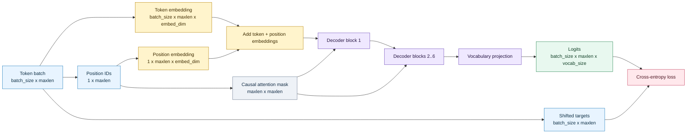
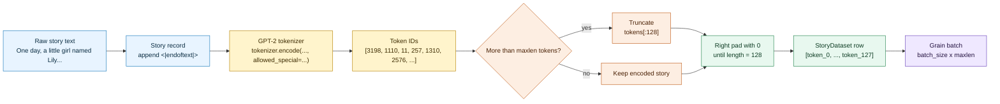

In this article, we will build a workflow for training a language-model using JAX ecosystem. Specifically, we will build a compact GPT-style language model with JAX and Flax NNX, train it on a small text dataset called TinyStories, use Orbax for checkpointing, and run text generation from the restored model.


Although the model is small, we still can cover the core pieces of a language model: the decoder architecture, tokenized data pipeline, differentiable training step, checkpoint handling, and an inference loop that turns token logits back into text.

The complete source material is available in [Build and Train an LLM with JAX](https://github.com/dzlab/deeplearning.ai/tree/main/2026/03/BuildandTrainanLLMwithJAX).

## Setup

First, install the following Python dependencies:

```text
jax==0.6.2
flax==0.10.7
grain==0.2.13
tiktoken==0.4.0
ipywidgets==8.1.8
typing-extensions==4.15.0
jupyter==1.1.1
matplotlib==3.10.8
```

> Note: If Orbax was not pulled in by the Flax/JAX stack, it can be install by adding explicitly these dependencies `optax` and `orbax-checkpoint`.

Then, imports the libraries and set global constants:

```python
import jax
import jax.numpy as jnp
import flax.nnx as nnx
import grain.python as grain
import optax
import tiktoken
from pathlib import Path

tokenizer = tiktoken.get_encoding("gpt2")

vocab_size = tokenizer.n_vocab
maxlen = 128
embed_dim = 192
num_heads = 6
num_transformer_blocks = 6
feed_forward_dim = 512
batch_size = 32
num_epochs = 3
```

We will use these libraries to implement various stages of the training workflow:

| Stage | Library | Role |
|---|---|---|
| Model definition | Flax NNX | Defines stateful modules for embeddings, attention blocks, and the output projection. |
| Array computation | JAX | Handles array operations, automatic differentiation, vectorization, and JIT compilation. |
| Data loading | Grain | Samples stories and batches fixed-shape token arrays. |
| Optimization | Optax | Provides cross-entropy, AdamW, and a warmup cosine learning-rate schedule. |
| Checkpointing | Orbax | Saves and restores model state as a PyTree. |

## Model Architecture

The model we will be building is small in size, a 20.2M parameter decoder with the GPT-2 tokenizer vocabulary, a context length of 128 tokens, and six causal attention blocks. The different model parameters are as follows:

| Setting | Value |
|---|---:|
| Vocabulary size | 50,257 |
| Context length | 128 tokens |
| Embedding dimension | 192 |
| Attention heads | 6 |
| Transformer blocks | 6 |
| Feed-forward dimension setting | 512 |
| Parameters | 20,212,608 |

The first block of the model is the embedding layer that combines token identity with position. The token embedding maps GPT-2 token IDs into dense vectors, while the positional embedding gives the model an order signal. It is defined as:

```python
class TokenAndPositionEmbedding(nnx.Module):
    def __init__(self, maxlen, vocab_size, embed_dim, *, rngs):
        self.token_emb = nnx.Embed(vocab_size, embed_dim, rngs=rngs)
        self.pos_emb = nnx.Embed(maxlen, embed_dim, rngs=rngs)

    def __call__(self, x):
        seq_len = x.shape[1]
        positions = jnp.arange(seq_len)[None, :]
        return self.token_emb(x) + self.pos_emb(positions)
```

The attention block uses Flax NNX's `MultiHeadAttention`. A causal mask prevents each token from attending to future tokens, which is the core rule that makes next-token prediction work. It is defined as:

```python
class TransformerBlock(nnx.Module):
    def __init__(self, embed_dim, num_heads, ff_dim, *, rngs):
        self.attention = nnx.MultiHeadAttention(
            num_heads=num_heads,
            in_features=embed_dim,
            qkv_features=embed_dim,
            out_features=embed_dim,
            decode=False,
            rngs=rngs,
        )

    def __call__(self, x, mask=None):
        attn_out = self.attention(x, mask=mask)
        x = x + attn_out
        return x
```

The full `MiniGPT` model wires together embeddings, repeated attention blocks, and a final vocabulary projection. It returns one logit vector per position in the input sequence. It is defined as:

```python
class MiniGPT(nnx.Module):
    def __init__(self, maxlen, vocab_size, embed_dim, num_heads,
                 feed_forward_dim, num_transformer_blocks, *, rngs):
        self.maxlen = maxlen
        self.embedding = TokenAndPositionEmbedding(
            maxlen, vocab_size, embed_dim, rngs=rngs
        )
        self.transformer_blocks = [
            TransformerBlock(embed_dim, num_heads, feed_forward_dim, rngs=rngs)
            for _ in range(num_transformer_blocks)
        ]
        self.output_layer = nnx.Linear(
            embed_dim, vocab_size, use_bias=False, rngs=rngs
        )

    def causal_attention_mask(self, seq_len):
        return jnp.tril(jnp.ones((seq_len, seq_len)))

    def __call__(self, token_ids):
        seq_len = token_ids.shape[1]
        mask = self.causal_attention_mask(seq_len)
        x = self.embedding(token_ids)

        for block in self.transformer_blocks:
            x = block(x, mask=mask)

        return self.output_layer(x)
```

During training/inference, as depicted by the diagram below, the data will flow through the model in batches of token IDs with shape `batch_size x maxlen`. The model, first turns those IDs into embeddings, then applies a succession of causal decoder blocks, and finally projects every position back to the GPT-2 vocabulary. During training, the resulting logits are compared with the same batch shifted one token to the left.



## Training Data

The training data used here is a small dataset of short stories where each story ends with `<|endoftext|>` delimiter. There are 1,000 stories; with the shortest story has 61 whitespace-separated words, the longest has 837, and the average is about 184 words.


First, we need to define a helper function to read stories text file:

```python
def load_stories_from_file(file_path, max_stories=None):
    text = Path(file_path).read_text(encoding="utf-8", errors="replace")
    stories = [
        story.strip() + "<|endoftext|>"
        for story in text.split("<|endoftext|>")
        if story.strip()
    ]

    if max_stories is not None:
        return stories[:max_stories]

    return stories
```

During transformation, each story becomes a fixed-length token sequence. Longer stories are truncated to the context length, and shorter stories are right-padded with zeros. Right padding matters because the generation function later uses the same alignment when it predicts the next token from a shorter prompt. This is implemented as follows:

```python
class StoryDataset:
    def __init__(self, stories, maxlen, tokenizer):
        self.stories = stories
        self.maxlen = maxlen
        self.tokenizer = tokenizer
        self.end_token = tokenizer.encode(
            "<|endoftext|>",
            allowed_special={"<|endoftext|>"},
        )[0]

    def __len__(self):
        return len(self.stories)

    def __getitem__(self, idx):
        story = self.stories[idx]
        tokens = self.tokenizer.encode(
            story,
            allowed_special={"<|endoftext|>"},
        )

        if len(tokens) > self.maxlen:
            tokens = tokens[:self.maxlen]

        tokens.extend([0] * (self.maxlen - len(tokens)))
        return tokens
```

Next, we use the [Grain library](https://github.com/google/grain) to implement a Data loader that will create batches for training from the raw text.


```python
def create_dataloader(stories, tokenizer, maxlen, batch_size,
                      shuffle=False, num_epochs=1, seed=42,
                      worker_count=0):
    dataset = StoryDataset(stories, maxlen, tokenizer)
    estimated_batches = len(dataset) // batch_size

    sampler = grain.IndexSampler(
        num_records=len(dataset),
        shuffle=shuffle,
        seed=seed,
        shard_options=grain.NoSharding(),
        num_epochs=num_epochs,
    )

    dataloader = grain.DataLoader(
        data_source=dataset,
        sampler=sampler,
        operations=[
            grain.Batch(batch_size=batch_size, drop_remainder=True)
        ],
        worker_count=worker_count,
    )

    return dataloader, estimated_batches
```

> The parameter `drop_remainder=True` helps keep every batch of the same shape and makes JIT compilation simpler.

The transformation is depicted by the following diagram: load one story, encode it with the GPT-2 tokenizer, normalize it to `maxlen`, and let Grain stack those rows into a training batch.



## Training Loop

The training objective is next-token prediction. The model receives the input sequence and learns to predict the target sequence. The target is the same token sequence shifted left by one position:

```python
prep_target_batch = jax.vmap(
    lambda tokens: jnp.concatenate((tokens[1:], jnp.array([0])))
)
```

The full loop repeatedly pulls a batch from Grain, builds input and target arrays, runs the JIT-compiled training step, updates metrics, and advances until every epoch has been consumed.

```mermaid
flowchart LR
    A["Grain DataLoader<br/>fixed-size token batches"] --> B["Epoch loop"]
    B --> C["Fetch next batch"]
    C --> D["Convert to JAX int32<br/>input_batch"]
    D --> E["Shift tokens left<br/>target_batch"]
    E --> F["JIT train_step"]
    F --> G["MiniGPT forward pass<br/>logits"]
    G --> H["Cross-entropy<br/>logits vs targets"]
    H --> I["value_and_grad<br/>loss + gradients"]
    I --> J["AdamW update<br/>model parameters"]
    I --> K["metrics.update<br/>loss history"]
    J --> L{"More batches?"}
    K --> L
    L -- yes --> C
    L -- no --> M{"More epochs?"}
    M -- yes --> B
    M -- no --> N["Trained model<br/>checkpoint-ready"]

    classDef data fill:#e8f4ff,stroke:#1677b9,color:#0b2d42;
    classDef loop fill:#fdeee2,stroke:#bf5b17,color:#4a2105;
    classDef tensor fill:#fff4cc,stroke:#b58100,color:#3d2b00;
    classDef compute fill:#efe8ff,stroke:#6a45b8,color:#241340;
    classDef update fill:#ffe8ec,stroke:#c43e5c,color:#4b1420;
    classDef output fill:#e8f8ef,stroke:#23834d,color:#0e3d24;
    class A,C data;
    class B,L,M loop;
    class D,E tensor;
    class F,G,H,I compute;
    class J,K update;
    class N output;
```



Optax computes token-level softmax cross-entropy and averages it across the batch.

```python
def loss_fn(model, batch):
    inputs, targets = batch
    logits = model(inputs)
    loss = optax.softmax_cross_entropy_with_integer_labels(
        logits, targets
    ).mean()
    return loss, logits
```

The training setup builds a warmup cosine schedule over the available steps and uses AdamW:

```python
total_steps = batches_per_epoch * num_epochs
warmup_steps = max(1, total_steps // 10)

lr_schedule = optax.warmup_cosine_decay_schedule(
    init_value=0.0,
    peak_value=3e-4,
    warmup_steps=warmup_steps,
    decay_steps=total_steps,
    end_value=1e-5,
)

optimizer = nnx.Optimizer(
    model,
    optax.adamw(learning_rate=lr_schedule, weight_decay=0.01),
)
```

The compact training step is where JAX starts to pay off. `nnx.value_and_grad` computes the loss and gradients, `metrics.update` records training metrics, and `optimizer.update` mutates the model parameters through the NNX optimizer wrapper. `@nnx.jit` compiles that whole step.

```python
@nnx.jit
def train_step(model, optimizer, metrics, batch):
    grad_fn = nnx.value_and_grad(loss_fn, has_aux=True)
    (loss, logits), grads = grad_fn(model, batch)

    metrics.update(loss=loss, logits=logits, labels=batch[1])
    optimizer.update(grads)
```

The loop converts each Grain batch into JAX integer arrays, builds the shifted targets, and calls the compiled step:

```python
metrics_history = {"train_loss": []}

for epoch in range(num_epochs):
    step = 0
    for batch in text_dl:
        input_batch = jnp.array(jnp.array(batch).T).astype(jnp.int32)
        target_batch = prep_target_batch(input_batch).astype(jnp.int32)

        train_step(model, optimizer, metrics, (input_batch, target_batch))

        if (step + 1) % 2 == 0:
            for metric, value in metrics.compute().items():
                metrics_history[f"train_{metric}"].append(value)
            metrics.reset()

        step += 1
```

For the quick run, 100 stories, batch size 32, and 3 epochs produce 9 total steps:

```text
Total training steps: 9
Warmup steps: 1

Epoch: 1, Step 2, Loss: 10.8881, LR: 3.00e-04
Epoch: 2, Step 2, Loss: 10.5748, LR: 3.00e-04
Epoch: 3, Step 2, Loss: 10.2045, LR: 3.00e-04
```

The lesson also includes a longer run over 2,000,000 stories for 3 epochs. The loss drops quickly in the early steps and then flattens near 2.

{: .center-image }

## Checkpointing

Once the model has trained, save the NNX model state with Orbax:

```python
from pathlib import Path
import orbax

checkpoint_path = Path.cwd() / "small_checkpoint.orbax"
checkpointer = orbax.checkpoint.PyTreeCheckpointer()
checkpointer.save(checkpoint_path, nnx.state(model), force=True)
```

The inference lesson restores a checkpoint onto a CPU device by building matching restore arguments for the model state PyTree:

```python
from orbax import checkpoint
from jax.sharding import SingleDeviceSharding

cpu_device = jax.devices("cpu")[0]
cpu_sharding = SingleDeviceSharding(cpu_device)

restore_args = jax.tree_util.tree_map(
    lambda _: checkpoint.ArrayRestoreArgs(sharding=cpu_sharding),
    nnx.state(model),
)
```

That restore step is important because the checkpoint is not just a flat file. It is structured model state, and each array needs sharding information when it is loaded.

## Generation

Generation is a loop around next-token prediction. The function keeps a growing token list, slices the latest model context, right-pads if the prompt is shorter than `maxlen`, runs the model, and selects the next token.

```python
def generate_text(model, start_tokens, max_new_tokens=50, temperature=1.0):
    tokens = list(start_tokens)

    for _ in range(max_new_tokens):
        context = tokens[-model.maxlen:]
        actual_len = len(context)

        if actual_len < model.maxlen:
            context = context + [0] * (model.maxlen - actual_len)

        context_array = jnp.array(context)[None, :]
        logits = model(context_array)
        next_token_logits = logits[0, actual_len - 1, :] / temperature
        next_token = int(jnp.argmax(next_token_logits))

        if next_token == tokenizer.encode(
            "<|endoftext|>",
            allowed_special={"<|endoftext|>"},
        )[0]:
            break

        tokens.append(next_token)

    return tokenizer.decode(tokens)
```

Wrap the tokenizer and generator in a small convenience function:

```python
def generate_story(model, story_prompt, temperature=1.0, max_new_tokens=50):
    start_tokens = tokenizer.encode(story_prompt)[:maxlen]
    return generate_text(
        model,
        start_tokens,
        max_new_tokens=max_new_tokens,
        temperature=temperature,
    )
```

The restored model generates a short TinyStories-like continuation:

```text
Once upon a time a big bear ops were in the forest. He was very happy and he was always looking for something to do. One day, he saw a big, shiny rock
```

The text is imperfect, which is expected from a compact teaching model. The point is that the full pipeline is working: prompt tokens go in, logits come out, the loop chooses new tokens, and the tokenizer turns those tokens back into text.

## Practical Notes

For local experimentation, the main practical lessons are:

| Concern | Practical choice |
|---|---|
| Fixed shapes | Use truncation, padding, and `drop_remainder=True` so JIT compilation sees stable batch shapes. |
| Short runs | Keep the 100-story run for fast feedback, but do not judge model quality from 9 update steps. |
| Longer training | Use larger data and more steps to see a meaningful loss curve. |
| Checkpoints | Save and restore structured NNX state with Orbax rather than trying to serialize ad hoc arrays. |
| Generation | Match inference padding to the training-time data layout. |

## Takeaways

The value of this MiniGPT project is that it makes the language-model stack concrete. JAX provides the differentiable array runtime, Flax NNX gives the model a clean stateful shape, Grain makes token batches explicit, Optax defines the training objective and optimizer, and Orbax preserves learned state.

For a production LLM, each of these sections becomes much deeper: larger datasets, more complete transformer blocks, distributed training, evaluation, sampling strategies, checkpoint management, and serving infrastructure. But the skeleton is already here, and that makes the larger system easier to reason about.
