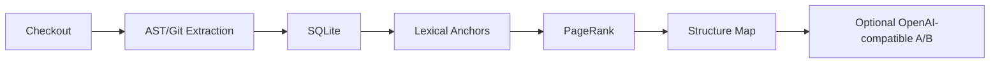

Flat search is still the first tool I reach for when I need to find a file quickly. Grepping for `Cache-Control`, `PageRank`, or `helper_value` is fast, cheap, and often good enough. The problem is that repository tasks are not always lexical. A bug report may mention a public function while the real fix lives two call edges away. A feature request may describe an entry point while the safest place to edit is a helper that tends to change with it in Git history.

That is the gap a code knowledge graph tries to close. Instead of treating a repository as an unstructured pile of text, it stores files and symbols as nodes, links them with typed edges, and then uses graph traversal to surface files that are structurally related to the query even when they do not share the same words.

This post shows how to build a portable version of that idea with standard-library Python, `sqlite3`, `ast`, `git`, and an optional OpenAI-compatible API. The complete runnable implementation used for these examples is kept in the companion project under `snippets/code-knowledge-graph/`.

## Why a graph helps

Keyword search is useful because most software tasks begin with names: a class, an endpoint, a config key, an error string. But lexical matching has predictable blind spots:

- It does not naturally follow multi-hop structure such as file -> imported module -> called helper.
- It does not encode containment, so finding a file does not automatically tell you which symbols inside it matter.
- It does not use historical co-edits, which are often a strong hint that two files participate in the same change surface.

The implementation uses the graph in a hybrid way: first find lexical anchors, then walk the graph outward from those anchors. That design matters because it preserves the speed of flat search while giving the retriever a way to reach files that text overlap alone would miss.

## What goes into the graph

The portable implementation projects retrieval down to files, but it still extracts symbol-level structure first so it can retain call and containment information in the raw graph.

| Kind | Source -> Target | How it is extracted | Why it matters |
|---|---|---|---|
| `file` node | `file:path/to/module.py` | repository scan | retrieval unit returned to a coding workflow |
| `symbol` node | `symbol:pkg.mod.Class.method` | Python AST | captures function, method, and class structure |
| `import` edge | file -> file | `ast.Import`, `ast.ImportFrom` | connects entry files to their dependencies |
| `call` edge | symbol -> symbol | `ast.Call` resolution | follows behavior across helper layers |
| `contains` edge | file -> symbol, class -> method | symbol collection pass | preserves nesting and ownership |
| `co_edit` edge | file -> file | `git log` commit co-occurrence | surfaces files that historically change together |

## Start with a real repository

The companion implementation can index any GitHub checkout, including the Django repository used by the coding-workflow benchmark. It extracts files, symbols, imports, calls, containment, and bounded Git co-edit edges into SQLite. The benchmark charts later in this post use committed Django results; the runnable commands show how to build a fresh graph for a checkout you control.

The graph is easier to reason about when we can see its shape. The renderer uses a consistent encoding: squares are files, triangles are symbols, larger nodes are hubs, and colour shows whether dependency edges or co-edit edges dominate a node. Both graph figures below use one modest but real repository, `agent-harness` (208 files and 1,467 graph nodes), rather than a hand-built toy. The Django data appears separately in the coding-workflow benchmark because that experiment measures a different end-to-end task.

{: .center-image }

_Figure 1: A full code knowledge graph rendered from the `agent-harness` repository export. The dense view is useful for seeing hubs and broad clusters; later retrieval views narrow the graph to the files relevant to a query._

The full graph is intentionally dense. For a view that is easier to inspect, the renderer also projects the graph onto files and shows a hub neighborhood with a small ghost halo for surrounding context.

{: .center-image }

_Figure 2: The file-layer projection of the same real graph. Core files are labelled and coloured by their dominant relationship; pale ghost files show how the readable neighborhood connects back to the rest of the repository._

## End-to-end workflow

The overall pipeline is small enough to run locally and portable enough to use on any checkout.



The important design choice is that SQLite is the durable center of the pipeline. Once the graph is indexed, retrieval, structure-map rendering, offline evaluation, and prompt experiments all run from the same local database file.

## Portable architecture

A heavier graph-backed setup is possible, but the companion implementation intentionally reduces the moving parts:

- Parsing uses the Python standard library: `ast`, `pathlib`, regular expressions, and `dataclasses`. Python is parsed with `ast`; TypeScript/JavaScript uses a deliberately conservative extractor for declarations and relative imports.
- Storage uses `sqlite3`, so the graph is just one portable file.
- History signals come from `git log`, not a hosted SCM API.
- LLM comparison is optional and uses an OpenAI-compatible `/v1/chat/completions` endpoint.
- There is no Oracle dependency, no interactive runtime requirement, and no dependency on private local paths.

That makes the tool suitable for arbitrary GitHub checkouts, quick local experiments, and reproducible smoke tests.

## Extracting graph edges

The parser does two passes. First it collects file and symbol nodes, and that symbol-collection pass emits the `contains` edges that keep nesting intact. The second pass resolves imports and calls across the collected nodes. For TypeScript/JavaScript, the extractor intentionally handles common declarations and relative imports without pretending to be a full compiler.

This excerpt shows the core AST reference collection:

```python
def visit_Import(self, node: ast.Import) -> None:
    current_scope = self.scope_stack[-1]
    for alias in node.names:
        module_name = alias.name
        if module_name in self.module_file_ids:
            self.edge_keys.add(
                (
                    self.file_info.file_node_id,
                    self.module_file_ids[module_name],
                    "imports",
                )
            )
        bound_name, bound_module = _bound_import(alias)
        current_scope.imported_modules[bound_name] = bound_module

def visit_Call(self, node: ast.Call) -> None:
    target_id = self._resolve_callable(node.func)
    if target_id is not None:
        self.edge_keys.add((self.scope_stack[-1].node_id, target_id, "calls"))
    self.generic_visit(node)
```

`visit_Import` links a source file to an internal imported module when the target resolves inside the checkout. `visit_Call` links the current symbol scope to another internal symbol when the callee can be resolved. In the parser these are recorded as raw `imports` and `calls` keys, then normalized by the file-graph projection into the canonical edge kinds `import` and `call`. Retrieval itself seeds file anchors first, then propagates through the projected symbol and file relationships to surface related files.

Historical coupling comes from Git rather than syntax. The implementation walks recent commits, collects files changed together, and converts those pairs into weighted `co_edit` edges. That signal is noisy if you feed it giant formatting commits, which is why the CLI bounds both commit depth and maximum files per commit.

## Storing the graph in SQLite

The storage layer is intentionally plain. Nodes and edges are normal SQLite tables with a few indexes.

```python
connection.executescript(
    """
    CREATE TABLE IF NOT EXISTS nodes (
        id TEXT PRIMARY KEY,
        kind TEXT NOT NULL,
        path TEXT,
        name TEXT,
        text TEXT
    );
    CREATE TABLE IF NOT EXISTS edges (
        src TEXT NOT NULL,
        dst TEXT NOT NULL,
        kind TEXT NOT NULL,
        weight REAL NOT NULL,
        PRIMARY KEY (src, dst, kind)
    );
    CREATE INDEX IF NOT EXISTS idx_edges_src ON edges (src);
    CREATE INDEX IF NOT EXISTS idx_edges_dst ON edges (dst);
    CREATE INDEX IF NOT EXISTS idx_nodes_path ON nodes (path);
    """
)
```

That schema is enough because the retriever later projects symbol-level edges back onto file paths. A `call` between two symbols becomes a weighted relationship between the files that own those symbols. `contains` is still useful in the raw symbol graph for ownership and nesting, but the current file-level projection drops same-file self-relationships, so `contains` does not currently explain file visibility in retrieval output.

## PageRank versus simple keyword search

Retrieval is hybrid. The query is tokenized and scored lexically first. The top lexical hits become anchors. Then a Personalized PageRank-style walk redistributes probability mass across the graph.

Keyword search ranks files by token overlap. PageRank starts from lexical anchors and propagates through the file graph. The graph method is therefore not an independent semantic oracle: it inherits the quality of its lexical starting point. The coding-workflow benchmark uses this structure-aware context inside an editing workflow; the companion CLI also exposes the two retrieval methods directly for offline experiments.

```python
lexical = lexical_rank(query, file_graph)
anchors = _top_anchors(lexical, n_anchors)
personalization = _personalization(paths, anchors)
transitions = _build_transitions(paths, file_graph)
scores = personalization.copy()

for _ in range(max_iterations):
    dangling_mass = sum(scores[path] for path in paths if not transitions[path])
    next_scores = {
        path: (1.0 - damping) * personalization[path]
        + damping * dangling_mass * personalization[path]
        for path in paths
    }
    for src_path in paths:
        outgoing = transitions[src_path]
        if not outgoing:
            continue
        damped_score = damping * scores[src_path]
        for dst_path, probability in outgoing.items():
            next_scores[dst_path] += damped_score * probability
```

Two details are worth noticing.

First, the walk is personalized, not global. It starts from the lexical anchors instead of treating every file equally. Second, connected files get a small self-loop in the transition builder, which prevents all anchor mass from immediately washing out into neighbors. In practice that makes the ranking steadier on small graphs.

The result is not "graph search instead of text search." It is "text search to find a starting point, then graph propagation to discover structurally related files."

## Rendering a structure map for an LLM

Once the graph-ranked files are selected, the tool renders a compact Markdown structure map. It includes the query, lexical anchors, selected files, and grouped neighbors such as `imports`, `calls`, and `co_edit`. The raw symbol graph retains `contains` edges for ownership and nesting, but the current file-level projection drops same-file self-relationships, so the rendered structure map may not emit `contains` neighbors.

That output is useful even without an LLM because it gives a human-readable explanation of why each file is in scope. When you do send it to a model, it acts more like a navigation hint than a magical answer key.

## Optional OpenAI-compatible ranking

The A/B path is deliberately narrow: it asks a model to rank a fixed candidate inventory, optionally with the structure map added to the prompt. The client speaks ordinary OpenAI-compatible JSON over `/v1/chat/completions`.

```python
payload = {
    "model": self.model,
    "temperature": self.temperature,
    "max_tokens": MAX_COMPLETION_TOKENS,
    "messages": self._build_messages(
        task=task,
        candidate_paths=inventory,
        structure_map=structure_map,
    ),
}
response = self._post_json("/chat/completions", payload)
```

This keeps the comparison honest. The control arm gets the task plus the candidate file inventory. The treatment arm gets the same inventory plus the generated structure map. That isolates whether structural context changes ranking behavior without turning the experiment into a full autonomous coding benchmark.

## A coding-workflow example: Django

The repository retrieval experiment above is deliberately offline. The coding-workflow benchmark on Django gives an agent either a bare repository or a graph-derived structure hint while implementing a real cache-control change. This is different evidence: it measures an end-to-end coding workflow, not just whether a file appears in a ranked list.

{: .center-image }

_Figure 3: Signed improvement bars for the five-run Django cache-control hero task. Positive values mean the structure-map treatment is better._

{: .center-image }

_Figure 4: Per-task time-improvement spread across ten Django tasks. Red bars are slower with the graph context; green bars are faster._

For the hero task, both arms passed the acceptance test in all five runs. The structure-map arm used fewer resources on average:

| Metric | Bare repository | Structure map | Change |
|---|---:|---:|---:|
| Total time | 212.6 s | 174.6 s | −17.9% |
| Total tokens | 3.02 M | 2.53 M | −16.3% |
| Tool calls | 57.2 | 47.6 | −16.8% |
| Calls to first correct edit | 14.4 | 12.0 | −16.7% |
| Cost | $0.4829 | $0.4218 | −12.7% |
| Acceptance | 100% | 100% | unchanged |

That is a useful example because the task has a concrete correctness endpoint. It is not enough to say that the model saw more related files; the edited Django checkout also had to pass the task's acceptance tests. Still, it is a five-run case study. The `anchors_only` ablation performed at least as well as the full graph map on several effort metrics, so this experiment does not isolate PageRank as the cause of the improvement.

Across the broader ten-task suite, the median time improvement was 11.0%, but the pooled exact test was not statistically conclusive (`p = 0.2324` for time). The honest conclusion is that structural context can be useful navigation assistance, while the current evidence does not establish a reliable correctness or speedup guarantee.

## Run it on any checkout

The companion CLI is dependency-free, so the commands are intentionally boring.

Index a repository:

```bash
python3 -m codekg index /path/to/github-checkout \
  --db /tmp/codekg.sqlite3 \
  --max-commits 500 \
  --max-files-per-commit 50
```

Retrieve likely files for a task:

```bash
python3 -m codekg retrieve \
  --db /tmp/codekg.sqlite3 \
  --query "Which file defines helper_value?" \
  --k 5 \
  --anchors 3
```

Render a structure map:

```bash
python3 -m codekg map \
  --db /tmp/codekg.sqlite3 \
  --query "Which file defines helper_value?" \
  --k 5 \
  --anchors 3
```

Run an offline recall experiment:

```bash
python3 -m codekg experiment \
  --db /tmp/codekg.sqlite3 \
  --tasks examples/tasks.json \
  --anchors 3
```

Optionally compare control vs treatment against an OpenAI-compatible endpoint:

```bash
export OPENAI_BASE_URL=https://api.openai.com/v1
export OPENAI_API_KEY=sk-...
export OPENAI_MODEL=gpt-4.1-mini

python3 -m codekg ab \
  --db /tmp/codekg.sqlite3 \
  --tasks examples/tasks.json \
  --k 8 \
  --runs 3 \
  --seed 7 \
  --output /tmp/codekg-ab.json
```

The same command also works with a local or self-hosted compatible server:

```bash
export OPENAI_BASE_URL=http://127.0.0.1:11434/v1
export OPENAI_API_KEY=dummy
export OPENAI_MODEL=qwen2.5-coder:14b
```

## Task JSON, metrics, and repeated runs

The task file is intentionally explicit. Every task names the query and the repository-relative files that count as correct.

```json
[
  {
    "query": "Which file scans the repository, parses Python ASTs, and builds graph nodes and edges?",
    "gold_files": ["codekg/parser.py"]
  },
  {
    "query": "Which file defines the SQLite-backed graph store and loads the projected file graph?",
    "gold_files": ["codekg/store.py"]
  },
  {
    "query": "Which file ranks candidate files and renders the structure map markdown for a query?",
    "gold_files": ["codekg/retrieval.py"]
  }
]
```

Three details matter here:

| Field or metric | Meaning | Why it matters |
|---|---|---|
| `gold_files` | explicit correct files for the task | makes evaluation reproducible |
| `control` vs `treatment` | same task and inventory, with or without the structure map | isolates the effect of graph context |
| `recall_at_k` | fraction of gold files found in the top `k` results | measures file localization quality, not code correctness |

Repeated runs matter only for the LLM A/B path. A model can vary its ranking even with the same prompt, so the CLI lets you specify `--runs` and `--seed`. More samples give you a better sense of spread and reduce the temptation to over-read one lucky run.

It is also important to keep the benchmark scoped correctly: this is a localization and ranking harness, not an autonomous editing benchmark. A model can rank the right files and still fail to implement the change. Conversely, a coding agent can sometimes discover the right files by reading code interactively even when the initial graph ranking was mediocre.

## Lessons from the coding-workflow benchmark

The Django results show why graph context should be evaluated as navigation assistance rather than treated as a correctness oracle. The treatment arm used fewer resources on the hero task, while the ten-task suite included both wins and regressions. On easy tasks with obvious vocabulary overlap, flat lexical search can be hard to beat; graph context is most promising when dependency structure and historical coupling add signal that the task wording does not contain.

The portable harness is designed to test whether graph context helps on a given set of localization tasks by comparing the same task and candidate inventory with and without the structure map. That is the right mental model: graph hints are useful to test and sometimes useful to apply, but they are not guaranteed improvements.

## Practical limitations

Before using this on a large codebase, I would keep these tradeoffs in mind:

| Concern | Practical impact |
|---|---|
| lexical anchors | bad anchors can send PageRank into the wrong neighborhood |
| graph hints | a model can over-trust a plausible structure map and still head into the wrong files |
| co-edit history | noisy commits can add misleading edges |
| graph freshness | a stale graph drifts away from the checkout you are actually editing |
| incremental updates | frequent re-indexing matters if the repository changes faster than your retrieval cache |
| language support | Python has AST extraction; TypeScript/JavaScript uses a conservative declaration/import extractor |
| prompt size | structure maps can get too large if you expose too many files or neighbors |
| API privacy and cost | `ab` can expose repository-relative file names and contextual hints to the configured provider |

The good news is that each tradeoff is local and understandable. You can tune commit depth, anchor count, map size, and candidate inventory without redesigning the whole system.

## Closing

The most interesting part of this pattern is not PageRank by itself. It is the combination of simple ingredients: AST edges, Git co-edits, a portable SQLite store, lexical anchors, and a structure map that a human or model can inspect. That is enough to turn a repository from "documents with filenames" into a lightweight structural memory.

The complete runnable implementation used for these examples is kept in the companion project under `snippets/code-knowledge-graph/`.
