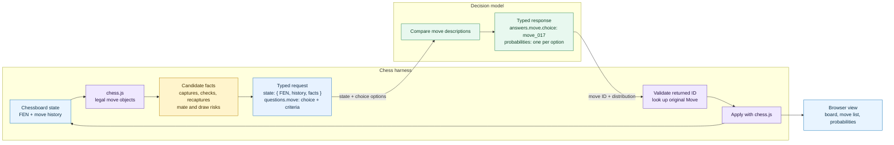
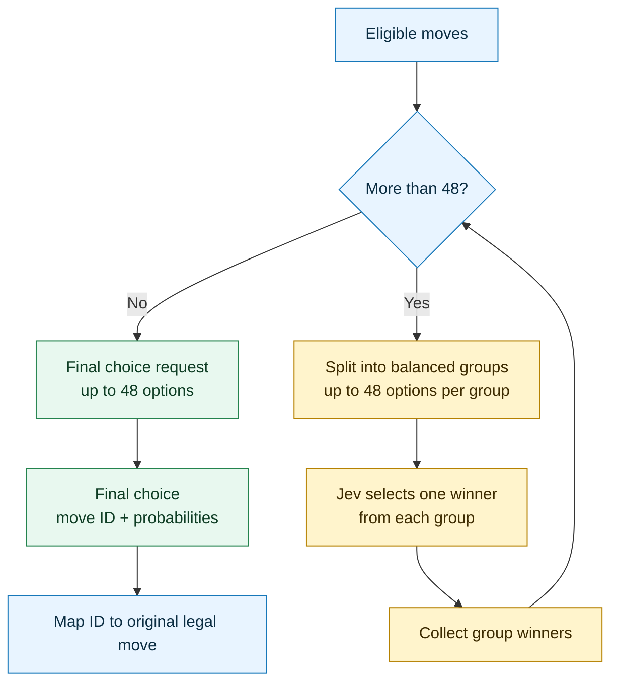

[Jev](https://typesafe.ai/blog/introducing-system-one-models-and-jev) is TypeSafe AI's first public [System One model](https://typesafe.ai/blog/introducing-system-one-models-and-jev). It is built to answer typed questions with structured decisions. That makes it a natural fit for a game: ask it to choose among legal moves, then let ordinary code apply the answer.

In this article we explore [Jev Chess](https://github.com/dzlab/snippets/tree/master/jev-chess) a small TypeScript web app that uses Jev plays chess. An experiment exploring how to put a constrained decision model in a loop.

The project leverages [chess.js](https://github.com/jhlywa/chess.js/) for chess rules and legal moves, [react-chessboard](https://github.com/Clariity/react-chessboard) for rendering, a server-side game loop, and a Jev client. At each game turn, Jev chooses from a set of move candidates prepared by the harness.

## Let code own the rules

The first design choice was to keep the game state authoritative as part of the harness and away from the decision model. The harness uses `chess.js` library to find legal moves in a position, whether a move ends the game, and how a move updates the position. Jev gets a description of the current position and a choice question whose options refer to those legal moves.



The diagram above explains the overall architecture; the harness builds a candidate list from `chess.js`, assigns each move an internal ID, and asks Jev to select one. When the response arrives, it looks up that ID in the original candidate list and passes the associated move back to `chess.js`. If the model returns an unknown ID, the turn fails instead of applying an arbitrary move. See the [Jev client](https://github.com/dzlab/snippets/blob/master/jev-chess/src/server/jev-client.ts) and [game runner](https://github.com/dzlab/snippets/blob/master/jev-chess/src/server/game-runner.ts).

This design keeps the model's job limited to judging the described options. The harness keeps responsibility for legal play and game state.

## Make candidate moves easier to compare

Sending Jev a list of candidates such as `Nf3`, `Qxd4`, and `O-O` that represent legal moves is not enough to make a decision, because the notation alone does not tell what the move threatens or leaves hanging. Therefore the harness needs to add additional information.

For a position, the harness summarizes the board, piece counts, and material using the simple values pawn 1, knight or bishop 3, rook 5, and queen 9. For each candidate move, it can describe captures, promotions, checks, immediate legal capture replies, whether the moved piece can be recaptured, and changes to attacks on occupied squares. It also checks whether the move allows an immediate checkmate or creates a threefold-repetition draw. The implementation is in [`decision-facts.ts`](https://github.com/dzlab/snippets/blob/master/jev-chess/src/server/decision-facts.ts).

The harness also applies two narrow safety rules. When at least one candidate avoids immediate mate, it removes moves that allow mate in one. When the side to move is ahead by at least three material points, it avoids an immediate threefold draw if a non-drawing move remains. If every move carries the relevant risk, Jev still receives the available moves and a warning.

Here is an example request sent to Jev; it specifies the model name, and the state: the FEN encodes the board, side to move, castling rights, and move counters; the harness also marks that White is in check:

```json
{
  "model": "typesafe-ai/jev",
  "state": {
    "game": "standard chess",
    "fen": "r1bq1rk1/ppp1bppp/3p1p2/3P4/8/P1N2N2/1Pn2PPP/R1BQKB1R w KQ - 0 9",
    "side_to_move": "white",
    "is_check": true,
    "legal_move_count": 3,
    "current_side_material_lead": 1
  }
}
```

The other part of the request `questions.move` asks Jev to select from the legal candidates. Each key is an ID the game runner can map back to its original move object; each value adds concrete facts about that move:

```json
{
  "questions": {
    "move": {
      "type": "choice",
      "instructions": "Which legal chess move is best for the side to move? Consider king safety, tactics, material, and improving the position. Choose only from the supplied moves.",
      "criteria": {
        "move_000": "Qxc2 (d1 to c2); queen captures knight (+3 material points); black pawn on h7 is newly attacked by white; white pawn on a3 is no longer attacked by black; white rook on a1 is no longer attacked by black; white king on e1 is no longer attacked by black",
        "move_001": "Kd2 (e1 to d2); king; white king on d2 is no longer attacked by black; opponent has immediate legal captures of pawn on a3, rook on a1",
        "move_002": "Ke2 (e1 to e2); king; white king on e2 is no longer attacked by black; opponent has immediate legal captures of pawn on a3, rook on a1"
      }
    }
  }
}
```

Here `move_000` is `Qxc2`, which captures the checking knight. The actual request combines this choice question with the fuller state above. Jev returns a candidate ID, and the game runner maps that ID back to the corresponding legal move rather than parsing generated chess notation.

The client posts this JSON to `https://ai-gateway.vercel.sh/v1/evaluate`, the API response names a candidate ID; which gets mapped back to the legal move object by the game runner.

If Jev returns `move_000`, the runner finds that ID in the supplied candidate list and applies the associated `from`, `to`, and promotion fields. If the response names an ID that was never offered, the turn errors instead of trying to parse it as a move.

## Handle positions with many choices

Most chess positions fit within the project's configured limit of 48 options (a configurable harness limit; TypeSafe's [Choice documentation](https://docs.typesafe.ai/primitives/choice) allows up to 255 options). When a position has more candidates, the runner splits them into balanced groups rather than dropping legal moves. Jev picks a finalist from each group, then chooses among the finalists in another request.



For example, 49 candidates become groups of 25 and 24. Jev chooses one winner from each group, then makes a final choice between those two finalists. Larger sets repeat the group-selection round until the finalists fit under the limit.

This bracket was improved after reviewing an early game. At one position there were 49 legal moves, and the first version split them into groups of 48 and 1. The single-option group was not a real decision. The updated grouping distributes options as evenly as possible, and the prompt distinguishes group selections from the final choice. The bracket keeps every candidate in the process, at the cost of extra requests.

## A bounded follow-up run

I recorded a short self-play run where Jev self-played 20 plies, or 10 moves per side, then collected some stats:

| Measurement | Result |
|---|---:|
| Moves applied | 20 plies |
| Jev API responses | 21 |
| Choices from the supplied candidate list | 21 of 21 |
| API or move-application errors | 0 |
| Response latency, median | 355 ms |
| Response latency, mean | 4.7 s |
| Response latency, range | 212 ms to 26.4 s |

The mean is pulled up by a few long responses; the median better represents a typical request in this small sample. All 20 moves suggested by Jev were accepted by `chess.js`. Here is a recdoring of the game:

<video controls preload="metadata" poster="https://raw.githubusercontent.com/dzlab/snippets/master/jev-chess/assets/jev-chess-run.png" width="100%">
  <source src="https://raw.githubusercontent.com/dzlab/snippets/master/jev-chess/assets/jev-chess-run.webm" type="video/webm">
  Your browser may not support inline WebM playback. [Open or download the recording](https://github.com/dzlab/snippets/blob/master/jev-chess/assets/jev-chess-run.webm).
</video>

[Open or download the 20-ply recording](https://github.com/dzlab/snippets/blob/master/jev-chess/assets/jev-chess-run.webm).

> Note: the probability distribution returned by Jev is a relative weighting over the options it received, not a prediction of the chance of winning the game.


## Improving the harness

This experiment shows that the chess rules and safety checks are much easier to verify when implemented in the harness. And that Jev can only compare the facts and options the harness provides.

Also having guardrails in the harness matter. A legal move can still lose immediately. Filtering an obvious mate-in-one risk is a useful boundary check, not a substitute for search.

These observations matches the recommendation from TypeSafe's [building guidance](https://docs.typesafe.ai/concepts/how-to-build-with-system-one) that describes a useful pattern: keep control flow and deterministic rules in code, give Jev only the state needed for a narrow judgment, and combine its structured answers in the application. It also recommends using confidence to route uncertain cases instead of treating every valid answer as equally reliable.

Jev Chess is a small experiment, which has a lot of room for improvement. For example, on the strategic judgments of Jev, we could try a few narrow, independent questions on the finalists—such as which move best improves king safety and which best creates a threat—and combine their results with the deterministic facts in code. TypeSafe documents parallel independent questions as a way to decompose a broad judgment without adding serial calls.


---

_I hope you enjoyed this article. Feel free to leave a comment or reach out on twitter [@bachiirc](https://twitter.com/bachiirc)._
